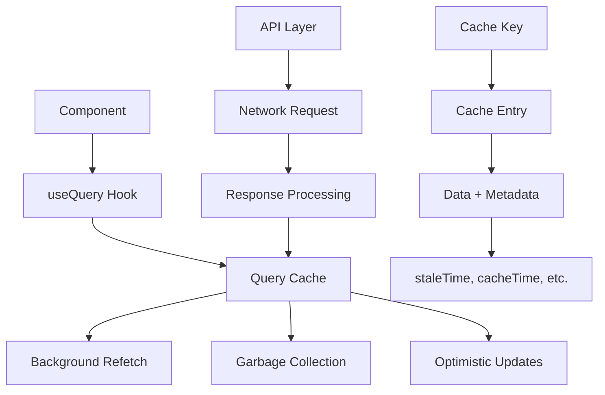

# 数据获取方案深度解析

> 📊 React应用中数据获取的演进历程、核心原理与最佳实践

## 📖 数据获取的核心挑战

在现代React应用中，数据获取是最复杂也是最重要的技术挑战之一。从简单的API调用到复杂的缓存策略，数据获取技术的演进反映了前端应用复杂度的不断提升。

### 🤔 为什么数据获取如此复杂？

#### 1. **异步性质的挑战**
```javascript
// 看似简单的数据获取，实际包含众多复杂性
function UserProfile({ userId }) {
  const [user, setUser] = useState(null);
  const [loading, setLoading] = useState(true);
  const [error, setError] = useState(null);
  
  useEffect(() => {
    fetchUser(userId)
      .then(setUser)
      .catch(setError)
      .finally(() => setLoading(false));
  }, [userId]);
  
  // 需要处理：加载状态、错误状态、空数据、竞态条件...
}
```

#### 2. **状态管理的复杂性**
- **加载状态** - loading、error、success的状态转换
- **缓存策略** - 何时缓存、何时更新、如何失效
- **数据同步** - 多个组件间的数据一致性
- **竞态条件** - 多个异步请求的执行顺序问题

#### 3. **用户体验要求**
- **即时反馈** - 用户操作后的即时状态更新
- **离线支持** - 网络断开时的降级策略
- **性能优化** - 减少不必要的请求和重复加载

## 🔄 数据获取方案的演进历程

### 📅 第一阶段：原生fetch时代 (2015-2018)

#### 手动管理一切
```javascript
// 早期的数据获取方式 - 完全手动管理
class UserComponent extends React.Component {
  constructor(props) {
    super(props);
    this.state = {
      user: null,
      loading: true,
      error: null
    };
  }
  
  async componentDidMount() {
    try {
      const response = await fetch(`/api/users/${this.props.userId}`);
      if (!response.ok) throw new Error('Failed to fetch');
      const user = await response.json();
      this.setState({ user, loading: false });
    } catch (error) {
      this.setState({ error, loading: false });
    }
  }
  
  componentDidUpdate(prevProps) {
    if (prevProps.userId !== this.props.userId) {
      // 需要手动处理props变化
      this.fetchUser();
    }
  }
  
  componentWillUnmount() {
    // 需要手动清理
    this.cancelled = true;
  }
}
```

**痛点分析**：
- **重复代码** - 每个组件都要写相似的loading/error逻辑
- **生命周期复杂** - 需要在多个生命周期方法中处理数据
- **内存泄漏** - 组件卸载后异步操作仍在进行
- **竞态条件** - 快速切换时的请求顺序问题

### 📅 第二阶段：Hook + useEffect时代 (2018-2020)

#### Hook简化了语法但问题依然存在
```javascript
// Hook时代的数据获取 - 语法简化但逻辑复杂
function useUser(userId) {
  const [user, setUser] = useState(null);
  const [loading, setLoading] = useState(true);
  const [error, setError] = useState(null);
  
  useEffect(() => {
    let cancelled = false;
    
    async function fetchUser() {
      try {
        setLoading(true);
        setError(null);
        const response = await fetch(`/api/users/${userId}`);
        if (!response.ok) throw new Error('Failed to fetch');
        const userData = await response.json();
        
        if (!cancelled) {
          setUser(userData);
        }
      } catch (err) {
        if (!cancelled) {
          setError(err);
        }
      } finally {
        if (!cancelled) {
          setLoading(false);
        }
      }
    }
    
    fetchUser();
    
    return () => {
      cancelled = true;
    };
  }, [userId]);
  
  return { user, loading, error };
}
```

**改进之处**：
- **复用性** - 可以在多个组件中复用
- **语法简洁** - Hook语法比类组件更简洁
- **逻辑集中** - 相关逻辑集中在一个Hook中

**仍存在问题**：
- **缓存缺失** - 每次都要重新请求数据
- **重复请求** - 多个组件使用同一数据时会重复请求
- **错误处理** - 错误处理逻辑仍然复杂
- **状态管理** - 复杂的loading/error状态管理

### 📅 第三阶段：专业数据获取库时代 (2020-至今)

#### React Query的革命性变化
```javascript
// React Query - 专业的数据获取解决方案
function UserProfile({ userId }) {
  const { 
    data: user, 
    isLoading, 
    error,
    refetch 
  } = useQuery({
    queryKey: ['user', userId],
    queryFn: () => fetchUser(userId),
    staleTime: 5 * 60 * 1000, // 5分钟内数据被认为是新鲜的
    retry: 3,
    retryDelay: (attemptIndex) => Math.min(1000 * 2 ** attemptIndex, 30000)
  });
  
  if (isLoading) return <LoadingSpinner />;
  if (error) return <ErrorMessage error={error} />;
  
  return (
    <div>
      <h1>{user.name}</h1>
      <button onClick={() => refetch()}>刷新</button>
    </div>
  );
}
```

## 🏗️ 现代数据获取方案对比

### 1. React Query (TanStack Query)

#### 🎯 核心设计理念
React Query的核心理念是**"服务端状态"与"客户端状态"的分离**：

```javascript
// React Query的核心概念演示
const queryClient = new QueryClient({
  defaultOptions: {
    queries: {
      // 数据在5分钟内被认为是新鲜的
      staleTime: 5 * 60 * 1000,
      // 数据在10分钟后被垃圾回收
      cacheTime: 10 * 60 * 1000,
      // 失败后重试3次
      retry: 3,
      // 窗口聚焦时重新获取数据
      refetchOnWindowFocus: true,
    },
  },
});
```

#### 💡 关键特性深度解析

**1. 智能缓存机制**
```javascript
// 缓存键设计 - 精确控制缓存粒度
function useUserPosts(userId, filters) {
  return useQuery({
    // 缓存键包含所有影响数据的参数
    queryKey: ['user-posts', userId, filters],
    queryFn: () => fetchUserPosts(userId, filters),
    // 当filters变化时，自动重新获取数据
  });
}

// 缓存更新策略
const mutation = useMutation({
  mutationFn: createPost,
  onSuccess: (newPost) => {
    // 乐观更新：立即更新UI
    queryClient.setQueryData(['user-posts', userId], (oldPosts) => [
      ...oldPosts,
      newPost
    ]);
    
    // 后台重新验证
    queryClient.invalidateQueries(['user-posts']);
  }
});
```

**2. 乐观更新(Optimistic Updates)**
```javascript
// 乐观更新的完整实现
const updateUserMutation = useMutation({
  mutationFn: updateUser,
  onMutate: async (newUserData) => {
    // 取消正在进行的查询
    await queryClient.cancelQueries(['user', userId]);
    
    // 保存之前的数据用于回滚
    const previousUser = queryClient.getQueryData(['user', userId]);
    
    // 乐观更新UI
    queryClient.setQueryData(['user', userId], {
      ...previousUser,
      ...newUserData
    });
    
    return { previousUser };
  },
  onError: (err, newUserData, context) => {
    // 发生错误时回滚
    if (context?.previousUser) {
      queryClient.setQueryData(['user', userId], context.previousUser);
    }
  },
  onSettled: () => {
    // 无论成功失败都重新获取数据
    queryClient.invalidateQueries(['user', userId]);
  }
});
```

**3. 后台同步机制**
```javascript
// 后台同步的高级配置
function useRealtimeData() {
  const { data } = useQuery({
    queryKey: ['realtime-data'],
    queryFn: fetchRealtimeData,
    // 每30秒后台更新
    refetchInterval: 30000,
    // 页面隐藏时停止更新
    refetchIntervalInBackground: false,
    // 网络重连时重新获取
    refetchOnReconnect: true,
    // 窗口聚焦时重新获取
    refetchOnWindowFocus: true,
  });
  
  return data;
}
```

#### 📊 React Query的架构原理



### 2. SWR (Stale-While-Revalidate)

#### 🎯 核心设计理念
SWR基于HTTP缓存策略"stale-while-revalidate"，**先返回缓存数据，同时在后台更新**：

```javascript
// SWR的核心使用模式
function UserProfile({ userId }) {
  const { data: user, error, mutate } = useSWR(
    `/api/users/${userId}`,
    fetcher,
    {
      // 配置选项
      refreshInterval: 30000, // 30秒自动刷新
      revalidateOnFocus: true, // 焦点时重新验证
      revalidateOnReconnect: true, // 重连时重新验证
      errorRetryCount: 3, // 错误重试次数
    }
  );
  
  if (error) return <div>加载失败</div>;
  if (!user) return <div>加载中...</div>;
  
  return (
    <div>
      <h1>{user.name}</h1>
      <button onClick={() => mutate()}>刷新</button>
    </div>
  );
}
```

#### 💡 SWR的独特特性

**1. 全局缓存共享**
```javascript
// 多个组件共享同一缓存
function UserName({ userId }) {
  const { data } = useSWR(`/api/users/${userId}`, fetcher);
  return <span>{data?.name}</span>;
}

function UserAvatar({ userId }) {
  const { data } = useSWR(`/api/users/${userId}`, fetcher);
  return ;
}

// 两个组件使用同一缓存键，只会发起一次请求
```

**2. 条件数据获取**
```javascript
// 条件性数据获取
function UserProfile({ userId, shouldFetch }) {
  const { data, error } = useSWR(
    // 只有shouldFetch为true时才发起请求
    shouldFetch ? `/api/users/${userId}` : null,
    fetcher
  );
  
  return data ? <UserInfo user={data} /> : null;
}
```

**3. 数据预取策略**
```javascript
// 预取策略的实现
function ProductList() {
  const { data: products } = useSWR('/api/products', fetcher);
  
  return (
    <div>
      {products?.map(product => (
        <ProductCard 
          key={product.id}
          product={product}
          onMouseEnter={() => {
            // 鼠标悬停时预取详情数据
            mutate(`/api/products/${product.id}`);
          }}
        />
      ))}
    </div>
  );
}
```

### 3. Apollo Client (GraphQL生态)

#### 🎯 GraphQL的数据获取革命
Apollo Client不仅是数据获取库，更是GraphQL生态的完整解决方案：

```javascript
// Apollo Client的强大查询能力
const GET_USER_WITH_POSTS = gql`
  query GetUserWithPosts($userId: ID!, $postLimit: Int!) {
    user(id: $userId) {
      id
      name
      email
      posts(limit: $postLimit) {
        id
        title
        content
        createdAt
      }
    }
  }
`;

function UserProfile({ userId }) {
  const { data, loading, error, fetchMore } = useQuery(
    GET_USER_WITH_POSTS,
    {
      variables: { userId, postLimit: 10 },
      // Apollo的缓存策略
      fetchPolicy: 'cache-first',
      errorPolicy: 'partial',
    }
  );
  
  if (loading) return <Loading />;
  if (error) return <Error error={error} />;
  
  return (
    <div>
      <UserInfo user={data.user} />
      <PostList posts={data.user.posts} />
      <button onClick={() => fetchMore({
        variables: { postLimit: data.user.posts.length + 10 }
      })}>
        加载更多
      </button>
    </div>
  );
}
```

#### 💡 Apollo Client的独特优势

**1. 智能缓存归一化**
```javascript
// Apollo Client的缓存归一化
const cache = new InMemoryCache({
  typePolicies: {
    User: {
      fields: {
        posts: {
          // 自定义字段的合并策略
          merge(existing = [], incoming) {
            return [...existing, ...incoming];
          }
        }
      }
    }
  }
});

// 缓存中的数据被归一化存储
{
  "User:1": {
    "__typename": "User",
    "id": "1",
    "name": "张三",
    "posts": [{ "__ref": "Post:1" }, { "__ref": "Post:2" }]
  },
  "Post:1": {
    "__typename": "Post",
    "id": "1",
    "title": "第一篇文章"
  }
}
```

**2. 乐观UI更新**
```javascript
// Apollo Client的乐观更新
const [createPost] = useMutation(CREATE_POST, {
  optimisticResponse: {
    createPost: {
      __typename: 'Post',
      id: 'temp-id',
      title: newPost.title,
      content: newPost.content,
      author: {
        __typename: 'User',
        id: currentUserId,
        name: currentUserName
      }
    }
  },
  update: (cache, { data: { createPost } }) => {
    // 更新缓存中的数据
    cache.modify({
      id: cache.identify({ __typename: 'User', id: currentUserId }),
      fields: {
        posts(existingPosts = []) {
          const newPostRef = cache.writeFragment({
            data: createPost,
            fragment: gql`
              fragment NewPost on Post {
                id
                title
                content
              }
            `
          });
          return [...existingPosts, newPostRef];
        }
      }
    });
  }
});
```

## 🔬 数据获取的核心原理分析

### 1. 缓存策略的实现原理

#### LRU缓存算法
```javascript
// 简化版的LRU缓存实现
class LRUCache {
  constructor(capacity) {
    this.capacity = capacity;
    this.cache = new Map();
  }
  
  get(key) {
    if (this.cache.has(key)) {
      // 访问时移到最前面
      const value = this.cache.get(key);
      this.cache.delete(key);
      this.cache.set(key, value);
      return value;
    }
    return null;
  }
  
  set(key, value) {
    if (this.cache.has(key)) {
      this.cache.delete(key);
    } else if (this.cache.size >= this.capacity) {
      // 删除最久未使用的项
      const firstKey = this.cache.keys().next().value;
      this.cache.delete(firstKey);
    }
    this.cache.set(key, value);
  }
}
```

#### 缓存失效策略
```javascript
// React Query的缓存失效实现原理
class QueryCache {
  constructor() {
    this.queries = new Map();
    this.subscribers = new Set();
  }
  
  invalidateQueries(predicate) {
    const queriesToInvalidate = [];
    
    this.queries.forEach((query, key) => {
      if (predicate(key, query)) {
        query.state.isInvalidated = true;
        queriesToInvalidate.push(query);
      }
    });
    
    // 批量触发重新获取
    queriesToInvalidate.forEach(query => {
      if (query.hasObservers()) {
        query.fetch();
      }
    });
  }
  
  setQueryData(queryKey, updater) {
    const query = this.queries.get(queryKey);
    if (query) {
      const newData = typeof updater === 'function' 
        ? updater(query.state.data) 
        : updater;
      
      query.state.data = newData;
      query.state.dataUpdatedAt = Date.now();
      
      // 通知所有订阅者
      this.notifySubscribers(query);
    }
  }
}
```

### 2. 请求去重和竞态条件处理

#### 请求去重实现
```javascript
// 请求去重的实现原理
class RequestDeduplication {
  constructor() {
    this.pendingRequests = new Map();
  }
  
  async fetch(url, options) {
    const key = this.getRequestKey(url, options);
    
    // 如果已有相同请求在进行中，返回同一个Promise
    if (this.pendingRequests.has(key)) {
      return this.pendingRequests.get(key);
    }
    
    const promise = this.performRequest(url, options)
      .finally(() => {
        // 请求完成后清除
        this.pendingRequests.delete(key);
      });
    
    this.pendingRequests.set(key, promise);
    return promise;
  }
  
  getRequestKey(url, options) {
    return `${options.method || 'GET'}:${url}:${JSON.stringify(options.body || {})}`;
  }
}
```

#### 竞态条件处理
```javascript
// AbortController处理竞态条件
function useAsyncData(url) {
  const [data, setData] = useState(null);
  const [loading, setLoading] = useState(false);
  
  useEffect(() => {
    const abortController = new AbortController();
    
    async function fetchData() {
      try {
        setLoading(true);
        const response = await fetch(url, {
          signal: abortController.signal
        });
        
        if (!abortController.signal.aborted) {
          const result = await response.json();
          setData(result);
        }
      } catch (error) {
        if (error.name !== 'AbortError') {
          console.error('Fetch error:', error);
        }
      } finally {
        if (!abortController.signal.aborted) {
          setLoading(false);
        }
      }
    }
    
    fetchData();
    
    return () => {
      abortController.abort();
    };
  }, [url]);
  
  return { data, loading };
}
```

## 🏢 企业级数据获取架构设计

### 1. 分层架构设计

```javascript
// 企业级数据获取的分层架构
// 1. API层 - 统一的API接口
class ApiClient {
  constructor(baseURL, options = {}) {
    this.baseURL = baseURL;
    this.interceptors = {
      request: [],
      response: []
    };
    this.setupInterceptors(options);
  }
  
  setupInterceptors(options) {
    // 请求拦截器 - 添加认证头、请求ID等
    this.addRequestInterceptor((config) => {
      config.headers = {
        ...config.headers,
        'Authorization': `Bearer ${getAuthToken()}`,
        'Request-ID': generateRequestId(),
        'User-Agent': getUserAgent()
      };
      return config;
    });
    
    // 响应拦截器 - 错误处理、数据转换等
    this.addResponseInterceptor(
      (response) => {
        // 成功响应处理
        logApiSuccess(response);
        return response.data;
      },
      (error) => {
        // 错误响应处理
        logApiError(error);
        if (error.response?.status === 401) {
          redirectToLogin();
        }
        throw new ApiError(error);
      }
    );
  }
}

// 2. 服务层 - 业务逻辑封装
class UserService {
  constructor(apiClient) {
    this.api = apiClient;
  }
  
  async getUser(userId) {
    return this.api.get(`/users/${userId}`);
  }
  
  async updateUser(userId, userData) {
    return this.api.patch(`/users/${userId}`, userData);
  }
  
  async getUserPosts(userId, options = {}) {
    const { page = 1, limit = 10 } = options;
    return this.api.get(`/users/${userId}/posts`, {
      params: { page, limit }
    });
  }
}

// 3. Hook层 - React集成
function useUser(userId) {
  return useQuery({
    queryKey: ['user', userId],
    queryFn: () => userService.getUser(userId),
    enabled: !!userId,
    staleTime: 5 * 60 * 1000 // 5分钟
  });
}
```

### 2. 错误处理策略

```javascript
// 分层的错误处理策略
class ErrorHandler {
  static handle(error, context) {
    const errorType = this.classifyError(error);
    
    switch (errorType) {
      case 'NETWORK_ERROR':
        return this.handleNetworkError(error, context);
      case 'BUSINESS_ERROR':
        return this.handleBusinessError(error, context);
      case 'VALIDATION_ERROR':
        return this.handleValidationError(error, context);
      default:
        return this.handleUnknownError(error, context);
    }
  }
  
  static classifyError(error) {
    if (error.code === 'NETWORK_ERROR') return 'NETWORK_ERROR';
    if (error.status >= 400 && error.status < 500) return 'BUSINESS_ERROR';
    if (error.status >= 500) return 'SERVER_ERROR';
    return 'UNKNOWN_ERROR';
  }
  
  static handleNetworkError(error, context) {
    // 网络错误处理
    showToast('网络连接失败，请检查网络');
    
    // 记录错误用于分析
    logError({
      type: 'NETWORK_ERROR',
      error,
      context,
      userAgent: navigator.userAgent,
      timestamp: Date.now()
    });
    
    // 返回降级数据
    return context.fallbackData || null;
  }
}

// 在查询中集成错误处理
function useUserWithErrorHandling(userId) {
  return useQuery({
    queryKey: ['user', userId],
    queryFn: () => userService.getUser(userId),
    onError: (error) => {
      ErrorHandler.handle(error, {
        component: 'UserProfile',
        userId,
        fallbackData: { name: '用户信息加载失败' }
      });
    },
    retry: (failureCount, error) => {
      // 自定义重试逻辑
      if (error.status === 404) return false; // 404不重试
      if (error.status >= 500) return failureCount < 3; // 服务器错误重试3次
      return false;
    },
    retryDelay: (attemptIndex) => Math.min(1000 * 2 ** attemptIndex, 30000)
  });
}
```

### 3. 性能优化策略

#### 智能预取
```javascript
// 智能预取策略
class PrefetchManager {
  constructor(queryClient) {
    this.queryClient = queryClient;
    this.prefetchQueue = new Set();
    this.observers = new Map();
  }
  
  // 基于用户行为的预取
  onUserInteraction(element, queryKey, queryFn) {
    const observer = new IntersectionObserver((entries) => {
      entries.forEach(entry => {
        if (entry.isIntersecting && !this.prefetchQueue.has(queryKey)) {
          this.prefetchQueue.add(queryKey);
          
          // 延迟预取，避免影响当前操作
          setTimeout(() => {
            this.queryClient.prefetchQuery({
              queryKey,
              queryFn,
              staleTime: 10 * 60 * 1000 // 预取的数据10分钟有效
            });
          }, 100);
        }
      });
    }, {
      threshold: 0.1 // 当元素10%可见时开始预取
    });
    
    observer.observe(element);
    this.observers.set(queryKey, observer);
  }
  
  // 基于路由的预取
  prefetchRouteData(routePath) {
    const routeQueries = this.getQueriesForRoute(routePath);
    
    routeQueries.forEach(({ queryKey, queryFn }) => {
      this.queryClient.prefetchQuery({
        queryKey,
        queryFn,
        staleTime: 5 * 60 * 1000
      });
    });
  }
  
  cleanup() {
    this.observers.forEach(observer => observer.disconnect());
    this.observers.clear();
    this.prefetchQueue.clear();
  }
}
```

#### 批量操作优化
```javascript
// 批量操作优化
class BatchRequestManager {
  constructor(delay = 100) {
    this.delay = delay;
    this.batches = new Map();
  }
  
  addToBatch(batchKey, request) {
    if (!this.batches.has(batchKey)) {
      this.batches.set(batchKey, {
        requests: [],
        timeout: null
      });
    }
    
    const batch = this.batches.get(batchKey);
    batch.requests.push(request);
    
    // 重置批量处理定时器
    if (batch.timeout) {
      clearTimeout(batch.timeout);
    }
    
    batch.timeout = setTimeout(() => {
      this.processBatch(batchKey);
    }, this.delay);
  }
  
  async processBatch(batchKey) {
    const batch = this.batches.get(batchKey);
    if (!batch || batch.requests.length === 0) return;
    
    try {
      // 批量处理请求
      const results = await this.executeBatchRequest(batch.requests);
      
      // 分发结果给各个请求
      batch.requests.forEach((request, index) => {
        request.resolve(results[index]);
      });
    } catch (error) {
      // 批量请求失败时，让每个请求单独重试
      batch.requests.forEach(request => {
        request.reject(error);
      });
    } finally {
      this.batches.delete(batchKey);
    }
  }
}

// 在React Query中使用批量管理
const batchManager = new BatchRequestManager();

function useBatchUser(userId) {
  return useQuery({
    queryKey: ['user', userId],
    queryFn: () => new Promise((resolve, reject) => {
      batchManager.addToBatch('users', {
        userId,
        resolve,
        reject
      });
    })
  });
}
```

## 🎯 最佳实践总结

### 🔧 技术选型指南

#### React Query vs SWR vs Apollo Client
```javascript
// 选择决策树
const chooseDataFetchingLibrary = (requirements) => {
  if (requirements.graphql) {
    return 'Apollo Client'; // GraphQL首选
  }
  
  if (requirements.complexity === 'high' && requirements.caching === 'advanced') {
    return 'React Query'; // 复杂应用首选
  }
  
  if (requirements.simplicity && requirements.bundle_size === 'small') {
    return 'SWR'; // 简单应用首选
  }
  
  return 'React Query'; // 默认推荐
};

// 实际应用示例
const projectRequirements = {
  graphql: false,
  complexity: 'high',
  caching: 'advanced',
  team_size: 'large',
  real_time: true
};

const recommendation = chooseDataFetchingLibrary(projectRequirements);
// 推荐: React Query
```

### 📊 性能优化清单

```javascript
// 性能优化检查清单
const performanceOptimizations = {
  // 1. 缓存策略优化
  caching: {
    staleTime: '根据数据更新频率设置合理的staleTime',
    cacheTime: '设置适当的cacheTime避免内存泄漏',
    queryKeyStructure: '设计合理的queryKey结构便于缓存管理'
  },
  
  // 2. 请求优化
  requests: {
    deduplication: '启用请求去重避免重复请求',
    batching: '对可能的请求进行批量处理',
    prefetching: '基于用户行为进行智能预取'
  },
  
  // 3. 组件优化
  components: {
    suspense: '使用Suspense处理加载状态',
    errorBoundary: '设置错误边界处理异常',
    memoization: '对重度数据处理进行记忆化'
  }
};
```

### 🔒 数据安全考虑

```javascript
// 数据安全最佳实践
const securityBestPractices = {
  // 1. 敏感数据处理
  sensitiveData: {
    // 客户端不存储敏感信息
    avoid: ['passwords', 'tokens', 'personal_ids'],
    
    // 敏感数据的安全传输
    encryption: 'HTTPS + 额外加密层',
    
    // 内存中的敏感数据及时清理
    cleanup: () => {
      // 组件卸载时清理敏感数据
      return () => {
        secureStorage.clear();
      };
    }
  },
  
  // 2. 请求安全
  requestSecurity: {
    csrf: '启用CSRF保护',
    cors: '配置合适的CORS策略',
    rateLimit: '客户端请求频率限制'
  }
};
```

## 📈 未来发展趋势

### 🚀 新兴技术

#### 1. React Server Components
```javascript
// React Server Components的数据获取
async function UserProfile({ userId }) {
  // 在服务器端直接获取数据
  const user = await db.user.findUnique({
    where: { id: userId },
    include: { posts: true }
  });
  
  return (
    <div>
      <h1>{user.name}</h1>
      <PostList posts={user.posts} />
    </div>
  );
}
```

#### 2. Streaming SSR
```javascript
// 流式服务端渲染的数据获取
function App() {
  return (
    <div>
      <Header />
      <Suspense fallback={<Skeleton />}>
        <UserProfile userId="1" />
      </Suspense>
      <Suspense fallback={<Skeleton />}>
        <RecommendedPosts />
      </Suspense>
    </div>
  );
}
```

### 🔮 技术展望

1. **更智能的缓存** - AI驱动的预取和缓存策略
2. **边缘计算集成** - CDN边缘节点的数据缓存
3. **实时数据同步** - WebSocket和Server-Sent Events的深度集成
4. **离线优先** - Progressive Web App的数据同步策略

---

*掌握现代数据获取技术，构建高性能、用户友好的React应用！*
