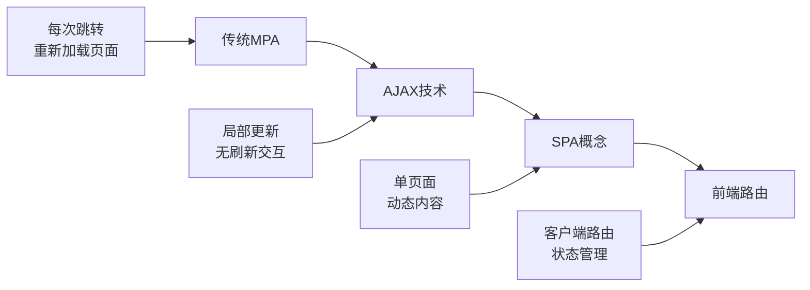

# React 路由系统深度解析

React 路由是 SPA (Single Page Application) 的核心技术之一，它让我们能够在不刷新页面的情况下，实现页面间的导航和状态管理。

## 🎯 学习目标

通过本章学习，你将：

- 理解前端路由的核心原理和实现方式
- 掌握 React Router 的演进历史和设计理念
- 了解路由系统的高级特性和应用场景
- 学会路由性能优化和最佳实践
- 比较不同路由方案的优缺点

## 📚 前端路由发展史

### 🌟 路由概念的诞生

在 Web 发展早期，每次页面跳转都需要向服务器请求新的 HTML 文档，这种模式被称为 **多页应用 (MPA)**。随着 AJAX 技术的发展，开发者开始探索在不刷新页面的情况下动态更新内容的方法，**单页应用 (SPA)** 的概念应运而生。



### 🔄 路由实现方式的演进

#### 1. Hash 路由 (#)
最早的前端路由实现方式，利用 URL 中的 hash 部分实现页面状态切换。

```javascript
// Hash 路由示例
// URL: http://example.com/#/user/123
window.addEventListener('hashchange', function() {
  const hash = window.location.hash;
  // 根据 hash 渲染不同组件
  renderComponent(hash);
});
```

**优点**：
- ✅ 兼容性好，所有浏览器都支持
- ✅ 实现简单，无需服务器配置
- ✅ 不会向服务器发送请求

**缺点**：
- ❌ URL 不够美观（带有 #）
- ❌ SEO 支持较差
- ❌ 服务器无法获取路由信息

#### 2. History 路由 (HTML5)
HTML5 引入的 History API 让我们能够操作浏览器历史记录，实现更优雅的路由。

```javascript
// History 路由示例
// URL: http://example.com/user/123
window.addEventListener('popstate', function(event) {
  const pathname = window.location.pathname;
  // 根据 pathname 渲染不同组件
  renderComponent(pathname);
});

// 编程式导航
history.pushState(null, '', '/user/123');
```

**优点**：
- ✅ URL 美观，没有 #
- ✅ SEO 友好
- ✅ 更好的用户体验

**缺点**：
- ❌ 需要服务器支持（配置 fallback）
- ❌ IE9 及以下不支持
- ❌ 实现相对复杂

## ⚛️ React Router 演进历史

### 📅 版本演进时间线

```
2014.05 ──── React Router 0.x 
     │        └─ 首个版本，基础路由功能
     │
2015.09 ──── React Router 1.x
     │        └─ 增加嵌套路由支持
     │
2016.02 ──── React Router 2.x
     │        └─ API 重构，更好的性能
     │
2017.03 ──── React Router 4.x
     │        └─ 彻底重写，组件化路由
     │
2019.01 ──── React Router 5.x
     │        └─ Hooks 支持，性能优化
     │
2021.11 ──── React Router 6.x
     │        └─ 更小体积，更好 TypeScript 支持
     │
2023.xx ──── React Router 7.x (开发中)
     │        └─ Remix 集成，全栈路由
```

### 🔄 主要版本特性对比

| 版本 | 发布时间 | 核心特性 | 路由定义 | 代码分割 | TypeScript |
|------|----------|----------|----------|----------|------------|
| **v3** | 2016.02 | 声明式路由 | JSX配置 | 手动 | 社区支持 |
| **v4** | 2017.03 | 组件化路由 | 组件内定义 | 动态import | 社区支持 |
| **v5** | 2019.01 | Hooks支持 | 组件内定义 | React.lazy | 改进支持 |
| **v6** | 2021.11 | 更小体积 | useRoutes | 内置支持 | 官方支持 |

## 🏗️ React Router v6 核心概念

### 1. 路由器 (Router)

路由器是整个路由系统的根容器，负责监听 URL 变化并提供路由上下文。

```jsx
import { BrowserRouter, HashRouter, MemoryRouter } from 'react-router-dom';

// Browser Router - 使用 HTML5 History API
function App() {
  return (
    <BrowserRouter>
      {/* 应用内容 */}
    </BrowserRouter>
  );
}

// Hash Router - 使用 hash 路由
function AppHash() {
  return (
    <HashRouter>
      {/* 应用内容 */}
    </HashRouter>
  );
}

// Memory Router - 内存中的路由（测试用）
function AppMemory() {
  return (
    <MemoryRouter>
      {/* 应用内容 */}
    </MemoryRouter>
  );
}
```

### 2. 路由配置 (Routes & Route)

定义应用的路由规则和对应的组件。

```jsx
import { Routes, Route } from 'react-router-dom';

function AppRoutes() {
  return (
    <Routes>
      {/* 基础路由 */}
      <Route path="/" element={<Home />} />
      <Route path="/about" element={<About />} />
      
      {/* 动态路由 */}
      <Route path="/user/:id" element={<UserProfile />} />
      
      {/* 嵌套路由 */}
      <Route path="/dashboard" element={<Dashboard />}>
        <Route path="profile" element={<Profile />} />
        <Route path="settings" element={<Settings />} />
      </Route>
      
      {/* 通配符路由 */}
      <Route path="*" element={<NotFound />} />
    </Routes>
  );
}
```

### 3. 导航组件 (Link & NavLink)

用于在应用内进行导航，不会触发页面刷新。

```jsx
import { Link, NavLink } from 'react-router-dom';

function Navigation() {
  return (
    <nav>
      {/* 基础链接 */}
      <Link to="/">首页</Link>
      <Link to="/about">关于</Link>
      
      {/* 活动状态链接 */}
      <NavLink 
        to="/dashboard"
        className={({ isActive }) => 
          isActive ? 'nav-link active' : 'nav-link'
        }
      >
        仪表板
      </NavLink>
      
      {/* 动态链接 */}
      <Link to={`/user/${userId}`}>用户资料</Link>
    </nav>
  );
}
```

### 4. 路由 Hooks

React Router v6 提供了一系列强大的 Hooks 来访问路由信息。

```jsx
import { 
  useNavigate, 
  useLocation, 
  useParams, 
  useSearchParams 
} from 'react-router-dom';

function UserProfile() {
  // 获取路由参数
  const { id } = useParams();
  
  // 获取当前位置信息
  const location = useLocation();
  
  // 获取查询参数
  const [searchParams, setSearchParams] = useSearchParams();
  const tab = searchParams.get('tab');
  
  // 编程式导航
  const navigate = useNavigate();
  
  const handleEdit = () => {
    navigate(`/user/${id}/edit`);
  };
  
  const handleTabChange = (newTab) => {
    setSearchParams({ tab: newTab });
  };
  
  return (
    <div>
      <h1>用户 {id} 的资料</h1>
      <p>当前路径: {location.pathname}</p>
      <p>当前标签: {tab}</p>
      
      <button onClick={handleEdit}>编辑资料</button>
      <button onClick={() => handleTabChange('settings')}>
        切换到设置
      </button>
    </div>
  );
}
```

## 🎯 高级路由特性

### 1. 嵌套路由

嵌套路由允许我们构建复杂的页面布局结构。

```jsx
import { Outlet } from 'react-router-dom';

// 父路由组件
function Dashboard() {
  return (
    <div className="dashboard">
      <aside>
        <nav>
          <Link to="profile">个人资料</Link>
          <Link to="settings">设置</Link>
          <Link to="analytics">分析</Link>
        </nav>
      </aside>
      
      <main>
        {/* 子路由会在这里渲染 */}
        <Outlet />
      </main>
    </div>
  );
}

// 路由配置
<Route path="/dashboard" element={<Dashboard />}>
  <Route path="profile" element={<Profile />} />
  <Route path="settings" element={<Settings />} />
  <Route path="analytics" element={<Analytics />} />
  <Route index element={<DashboardHome />} /> {/* 默认子路由 */}
</Route>
```

### 2. 路由守卫

实现路由级别的权限控制和访问保护。

```jsx
import { Navigate, useLocation } from 'react-router-dom';

// 认证守卫组件
function RequireAuth({ children }) {
  const { isAuthenticated } = useAuth();
  const location = useLocation();
  
  if (!isAuthenticated) {
    // 重定向到登录页，并保存当前位置
    return <Navigate to="/login" state={{ from: location }} replace />;
  }
  
  return children;
}

// 角色守卫组件
function RequireRole({ children, requiredRole }) {
  const { user } = useAuth();
  
  if (!user.roles.includes(requiredRole)) {
    return <Navigate to="/unauthorized" replace />;
  }
  
  return children;
}

// 使用守卫
<Route 
  path="/admin" 
  element={
    <RequireAuth>
      <RequireRole requiredRole="admin">
        <AdminPanel />
      </RequireRole>
    </RequireAuth>
  } 
/>
```

### 3. 数据预加载

在路由跳转前预加载数据，提升用户体验。

```jsx
import { defer, useLoaderData, Await } from 'react-router-dom';
import { Suspense } from 'react';

// 数据加载器
async function userLoader({ params }) {
  const userPromise = fetchUser(params.id);
  const postsPromise = fetchUserPosts(params.id);
  
  // 立即返回，不等待数据加载完成
  return defer({
    user: await userPromise, // 等待关键数据
    posts: postsPromise      // 延迟加载非关键数据
  });
}

// 组件
function UserProfile() {
  const { user, posts } = useLoaderData();
  
  return (
    <div>
      <h1>{user.name}</h1>
      
      <Suspense fallback={<div>加载文章中...</div>}>
        <Await resolve={posts}>
          {(posts) => (
            <div>
              {posts.map(post => (
                <article key={post.id}>
                  <h3>{post.title}</h3>
                  <p>{post.summary}</p>
                </article>
              ))}
            </div>
          )}
        </Await>
      </Suspense>
    </div>
  );
}

// 路由配置
<Route 
  path="/user/:id" 
  element={<UserProfile />}
  loader={userLoader}
/>
```

### 4. 错误边界

优雅处理路由级别的错误。

```jsx
import { useRouteError, isRouteErrorResponse } from 'react-router-dom';

function ErrorBoundary() {
  const error = useRouteError();
  
  if (isRouteErrorResponse(error)) {
    return (
      <div className="error-page">
        <h1>{error.status} {error.statusText}</h1>
        <p>{error.data}</p>
      </div>
    );
  }
  
  if (error instanceof Error) {
    return (
      <div className="error-page">
        <h1>Oops!</h1>
        <p>Sorry, an unexpected error has occurred.</p>
        <p><i>{error.message}</i></p>
      </div>
    );
  }
  
  return <div>Unknown error</div>;
}

// 路由配置
<Route 
  path="/dashboard" 
  element={<Dashboard />}
  errorElement={<ErrorBoundary />}
>
  <Route path="users" element={<Users />} loader={usersLoader} />
</Route>
```

## ⚡ 性能优化策略

### 1. 代码分割与懒加载

通过动态导入实现按需加载，减少初始包大小。

```jsx
import { lazy, Suspense } from 'react';
import { Routes, Route } from 'react-router-dom';

// 懒加载组件
const Home = lazy(() => import('./pages/Home'));
const About = lazy(() => import('./pages/About'));
const Dashboard = lazy(() => import('./pages/Dashboard'));

function App() {
  return (
    <Suspense fallback={<div>页面加载中...</div>}>
      <Routes>
        <Route path="/" element={<Home />} />
        <Route path="/about" element={<About />} />
        <Route path="/dashboard" element={<Dashboard />} />
      </Routes>
    </Suspense>
  );
}
```

### 2. 预加载策略

智能预加载用户可能访问的页面。

```jsx
// 链接预加载
function SmartLink({ to, children, ...props }) {
  const handleMouseEnter = () => {
    // 鼠标悬停时预加载
    import(`./pages/${to.slice(1)}`);
  };
  
  return (
    <Link to={to} onMouseEnter={handleMouseEnter} {...props}>
      {children}
    </Link>
  );
}

// 视口预加载
function useIntersectionPreload(routePath) {
  const [ref, isIntersecting] = useIntersection({
    threshold: 0.1
  });
  
  useEffect(() => {
    if (isIntersecting) {
      import(`./pages/${routePath}`);
    }
  }, [isIntersecting, routePath]);
  
  return ref;
}
```

### 3. 路由缓存

缓存已访问的路由组件，避免重复加载。

```jsx
// 路由缓存 Hook
function useRouteCache() {
  const [cache, setCache] = useState(new Map());
  
  const getCachedComponent = (path) => {
    return cache.get(path);
  };
  
  const setCachedComponent = (path, component) => {
    setCache(prev => new Map(prev).set(path, component));
  };
  
  return { getCachedComponent, setCachedComponent };
}

// 缓存路由组件
function CachedRoute({ path, component: Component }) {
  const { getCachedComponent, setCachedComponent } = useRouteCache();
  const cachedComponent = getCachedComponent(path);
  
  if (cachedComponent) {
    return cachedComponent;
  }
  
  const newComponent = <Component />;
  setCachedComponent(path, newComponent);
  return newComponent;
}
```

## 🔍 路由方案对比

### React Router vs Next.js Router

| 特性 | React Router | Next.js Router |
|------|-------------|----------------|
| **类型** | 客户端路由 | 文件系统路由 |
| **配置方式** | 组件配置 | 文件结构 |
| **代码分割** | 手动配置 | 自动分割 |
| **SEO支持** | 需要SSR | 内置支持 |
| **学习成本** | 中等 | 较低 |
| **灵活性** | 很高 | 中等 |
| **适用场景** | SPA应用 | 全栈应用 |

### React Router vs Reach Router

| 特性 | React Router | Reach Router (已合并) |
|------|-------------|---------------------|
| **可访问性** | 手动配置 | 内置支持 |
| **API设计** | 声明式 | 更简洁 |
| **包大小** | 较大 | 更小 |
| **社区支持** | 很强 | 已合并到RR |
| **维护状态** | 活跃 | 已停止 |

## 🛠️ 实践建议

### 1. 路由结构设计

```jsx
// 推荐的路由结构
const routes = [
  {
    path: '/',
    element: <Layout />,
    children: [
      { index: true, element: <Home /> },
      { path: 'about', element: <About /> },
      {
        path: 'dashboard',
        element: <Dashboard />,
        children: [
          { index: true, element: <DashboardOverview /> },
          { path: 'users', element: <Users /> },
          { path: 'settings', element: <Settings /> }
        ]
      }
    ]
  },
  { path: '/login', element: <Login /> },
  { path: '*', element: <NotFound /> }
];
```

### 2. 状态管理集成

```jsx
// 路由状态持久化
function useRouteState() {
  const location = useLocation();
  
  // 将路由状态同步到全局状态
  useEffect(() => {
    store.dispatch(setCurrentRoute(location));
  }, [location]);
}

// 基于路由的数据预取
function useRouteDataFetching() {
  const location = useLocation();
  
  useEffect(() => {
    const routeData = getRouteData(location.pathname);
    if (routeData?.preload) {
      routeData.preload();
    }
  }, [location]);
}
```

### 3. 测试策略

```jsx
// 路由测试工具
function renderWithRouter(component, { initialEntries = ['/'] } = {}) {
  return render(
    <MemoryRouter initialEntries={initialEntries}>
      {component}
    </MemoryRouter>
  );
}

// 测试示例
test('navigates to user profile', async () => {
  renderWithRouter(<App />, { initialEntries: ['/user/123'] });
  
  expect(screen.getByText('User Profile')).toBeInTheDocument();
  expect(screen.getByText('User ID: 123')).toBeInTheDocument();
});
```

## 🚀 未来趋势

### 1. 服务端路由集成
- Remix 路由模式
- 全栈类型安全
- 边缘计算支持

### 2. 性能优化
- 智能预加载
- 流式路由
- 增量静态生成

### 3. 开发体验
- 更好的 TypeScript 支持
- 可视化路由调试
- 自动路由生成

---

通过深入理解这些路由概念和最佳实践，你将能够构建出高性能、用户友好的单页应用。路由系统是现代前端应用的重要基础设施，掌握它对于成为优秀的 React 开发者至关重要。
