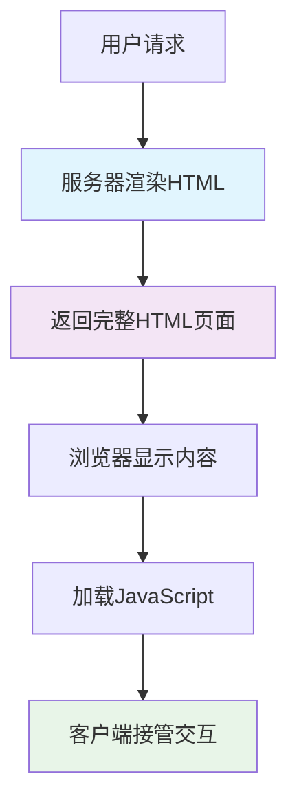

# 服务端渲染 (SSR) 深度解析

> 🌐 从传统服务端渲染到现代同构应用的技术演进与实践指南

## 📖 目录

- [SSR 技术背景](#ssr-技术背景)
- [核心概念解析](#核心概念解析)
- [技术演进历程](#技术演进历程)
- [现代 SSR 方案](#现代-ssr-方案)
- [性能与SEO优化](#性能与seo优化)
- [架构设计原则](#架构设计原则)
- [实施路线图](#实施路线图)
- [相关资源](#相关资源)

---

## 🎯 SSR 技术背景

### 💭 为什么需要服务端渲染？

#### **传统 SPA 的问题**

1. **首屏加载慢**
   - 需要下载完整的 JavaScript 包
   - 客户端执行渲染逻辑
   - 白屏时间长，用户体验差

2. **SEO 友好性差**
   - 搜索引擎爬虫难以执行 JavaScript
   - 动态内容无法被正确索引
   - 影响搜索排名和流量获取

3. **社交分享受限**
   - Open Graph 标签无法动态生成
   - 分享链接预览显示异常
   - 影响内容传播效果

#### **服务端渲染的价值**



**核心优势**：
- ✅ **首屏渲染快** - 服务器直接返回HTML
- ✅ **SEO友好** - 搜索引擎可直接解析内容
- ✅ **社交分享** - 支持动态meta标签
- ✅ **渐进增强** - 即使JavaScript失败也能显示内容

---

## 🔍 核心概念解析

### 🏗️ SSR vs SSG vs CSR

#### **服务端渲染 (SSR)**
```javascript
// 每次请求时在服务器渲染
app.get('/product/:id', async (req, res) => {
  const product = await fetchProduct(req.params.id);
  const html = renderToString(<ProductPage product={product} />);
  res.send(generateHTML(html, product));
});
```

**特点**：
- 🔄 **请求时渲染** - 每次访问都在服务器生成HTML
- 🎯 **动态内容** - 适合频繁变化的数据
- 🚀 **实时性强** - 总是显示最新内容
- 💰 **服务器成本** - 需要更多计算资源

#### **静态站点生成 (SSG)**
```javascript
// 构建时预渲染所有页面
export async function getStaticProps() {
  const posts = await fetchAllPosts();
  return {
    props: { posts },
    revalidate: 3600 // 1小时后重新验证
  };
}
```

**特点**：
- 📦 **构建时渲染** - 预先生成所有静态HTML
- 🚀 **极速访问** - CDN直接分发静态文件
- 💰 **成本低廉** - 无需服务器实时计算
- 📊 **适合静态内容** - 博客、文档、营销页面

#### **客户端渲染 (CSR)**
```javascript
// 浏览器中渲染所有内容
function App() {
  const [data, setData] = useState(null);
  
  useEffect(() => {
    fetchData().then(setData);
  }, []);
  
  return data ? <Content data={data} /> : <Loading />;
}
```

**特点**：
- 🖥️ **浏览器渲染** - 所有逻辑在客户端执行
- 🔄 **灵活交互** - 丰富的用户体验
- 📱 **SPA体验** - 页面切换无刷新
- ⚠️ **SEO限制** - 搜索引擎支持有限

### 🔄 同构应用 (Isomorphic/Universal)

```javascript
// 同一套代码在服务端和客户端运行
const App = ({ initialData }) => {
  const [data, setData] = useState(initialData);
  
  // 同构数据获取
  useEffect(() => {
    if (!initialData) {
      fetchData().then(setData);
    }
  }, [initialData]);
  
  return <ProductList data={data} />;
};

// 服务端
const serverHtml = renderToString(<App initialData={serverData} />);

// 客户端
hydrate(<App initialData={window.__INITIAL_DATA__} />, document.getElementById('root'));
```

**核心思想**：
- 📝 **一套代码** - 服务端和客户端共享组件逻辑
- 🔄 **数据同步** - 服务端渲染的数据传递给客户端
- 🚀 **无缝接管** - 客户端JavaScript接管已渲染的DOM
- ⚡ **最佳体验** - 结合SSR和CSR的优势

---

## 📈 技术演进历程

### 🏛️ 传统服务端渲染时代 (1990s-2000s)

```php
<!-- PHP/ASP/JSP 时代 -->
<html>
<body>
  <h1><?php echo $title; ?></h1>
  <?php foreach($products as $product): ?>
    <div><?php echo $product->name; ?></div>
  <?php endforeach; ?>
</body>
</html>
```

**特点**：
- 🔄 每次请求完整页面刷新
- 🗄️ 服务器直接查询数据库渲染HTML
- 📄 页面间跳转需要重新加载
- 🎯 SEO友好，但用户体验一般

### 🌐 AJAX 与部分刷新时代 (2000s-2010s)

```javascript
// jQuery AJAX 时代
$.ajax({
  url: '/api/products',
  success: function(data) {
    $('#products').html(renderProducts(data));
  }
});
```

**特点**：
- 🔄 部分页面内容异步更新
- 🚀 提升用户体验，减少页面刷新
- 🧩 前后端职责开始分离
- ⚠️ SEO和浏览器历史管理复杂

### ⚡ SPA 单页应用时代 (2010s)

```javascript
// React/Vue/Angular 兴起
function ProductApp() {
  const [products, setProducts] = useState([]);
  
  useEffect(() => {
    fetch('/api/products')
      .then(res => res.json())
      .then(setProducts);
  }, []);
  
  return <ProductList products={products} />;
}
```

**特点**：
- 📱 原生应用般的用户体验
- 🎯 前端框架生态成熟
- 🔄 客户端路由管理
- ⚠️ SEO和首屏性能问题凸显

### 🔄 现代同构应用时代 (2015s-至今)

```javascript
// Next.js/Nuxt.js 等框架
export async function getServerSideProps({ params }) {
  const product = await fetchProduct(params.id);
  return {
    props: { product }
  };
}

export default function ProductPage({ product }) {
  return <ProductDetail product={product} />;
}
```

**特点**：
- 🎯 结合SSR和SPA的优势
- 🚀 框架提供开箱即用的解决方案
- ⚡ 自动代码分割和优化
- 🌐 边缘计算和CDN集成

---

## 🛠️ 现代 SSR 方案

### 🚀 Next.js - React 生态的领军者

#### **核心特性**

```javascript
// pages/products/[id].js
export async function getServerSideProps(context) {
  const { id } = context.params;
  const product = await fetchProduct(id);
  
  return {
    props: {
      product,
      timestamp: Date.now()
    }
  };
}

export default function ProductPage({ product, timestamp }) {
  return (
    <div>
      <h1>{product.name}</h1>
      <p>渲染时间: {new Date(timestamp).toLocaleString()}</p>
    </div>
  );
}
```

**技术优势**：
- 📦 **零配置** - 开箱即用的文件系统路由
- 🔄 **多种渲染模式** - SSR/SSG/ISR灵活选择
- ⚡ **性能优化** - 自动代码分割、图片优化
- 🌐 **边缘部署** - Vercel平台深度集成

**适用场景**：
- 🏢 企业级应用
- 🛒 电商平台
- 📰 内容管理系统
- 📱 移动端优先的应用

#### **增量静态再生 (ISR)**

```javascript
export async function getStaticProps() {
  const posts = await fetchPosts();
  
  return {
    props: { posts },
    revalidate: 60 // 60秒后重新验证
  };
}
```

**创新点**：
- 🔄 **按需重新生成** - 访问时触发静态页面更新
- 🚀 **最佳性能** - 结合SSG的速度和SSR的实时性
- 💰 **成本控制** - 减少服务器计算压力

### 🎵 Remix - 现代Web标准的拥护者

#### **设计哲学**

```javascript
// routes/products/$productId.tsx
export async function loader({ params }) {
  const product = await getProduct(params.productId);
  return json(product);
}

export async function action({ request, params }) {
  const formData = await request.formData();
  await updateProduct(params.productId, formData);
  return redirect(`/products/${params.productId}`);
}

export default function ProductRoute() {
  const product = useLoaderData();
  const actionData = useActionData();
  
  return (
    <Form method="post">
      <input name="name" defaultValue={product.name} />
      <button type="submit">更新</button>
      {actionData?.error && <p>{actionData.error}</p>}
    </Form>
  );
}
```

**核心理念**：
- 🌐 **Web标准优先** - 基于Web平台API设计
- 🔄 **嵌套路由** - 组件化的数据加载和错误处理
- 📝 **表单优先** - 渐进增强的用户交互
- ⚡ **性能为王** - 优化的数据获取和缓存策略

**技术特色**：

```javascript
// 嵌套数据加载
export function loader() {
  return json({
    user: getUser(),
    notifications: getNotifications()
  });
}

// 错误边界
export function ErrorBoundary({ error }) {
  return (
    <div>
      <h1>糟糕！出现了错误</h1>
      <p>{error.message}</p>
    </div>
  );
}
```

**适用场景**：
- 📱 **原生Web体验** - 注重标准和性能
- 🔄 **表单密集应用** - 后台管理系统
- 🚀 **渐进式应用** - 需要离线支持
- 🌐 **多平台部署** - 不绑定特定云服务

### 🔧 自定义 SSR 解决方案

#### **基础架构**

```javascript
// server.js
import express from 'express';
import React from 'react';
import { renderToString } from 'react-dom/server';
import { StaticRouter } from 'react-router-dom/server';
import App from './App';

const server = express();

server.get('*', async (req, res) => {
  try {
    // 数据预取
    const initialData = await fetchInitialData(req.path);
    
    // 服务端渲染
    const html = renderToString(
      <StaticRouter location={req.url}>
        <App initialData={initialData} />
      </StaticRouter>
    );
    
    // 生成完整HTML
    const fullHtml = `
      <!DOCTYPE html>
      <html>
        <head>
          <title>My SSR App</title>
          <meta charset="utf-8">
        </head>
        <body>
          <div id="root">${html}</div>
          <script>
            window.__INITIAL_DATA__ = ${JSON.stringify(initialData)};
          </script>
          <script src="/bundle.js"></script>
        </body>
      </html>
    `;
    
    res.send(fullHtml);
  } catch (error) {
    res.status(500).send('Server Error');
  }
});
```

#### **客户端水合**

```javascript
// client.js
import React from 'react';
import { hydrateRoot } from 'react-dom/client';
import { BrowserRouter } from 'react-router-dom';
import App from './App';

const initialData = window.__INITIAL_DATA__;

hydrateRoot(
  document.getElementById('root'),
  <BrowserRouter>
    <App initialData={initialData} />
  </BrowserRouter>
);
```

**实现要点**：
- 🔄 **状态同步** - 服务端和客户端状态一致
- 📦 **代码分割** - 按需加载减少包大小
- 🚀 **性能监控** - 渲染时间和错误追踪
- 🛡️ **错误处理** - 优雅降级到客户端渲染

---

## 🚀 性能与SEO优化

### ⚡ 首屏性能优化

#### **关键性能指标**

```javascript
// 性能监控
function measurePerformance() {
  const timing = performance.timing;
  const metrics = {
    // 首字节时间
    TTFB: timing.responseStart - timing.requestStart,
    // 首次内容绘制
    FCP: performance.getEntriesByName('first-contentful-paint')[0]?.startTime,
    // 最大内容绘制
    LCP: performance.getEntriesByName('largest-contentful-paint')[0]?.startTime,
    // 首次输入延迟
    FID: performance.getEntriesByName('first-input')[0]?.processingStart - 
         performance.getEntriesByName('first-input')[0]?.startTime
  };
  
  return metrics;
}
```

#### **优化策略**

1. **数据预取优化**
```javascript
// 并行数据获取
export async function getServerSideProps() {
  const [user, products, categories] = await Promise.all([
    fetchUser(),
    fetchProducts(),
    fetchCategories()
  ]);
  
  return {
    props: { user, products, categories }
  };
}
```

2. **资源优化**
```javascript
// 关键资源预加载
<head>
  <link rel="preload" href="/fonts/main.woff2" as="font" type="font/woff2" crossOrigin />
  <link rel="preload" href="/api/critical-data" as="fetch" crossOrigin />
  <link rel="dns-prefetch" href="//cdn.example.com" />
</head>
```

3. **代码分割策略**
```javascript
// 路由级别分割
const ProductPage = lazy(() => import('./pages/ProductPage'));
const UserPage = lazy(() => import('./pages/UserPage'));

// 组件级别分割
const HeavyChart = lazy(() => import('./components/HeavyChart'));
```

### 🔍 SEO 深度优化

#### **动态元数据生成**

```javascript
// Next.js 动态 meta 标签
export async function generateMetadata({ params }) {
  const product = await fetchProduct(params.id);
  
  return {
    title: `${product.name} - 我的商店`,
    description: product.description,
    openGraph: {
      title: product.name,
      description: product.description,
      images: [product.image],
      type: 'product'
    },
    twitter: {
      card: 'summary_large_image',
      title: product.name,
      description: product.description,
      images: [product.image]
    }
  };
}
```

#### **结构化数据**

```javascript
// JSON-LD 结构化数据
function ProductStructuredData({ product }) {
  const structuredData = {
    "@context": "https://schema.org",
    "@type": "Product",
    "name": product.name,
    "description": product.description,
    "image": product.images,
    "offers": {
      "@type": "Offer",
      "price": product.price,
      "priceCurrency": "CNY",
      "availability": "https://schema.org/InStock"
    },
    "aggregateRating": {
      "@type": "AggregateRating",
      "ratingValue": product.rating,
      "reviewCount": product.reviewCount
    }
  };
  
  return (
    <script
      type="application/ld+json"
      dangerouslySetInnerHTML={{ __html: JSON.stringify(structuredData) }}
    />
  );
}
```

#### **SEO 最佳实践清单**

- ✅ **语义化HTML** - 正确使用HTML标签
- ✅ **URL优化** - 简洁、描述性的URL结构
- ✅ **页面标题** - 独特、相关的页面标题
- ✅ **元描述** - 吸引人的meta description
- ✅ **图片优化** - alt属性和适当的文件大小
- ✅ **内部链接** - 合理的站内链接结构
- ✅ **网站地图** - 自动生成sitemap.xml
- ✅ **移动友好** - 响应式设计和移动优化

---

## 🏗️ 架构设计原则

### 🔧 可扩展架构模式

#### **微服务化 SSR**

```javascript
// 服务拆分示例
const services = {
  user: 'https://user-service.example.com',
  product: 'https://product-service.example.com',
  order: 'https://order-service.example.com'
};

async function fetchPageData(pageType, params) {
  switch (pageType) {
    case 'product':
      return Promise.all([
        fetch(`${services.product}/api/products/${params.id}`),
        fetch(`${services.user}/api/user/recommendations/${params.id}`)
      ]);
    case 'profile':
      return Promise.all([
        fetch(`${services.user}/api/users/${params.id}`),
        fetch(`${services.order}/api/orders?userId=${params.id}`)
      ]);
  }
}
```

#### **分层缓存策略**

```javascript
// 多级缓存架构
class CacheManager {
  constructor() {
    this.l1Cache = new Map(); // 内存缓存
    this.l2Cache = new Redis(); // Redis缓存
    this.l3Cache = new CDN(); // CDN缓存
  }
  
  async get(key) {
    // L1: 内存缓存
    if (this.l1Cache.has(key)) {
      return this.l1Cache.get(key);
    }
    
    // L2: Redis 缓存
    const l2Data = await this.l2Cache.get(key);
    if (l2Data) {
      this.l1Cache.set(key, l2Data);
      return l2Data;
    }
    
    // L3: 数据库/API
    const freshData = await this.fetchFromSource(key);
    this.l1Cache.set(key, freshData);
    this.l2Cache.set(key, freshData, 3600); // 1小时
    
    return freshData;
  }
}
```

### 🛡️ 错误处理与降级

#### **渐进式错误处理**

```javascript
// 错误边界与降级策略
function SSRErrorBoundary({ children, fallback }) {
  return (
    <ErrorBoundary
      onError={(error, errorInfo) => {
        // 错误上报
        reportError(error, errorInfo);
        
        // 降级到客户端渲染
        if (typeof window === 'undefined') {
          // 服务端错误，返回基础HTML
          return fallback;
        }
      }}
    >
      {children}
    </ErrorBoundary>
  );
}

// 使用示例
<SSRErrorBoundary fallback={<BasicLayout />}>
  <ComplexDashboard />
</SSRErrorBoundary>
```

#### **服务降级机制**

```javascript
// 服务降级配置
const fallbackStrategies = {
  // 数据服务不可用时的降级
  dataServiceDown: {
    useCache: true,
    cacheMaxAge: 3600,
    fallbackToCSR: true
  },
  
  // 渲染服务超时降级
  renderTimeout: {
    maxWaitTime: 2000,
    fallbackToCSR: true,
    skipNonCritical: true
  }
};

async function renderWithFallback(component, props) {
  try {
    return await Promise.race([
      renderToString(component, props),
      new Promise((_, reject) => 
        setTimeout(() => reject(new Error('Render timeout')), 2000)
      )
    ]);
  } catch (error) {
    // 降级到客户端渲染
    return generateCSRFallback(props);
  }
}
```

---

## 📊 实施路线图

### 🎯 阶段一：基础建设 (1-2周)

#### **技术选型与架构设计**
- [ ] **方案评估** - Next.js vs Remix vs 自定义方案
- [ ] **架构设计** - 服务器架构和部署策略
- [ ] **环境搭建** - 开发、测试、生产环境
- [ ] **基础配置** - 路由、样式、构建工具

#### **核心功能实现**
```javascript
// 基础SSR配置示例
const nextConfig = {
  experimental: {
    serverComponentsExternalPackages: ['some-package']
  },
  images: {
    domains: ['cdn.example.com']
  },
  i18n: {
    locales: ['zh', 'en'],
    defaultLocale: 'zh'
  }
};
```

### 🚀 阶段二：性能优化 (2-3周)

#### **渲染性能优化**
- [ ] **数据预取** - 并行数据获取策略
- [ ] **代码分割** - 路由和组件级别分割
- [ ] **缓存策略** - 多级缓存实现
- [ ] **资源优化** - 图片、字体、CSS优化

#### **监控与度量**
```javascript
// 性能监控集成
function setupPerformanceMonitoring() {
  // Web Vitals监控
  getCLS(sendToAnalytics);
  getFID(sendToAnalytics);
  getFCP(sendToAnalytics);
  getLCP(sendToAnalytics);
  getTTFB(sendToAnalytics);
}
```

### 🔍 阶段三：SEO深度优化 (1-2周)

#### **搜索引擎优化**
- [ ] **元数据管理** - 动态title、description、OG标签
- [ ] **结构化数据** - JSON-LD schema实现
- [ ] **网站地图** - 动态sitemap生成
- [ ] **移动优化** - 响应式设计和PWA

#### **内容优化**
```javascript
// SEO组件封装
function SEOHead({ title, description, image, url }) {
  return (
    <Head>
      <title>{title}</title>
      <meta name="description" content={description} />
      <meta property="og:title" content={title} />
      <meta property="og:description" content={description} />
      <meta property="og:image" content={image} />
      <meta property="og:url" content={url} />
      <link rel="canonical" href={url} />
    </Head>
  );
}
```

### 🛡️ 阶段四：生产部署 (1周)

#### **部署与运维**
- [ ] **CI/CD流程** - 自动化构建和部署
- [ ] **监控告警** - 性能监控和错误追踪
- [ ] **安全防护** - HTTPS、CSP、安全头设置
- [ ] **容灾备份** - 多区域部署和故障转移

---

## 🎯 最佳实践总结

### ✅ **做得对的事情**

1. **合理选择渲染策略**
   - 静态内容使用SSG
   - 动态内容使用SSR
   - 交互密集使用CSR

2. **性能优先设计**
   - 数据预取和并行加载
   - 合理的缓存策略
   - 代码分割和懒加载

3. **SEO友好实现**
   - 语义化HTML结构
   - 完善的元数据管理
   - 结构化数据支持

### ❌ **常见错误避免**

1. **过度SSR**
   - 不是所有内容都需要服务端渲染
   - 合理权衡性能和复杂度

2. **忽视缓存策略**
   - 没有合适的缓存会严重影响性能
   - 缓存失效策略要合理

3. **水合失败**
   - 服务端和客户端状态不一致
   - 动态内容处理不当

### 🚀 **企业级实施建议**

1. **团队协作**
   - 前后端协作机制
   - 代码规范和最佳实践
   - 知识分享和培训

2. **监控运维**
   - 完善的监控体系
   - 性能指标追踪
   - 用户体验监控

3. **持续优化**
   - 定期性能评估
   - 用户反馈收集
   - 技术方案迭代

---

## 📚 相关资源

### 🔗 **实践项目**
- [SSR Solutions Demo](http://localhost:3009) - 多种SSR方案对比演示
- [Next.js 企业级实践](http://localhost:3009/nextjs) - Next.js最佳实践展示
- [Remix 现代Web应用](http://localhost:3009/remix) - Remix框架特性演示
- [自定义SSR解决方案](http://localhost:3009/custom) - 从零构建SSR架构

### 📖 **学习资源**
- [React Server Components RFC](https://github.com/reactjs/rfcs/blob/main/text/0188-server-components.md)
- [Next.js 官方文档](https://nextjs.org/docs)
- [Remix 官方指南](https://remix.run/docs)
- [Web.dev SSR 指南](https://web.dev/rendering-on-the-web/)

### 🛠️ **开发工具**
- [React Developer Tools](https://react.dev/learn/react-developer-tools)
- [Next.js Bundle Analyzer](https://www.npmjs.com/package/@next/bundle-analyzer)
- [Lighthouse CI](https://github.com/GoogleChrome/lighthouse-ci)
- [React Server Components DevTools](https://www.npmjs.com/package/react-server-dom-webpack)

---

*本文档基于10年React开发经验总结，持续更新中... 🚀*

> 💡 **学习建议**: 结合理论学习和实践项目，深入理解现代Web应用的渲染策略和性能优化技术。
