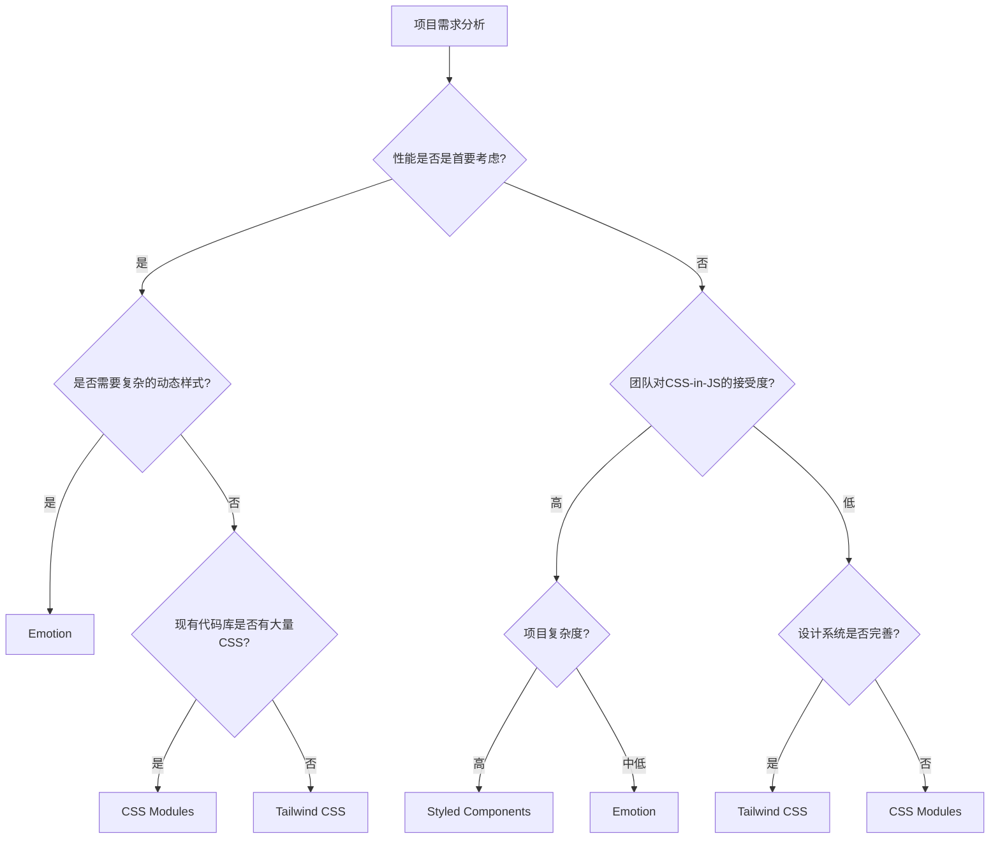

# React 样式解决方案深度解析

> 🎨 从原生CSS到现代工程化方案的演进历程，企业级样式架构设计与最佳实践

## 📋 概述

样式管理是前端开发中最具挑战性的问题之一。从简单的CSS文件到复杂的样式系统，从全局样式冲突到组件级别的样式隔离，前端样式技术在过去二十年经历了翻天覆地的变化。

在React生态中，样式解决方案更是百花齐放：CSS Modules、CSS-in-JS、Atomic CSS等各种方案都有其独特的优势和适用场景。本文将深入分析现代样式解决方案的本质、演进历程以及在不同场景下的技术选型。

## 🤔 为什么样式管理如此复杂？

### 🎨 CSS的天生局限性

CSS设计之初是为文档样式而生，面对现代应用开发暴露出诸多问题：

```css
/* 全局作用域 - 样式污染的根源 */
.button {
  background: blue;
  color: white;
}

/* 在另一个文件中 */
.button {
  background: red; /* 覆盖了前面的样式 */
}

/* 特异性问题 */
.nav .button { background: green; }     /* 特异性: 0,2,0 */
#sidebar .button { background: yellow; } /* 特异性: 1,1,0 - 优先级更高 */

/* 级联副作用 */
.container p {
  font-size: 14px; /* 影响所有子元素的 p 标签 */
}
```

**CSS的核心问题**：
- 🔴 **全局作用域** - 样式容易冲突和污染
- 🔴 **级联副作用** - 样式变更影响范围难以预测
- 🔴 **特异性战争** - 选择器优先级导致维护困难
- 🔴 **无模块化** - 缺乏依赖管理和模块边界
- 🔴 **运行时动态性差** - 难以根据状态动态生成样式

### 🏗️ 现代应用的样式需求

现代React应用对样式系统提出了更高要求：

```jsx
// 组件化开发需求
function Button({ variant, size, disabled, children }) {
  // 需要根据props动态生成样式
  const className = generateButtonClass({ variant, size, disabled });
  
  return (
    <button className={className} disabled={disabled}>
      {children}
    </button>
  );
}

// 主题系统需求
function App() {
  const theme = useTheme(); // dark / light
  
  return (
    <div className={`app ${theme}`}>
      {/* 所有组件都要响应主题变化 */}
    </div>
  );
}

// 响应式设计需求
function Card() {
  return (
    <div className="card">
      {/* 需要在不同屏幕尺寸下表现不同 */}
    </div>
  );
}
```

**现代应用的样式挑战**：
- ⚡ **动态样式** - 基于props、state、context的样式计算
- 🎨 **主题系统** - 支持多主题切换和自定义
- 📱 **响应式设计** - 跨设备的一致体验
- 🚀 **性能优化** - 样式的按需加载和运行时优化
- 🔧 **开发体验** - 类型安全、自动补全、调试友好
- 🏢 **工程化需求** - 样式的模块化、复用和维护

## 📚 样式技术发展史

### 🏺 史前时代：原生CSS（1996-2010）

最初的Web开发使用纯CSS文件：

```html
<!-- HTML -->
<link rel="stylesheet" href="styles.css">
<div class="header">
  <h1 class="title">Welcome</h1>
  <nav class="navigation">
    <a href="/" class="nav-link active">Home</a>
    <a href="/about" class="nav-link">About</a>
  </nav>
</div>
```

```css
/* styles.css */
.header {
  background: #333;
  padding: 20px;
}

.title {
  color: white;
  margin: 0;
}

.navigation {
  margin-top: 10px;
}

.nav-link {
  color: #ccc;
  text-decoration: none;
  margin-right: 20px;
}

.nav-link.active {
  color: white;
  font-weight: bold;
}
```

**原生CSS的问题**：
- ❌ 样式与组件分离，维护困难
- ❌ 全局作用域，样式冲突频发
- ❌ 缺乏变量和函数，重复代码多
- ❌ 难以实现复杂的条件样式

### 🔧 预处理器时代：Sass/Less（2007-2015）

CSS预处理器引入了编程语言特性：

```scss
// variables.scss
$primary-color: #3498db;
$secondary-color: #2ecc71;
$border-radius: 4px;
$breakpoints: (
  mobile: 480px,
  tablet: 768px,
  desktop: 1024px
);

// mixins.scss
@mixin button-style($bg-color, $text-color: white) {
  background: $bg-color;
  color: $text-color;
  border: none;
  border-radius: $border-radius;
  padding: 12px 24px;
  cursor: pointer;
  
  &:hover {
    background: darken($bg-color, 10%);
  }
  
  &:disabled {
    background: #ccc;
    cursor: not-allowed;
  }
}

@mixin responsive($breakpoint) {
  @media (min-width: map-get($breakpoints, $breakpoint)) {
    @content;
  }
}

// components.scss
.button {
  @include button-style($primary-color);
  
  &.secondary {
    @include button-style($secondary-color);
  }
  
  &.large {
    padding: 16px 32px;
    font-size: 18px;
  }
}

.card {
  background: white;
  border-radius: $border-radius;
  box-shadow: 0 2px 4px rgba(0,0,0,0.1);
  
  @include responsive(tablet) {
    display: flex;
    align-items: center;
  }
  
  .title {
    font-size: 18px;
    
    @include responsive(desktop) {
      font-size: 24px;
    }
  }
}
```

**预处理器的优势**：
- ✅ **变量系统** - 统一管理设计token
- ✅ **嵌套语法** - 更清晰的层级关系
- ✅ **Mixins** - 样式代码复用
- ✅ **函数** - 动态计算样式值

**仍然存在的问题**：
- ❌ **全局作用域** - 样式冲突问题依然存在
- ❌ **运行时动态性** - 无法基于JavaScript状态生成样式
- ❌ **组件耦合度低** - 样式与组件逻辑分离

### 🎣 React时代：内联样式与CSS Modules（2013-2016）

React引入了组件化思想，推动了样式方案的革新：

#### 内联样式（Inline Styles）

```jsx
// 内联样式 - React的早期尝试
const buttonStyles = {
  background: '#3498db',
  color: 'white',
  border: 'none',
  borderRadius: '4px',
  padding: '12px 24px',
  cursor: 'pointer'
};

const hoverStyles = {
  background: '#2980b9'
};

function Button({ children, variant = 'primary' }) {
  const [isHovered, setIsHovered] = useState(false);
  
  const styles = {
    ...buttonStyles,
    ...(variant === 'secondary' && { background: '#2ecc71' }),
    ...(isHovered && hoverStyles)
  };
  
  return (
    <button
      style={styles}
      onMouseEnter={() => setIsHovered(true)}
      onMouseLeave={() => setIsHovered(false)}
    >
      {children}
    </button>
  );
}
```

**内联样式的优势**：
- ✅ **完全隔离** - 样式只作用于当前元素
- ✅ **动态性强** - 可以基于props和state生成样式
- ✅ **组件封装** - 样式与组件逻辑紧密结合

**内联样式的局限**：
- ❌ **功能受限** - 不支持伪类、媒体查询、关键帧动画
- ❌ **性能问题** - 每次渲染都会创建新的样式对象
- ❌ **开发体验差** - 缺乏CSS的强大功能

#### CSS Modules

```css
/* Button.module.css */
.button {
  background: #3498db;
  color: white;
  border: none;
  border-radius: 4px;
  padding: 12px 24px;
  cursor: pointer;
  transition: background 0.2s;
}

.button:hover {
  background: #2980b9;
}

.button:disabled {
  background: #bdc3c7;
  cursor: not-allowed;
}

.secondary {
  background: #2ecc71;
}

.secondary:hover {
  background: #27ae60;
}

.large {
  padding: 16px 32px;
  font-size: 18px;
}
```

```jsx
// Button.jsx
import styles from './Button.module.css';
import classnames from 'classnames';

function Button({ 
  children, 
  variant = 'primary', 
  size = 'medium', 
  disabled = false,
  onClick 
}) {
  const className = classnames(
    styles.button,
    {
      [styles.secondary]: variant === 'secondary',
      [styles.large]: size === 'large'
    }
  );
  
  return (
    <button 
      className={className} 
      disabled={disabled}
      onClick={onClick}
    >
      {children}
    </button>
  );
}
```

#### 🔬 CSS Modules 深度源码解析

让我们深入了解 CSS Modules 是如何实现作用域隔离的。这不是魔法，而是巧妙的编译时转换：

**第一步：CSS 解析与转换**

```javascript
// webpack css-loader 的核心转换逻辑（简化版）
function processCSSModules(cssContent, filename) {
  const ast = postcss.parse(cssContent);
  const classMap = {};
  
  // 遍历所有CSS规则
  ast.walkRules(rule => {
    // 解析选择器中的类名
    rule.selector = rule.selector.replace(/\.([a-zA-Z_-][a-zA-Z0-9_-]*)/g, (match, className) => {
      // 生成唯一的类名
      const uniqueClassName = generateUniqueClassName(className, filename);
      classMap[className] = uniqueClassName;
      
      return `.${uniqueClassName}`;
    });
  });
  
  return {
    css: ast.toString(), // 转换后的CSS
    classMap // 类名映射表
  };
}

function generateUniqueClassName(originalName, filename) {
  // 基于文件路径和类名生成哈希
  const hash = crypto
    .createHash('md5')
    .update(filename + originalName)
    .digest('hex')
    .substring(0, 8);
    
  return `${originalName}_${hash}`;
}
```

**第二步：JavaScript 模块生成**

```javascript
// 原始 Button.module.css
/*
.button { background: blue; }
.primary { background: red; }
.large { font-size: 18px; }
*/

// 经过 css-loader 处理后生成的 JavaScript 模块
export default {
  "button": "button_a1b2c3d4",
  "primary": "primary_e5f6g7h8", 
  "large": "large_i9j0k1l2"
};

// 同时生成转换后的CSS文件
/*
.button_a1b2c3d4 { background: blue; }
.primary_e5f6g7h8 { background: red; }
.large_i9j0k1l2 { font-size: 18px; }
*/
```

**第三步：运行时类名映射**

```jsx
// 编译前的 React 组件
import styles from './Button.module.css';

function Button({ variant, size }) {
  return (
    <button className={`${styles.button} ${styles[variant]} ${styles[size]}`}>
      Click me
    </button>
  );
}

// 实际执行时的类名映射
function Button({ variant, size }) {
  return (
    <button className="button_a1b2c3d4 primary_e5f6g7h8 large_i9j0k1l2">
      Click me
    </button>
  );
}
```

**关键技术洞察**：

1. **编译时哈希生成**：CSS Modules 的核心是在构建时为每个类名生成唯一标识符，通常基于文件路径 + 类名 + 内容哈希。

2. **模块系统集成**：将 CSS 转换为 JavaScript 模块，使类名可以像变量一样被引用，获得了 IDE 支持和类型检查。

3. **零运行时开销**：所有转换都在构建时完成，运行时只是普通的CSS类名，没有额外的JavaScript执行开销。

```javascript
// 深入 postcss-modules 插件的实现原理
class CSSModulesPlugin {
  constructor(options = {}) {
    this.generateScopedName = options.generateScopedName || this.defaultGenerator;
    this.getJSON = options.getJSON || (() => {});
  }
  
  defaultGenerator(name, filename, css) {
    // 生成作用域类名的默认策略
    const hash = crypto.createHash('md5');
    hash.update(css); // 基于CSS内容
    hash.update(filename); // 基于文件路径
    
    return `${name}_${hash.digest('hex').substr(0, 8)}`;
  }
  
  process(css, from) {
    const exports = {};
    const plugins = [
      // 提取和转换类名
      localByDefault({ mode: 'local' }),
      extractImports(),
      localByDefault({ mode: 'global' }),
      scopePlugin({
        generateScopedName: this.generateScopedName,
        exportGlobals: true
      })
    ];
    
    return postcss(plugins)
      .process(css, { from })
      .then(result => {
        // 收集导出的类名映射
        result.messages.forEach(message => {
          if (message.type === 'export') {
            exports[message.name] = message.value;
          }
        });
        
        // 调用 getJSON 回调，让 webpack 可以生成 JS 模块
        this.getJSON(from, exports);
        
        return result.css;
      });
  }
}
```

**CSS Modules的优势**：
- ✅ **作用域隔离** - 通过编译时类名转换实现真正的样式隔离
- ✅ **CSS功能完整** - 支持所有CSS特性，包括伪类、媒体查询、动画
- ✅ **编译时优化** - 零运行时开销，最终输出的是优化后的静态CSS
- ✅ **开发体验好** - 保持CSS的编写方式，同时获得JavaScript模块系统的好处
- ✅ **类型安全** - 配合TypeScript可以获得类名的类型检查和自动补全

### 🌟 CSS-in-JS革命：Styled Components时代（2016-2020）

CSS-in-JS彻底改变了样式编写方式：

```jsx
import styled, { css, ThemeProvider } from 'styled-components';

// 主题定义
const theme = {
  colors: {
    primary: '#3498db',
    secondary: '#2ecc71',
    grey: '#95a5a6'
  },
  spacing: {
    small: '8px',
    medium: '16px',
    large: '24px'
  },
  breakpoints: {
    mobile: '480px',
    tablet: '768px',
    desktop: '1024px'
  }
};

// 基础样式组件
const Button = styled.button`
  background: ${props => props.theme.colors.primary};
  color: white;
  border: none;
  border-radius: 4px;
  padding: ${props => props.theme.spacing.medium};
  cursor: pointer;
  font-size: 16px;
  transition: all 0.2s ease;
  
  ${props => props.variant === 'secondary' && css`
    background: ${props.theme.colors.secondary};
  `}
  
  ${props => props.size === 'large' && css`
    padding: ${props.theme.spacing.large};
    font-size: 18px;
  `}
  
  ${props => props.fullWidth && css`
    width: 100%;
  `}
  
  &:hover {
    opacity: 0.9;
    transform: translateY(-1px);
  }
  
  &:disabled {
    background: ${props => props.theme.colors.grey};
    cursor: not-allowed;
    transform: none;
  }
  
  @media (max-width: ${props => props.theme.breakpoints.mobile}) {
    font-size: 14px;
    padding: ${props => props.theme.spacing.small};
  }
`;

// 复杂的组合组件
const Card = styled.div`
  background: white;
  border-radius: 8px;
  box-shadow: 0 2px 8px rgba(0, 0, 0, 0.1);
  padding: ${props => props.theme.spacing.large};
  
  ${props => props.hoverable && css`
    transition: transform 0.2s ease, box-shadow 0.2s ease;
    
    &:hover {
      transform: translateY(-2px);
      box-shadow: 0 4px 16px rgba(0, 0, 0, 0.15);
    }
  `}
`;

const CardHeader = styled.div`
  display: flex;
  justify-content: space-between;
  align-items: center;
  margin-bottom: ${props => props.theme.spacing.medium};
  
  h3 {
    margin: 0;
    color: #2c3e50;
  }
`;

// 使用示例
function ProductCard({ product, onAddToCart }) {
  return (
    <Card hoverable>
      <CardHeader>
        <h3>{product.name}</h3>
        <span>${product.price}</span>
      </CardHeader>
      
      <p>{product.description}</p>
      
      <Button 
        variant="primary" 
        size="large" 
        fullWidth
        onClick={() => onAddToCart(product)}
      >
        Add to Cart
      </Button>
    </Card>
  );
}

// 应用根组件
function App() {
  return (
    <ThemeProvider theme={theme}>
      <ProductCard product={sampleProduct} onAddToCart={handleAddToCart} />
    </ThemeProvider>
  );
}
```

#### 🔬 Styled Components 深度源码解析

Styled Components 的魔法在于它巧妙地结合了 JavaScript 的灵活性和 CSS 的表达力。让我们深入其内部实现：

**第一步：模板字符串解析**

```javascript
// styled-components 的核心解析引擎（简化版）
function parseTemplateString(strings, ...interpolations) {
  let cssString = '';
  
  // 合并模板字符串和插值
  for (let i = 0; i < strings.length; i++) {
    cssString += strings[i];
    
    if (i < interpolations.length) {
      const interpolation = interpolations[i];
      
      // 处理函数插值（props => props.primary ? 'blue' : 'gray'）
      if (typeof interpolation === 'function') {
        // 标记为动态值，运行时处理
        cssString += `__DYNAMIC_${i}__`;
      } else {
        // 静态值直接插入
        cssString += interpolation;
      }
    }
  }
  
  return {
    staticCSS: cssString,
    dynamicInterpolations: interpolations.filter(i => typeof i === 'function')
  };
}

// 使用示例
const Button = styled.button`
  background: ${props => props.primary ? 'blue' : 'gray'};
  color: white;
  padding: 16px;
`;

// 解析结果
const parsed = parseTemplateString(
  ['background: ', '; color: white; padding: 16px;'],
  props => props.primary ? 'blue' : 'gray'
);
// {
//   staticCSS: "background: __DYNAMIC_0__; color: white; padding: 16px;",
//   dynamicInterpolations: [props => props.primary ? 'blue' : 'gray']
// }
```

**第二步：样式组件工厂**

```javascript
// styled.button 的实现原理
function createStyledComponent(tag) {
  return function styledTemplate(strings, ...interpolations) {
    // 解析模板字符串
    const { staticCSS, dynamicInterpolations } = parseTemplateString(strings, ...interpolations);
    
    // 生成唯一的组件ID
    const componentId = generateComponentId();
    
    // 返回 React 组件
    return React.forwardRef((props, ref) => {
      // 计算动态样式
      const dynamicCSS = dynamicInterpolations.map(fn => fn(props)).join('');
      const finalCSS = staticCSS.replace(/__DYNAMIC_\d+__/g, () => dynamicCSS);
      
      // 生成唯一类名
      const className = `sc-${componentId}`;
      
      // 注入样式到 DOM
      injectStyles(className, finalCSS);
      
      // 渲染组件
      return React.createElement(tag, {
        ...props,
        ref,
        className: `${className} ${props.className || ''}`
      });
    });
  };
}

// styled 对象的实现
const styled = new Proxy({}, {
  get(target, prop) {
    // 动态生成 styled.button, styled.div 等
    return createStyledComponent(prop);
  }
});
```

**第三步：运行时样式注入**

```javascript
// StyleSheet 管理器 - 负责样式的注入和管理
class StyleSheetManager {
  constructor() {
    this.sheet = this.createStyleSheet();
    this.injected = new Set(); // 避免重复注入
  }
  
  createStyleSheet() {
    // 创建或复用 <style> 标签
    let style = document.querySelector('#styled-components');
    if (!style) {
      style = document.createElement('style');
      style.id = 'styled-components';
      style.type = 'text/css';
      document.head.appendChild(style);
    }
    return style.sheet;
  }
  
  injectRule(className, cssRule) {
    const ruleText = `.${className} { ${cssRule} }`;
    
    // 避免重复注入相同的规则
    if (this.injected.has(ruleText)) {
      return;
    }
    
    try {
      // 插入CSS规则到样式表
      this.sheet.insertRule(ruleText, this.sheet.cssRules.length);
      this.injected.add(ruleText);
    } catch (error) {
      console.warn('Failed to inject CSS rule:', ruleText, error);
    }
  }
}

const styleSheetManager = new StyleSheetManager();

function injectStyles(className, css) {
  styleSheetManager.injectRule(className, css);
}
```

**第四步：主题系统实现**

```javascript
// ThemeProvider 的核心实现
const ThemeContext = React.createContext();

function ThemeProvider({ theme, children }) {
  return (
    <ThemeContext.Provider value={theme}>
      {children}
    </ThemeContext.Provider>
  );
}

// 在组件中使用主题
function createStyledComponent(tag) {
  return function styledTemplate(strings, ...interpolations) {
    const { staticCSS, dynamicInterpolations } = parseTemplateString(strings, ...interpolations);
    const componentId = generateComponentId();
    
    return React.forwardRef((props, ref) => {
      // 获取主题
      const theme = React.useContext(ThemeContext);
      
      // 将主题注入到 props 中
      const propsWithTheme = { ...props, theme };
      
      // 计算动态样式（现在包含主题）
      const dynamicCSS = dynamicInterpolations
        .map(fn => fn(propsWithTheme))
        .join('');
      
      const finalCSS = staticCSS.replace(/__DYNAMIC_\d+__/g, () => dynamicCSS);
      const className = `sc-${componentId}`;
      
      injectStyles(className, finalCSS);
      
      return React.createElement(tag, {
        ...props,
        ref,
        className: `${className} ${props.className || ''}`
      });
    });
  };
}
```

**第五步：性能优化机制**

```javascript
// 样式缓存和优化
class StyledComponentsCache {
  constructor() {
    this.componentCache = new Map(); // 组件实例缓存
    this.styleCache = new Map();     // 样式计算缓存
  }
  
  // 基于 props 生成缓存键
  getCacheKey(props) {
    // 只缓存影响样式的 props
    const styleProps = Object.keys(props)
      .filter(key => this.isStyleProp(key))
      .sort()
      .map(key => `${key}:${props[key]}`)
      .join('|');
    
    return styleProps;
  }
  
  // 缓存样式计算结果
  getComputedStyle(componentId, props, interpolations) {
    const cacheKey = `${componentId}:${this.getCacheKey(props)}`;
    
    if (this.styleCache.has(cacheKey)) {
      return this.styleCache.get(cacheKey);
    }
    
    // 计算样式
    const computedStyle = interpolations.map(fn => fn(props)).join('');
    this.styleCache.set(cacheKey, computedStyle);
    
    return computedStyle;
  }
  
  isStyleProp(prop) {
    // 识别哪些 props 会影响样式
    return !['children', 'onClick', 'onHover', 'ref'].includes(prop);
  }
}

const cache = new StyledComponentsCache();
```

**关键技术洞察**：

1. **模板字符串魔法**：利用 ES6 模板字符串的标签函数特性，将 CSS 和 JavaScript 无缝结合。

2. **运行时样式注入**：动态创建和管理 `<style>` 标签，实现样式的按需注入和更新。

3. **React 组件包装**：每个 styled 组件实际上是一个高阶组件，包装了原生 DOM 元素并注入计算后的样式。

4. **上下文主题系统**：通过 React Context 实现全局主题管理，使得任何组件都能访问主题变量。

5. **智能缓存机制**：缓存样式计算结果，避免重复计算，提升运行时性能。

**CSS-in-JS的革命性优势**：
- ✅ **完全的组件化** - 样式与组件逻辑在同一个文件中，真正的"关注点分离"
- ✅ **动态样式** - 基于 props、state、context 的强大样式计算能力  
- ✅ **主题系统** - 内置的主题支持，支持动态切换和深度定制
- ✅ **作用域隔离** - 自动生成唯一类名，彻底解决样式冲突问题
- ✅ **开发体验** - 完整的 TypeScript 支持，语法高亮，自动补全
- ✅ **运行时优化** - 智能缓存和按需注入，减少不必要的样式计算

### ⚡ 现代时代：Atomic CSS与实用优先（2017-至今）

Tailwind CSS代表的实用优先方法学：

```jsx
// Tailwind CSS - 实用优先的方法
function ProductCard({ product, onAddToCart }) {
  return (
    <div className="bg-white rounded-lg shadow-md p-6 hover:shadow-lg hover:-translate-y-1 transition-all duration-200">
      <div className="flex justify-between items-center mb-4">
        <h3 className="text-xl font-semibold text-gray-800 m-0">
          {product.name}
        </h3>
        <span className="text-lg font-bold text-green-600">
          ${product.price}
        </span>
      </div>
      
      <p className="text-gray-600 mb-4 leading-relaxed">
        {product.description}
      </p>
      
      <button 
        className="w-full bg-blue-500 text-white font-medium py-3 px-6 rounded-md hover:bg-blue-600 active:bg-blue-700 transition-colors duration-150 focus:outline-none focus:ring-2 focus:ring-blue-500 focus:ring-offset-2"
        onClick={() => onAddToCart(product)}
      >
        Add to Cart
      </button>
    </div>
  );
}

// 响应式设计
function ResponsiveGrid() {
  return (
    <div className="grid grid-cols-1 md:grid-cols-2 lg:grid-cols-3 xl:grid-cols-4 gap-6 p-6">
      {products.map(product => (
        <ProductCard key={product.id} product={product} />
      ))}
    </div>
  );
}

// 自定义组件类
function CustomButton({ variant = 'primary', size = 'medium', children, ...props }) {
  const baseClasses = "font-medium rounded-md transition-colors duration-150 focus:outline-none focus:ring-2 focus:ring-offset-2";
  
  const variantClasses = {
    primary: "bg-blue-500 text-white hover:bg-blue-600 focus:ring-blue-500",
    secondary: "bg-gray-200 text-gray-800 hover:bg-gray-300 focus:ring-gray-500",
    danger: "bg-red-500 text-white hover:bg-red-600 focus:ring-red-500"
  };
  
  const sizeClasses = {
    small: "py-2 px-3 text-sm",
    medium: "py-3 px-4 text-base",
    large: "py-4 px-6 text-lg"
  };
  
  const className = `${baseClasses} ${variantClasses[variant]} ${sizeClasses[size]}`;
  
  return (
    <button className={className} {...props}>
      {children}
    </button>
  );
}
```

#### 🔬 Tailwind CSS 深度源码解析

Tailwind CSS 的核心是一个强大的编译器，它能够分析你的代码并生成最小化的 CSS。让我们深入了解这个"魔法"：

**第一步：类名扫描与解析**

```javascript
// Tailwind CSS 扫描器的核心实现（简化版）
class TailwindScanner {
  constructor(config) {
    this.config = config;
    this.classMap = new Map(); // 缓存解析结果
    this.usedClasses = new Set(); // 记录使用的类名
  }
  
  // 扫描文件内容，提取类名
  scanContent(content, filePath) {
    // 匹配各种类名格式
    const patterns = [
      /className\s*=\s*["'`]([^"'`]+)["'`]/g,       // React className
      /class\s*=\s*["'`]([^"'`]+)["'`]/g,           // HTML class
      /classList\.add\(['"`]([^'"`]+)['"`]\)/g,     // JavaScript classList
      /@apply\s+([^;]+);/g,                         // CSS @apply
      /clsx\(([^)]+)\)/g,                           // clsx()
      /classnames\(([^)]+)\)/g,                     // classnames()
    ];
    
    const extractedClasses = new Set();
    
    patterns.forEach(pattern => {
      let match;
      while ((match = pattern.exec(content)) !== null) {
        // 分割并清理类名
        const classes = match[1]
          .split(/\s+/)
          .map(cls => cls.trim())
          .filter(cls => cls && this.isValidTailwindClass(cls));
        
        classes.forEach(cls => extractedClasses.add(cls));
      }
    });
    
    return extractedClasses;
  }
  
  // 验证是否为有效的 Tailwind 类名
  isValidTailwindClass(className) {
    // 检查类名是否符合 Tailwind 命名规则
    const tailwindPatterns = [
      /^(m|p)[trblxy]?-\d+$/,           // margin, padding
      /^(w|h)-(\d+|auto|full|screen)$/, // width, height
      /^text-(xs|sm|lg|xl|\d*xl)$/,     // font size
      /^bg-(red|blue|green|gray)-\d{3}$/, // background colors
      /^flex(-\w+)?$/,                  // flexbox
      /^grid(-\w+)?$/,                  // grid
      /^(hidden|block|inline)$/,        // display
      // ... 更多模式
    ];
    
    return tailwindPatterns.some(pattern => pattern.test(className));
  }
}
```

**第二步：CSS 生成引擎**

```javascript
// Tailwind CSS 生成引擎的核心逻辑
class TailwindGenerator {
  constructor(config) {
    this.config = config;
    this.utilities = this.buildUtilityMap();
    this.components = this.buildComponentMap();
  }
  
  // 构建工具类映射表
  buildUtilityMap() {
    const utilities = new Map();
    
    // 间距工具类（margin, padding）
    const spacingScale = this.config.theme.spacing;
    Object.entries(spacingScale).forEach(([key, value]) => {
      utilities.set(`m-${key}`, { margin: value });
      utilities.set(`mt-${key}`, { 'margin-top': value });
      utilities.set(`mr-${key}`, { 'margin-right': value });
      utilities.set(`mb-${key}`, { 'margin-bottom': value });
      utilities.set(`ml-${key}`, { 'margin-left': value });
      utilities.set(`mx-${key}`, { 
        'margin-left': value, 
        'margin-right': value 
      });
      utilities.set(`my-${key}`, { 
        'margin-top': value, 
        'margin-bottom': value 
      });
      
      // 同样处理 padding
      utilities.set(`p-${key}`, { padding: value });
      // ... 更多 padding 变体
    });
    
    // 颜色工具类
    const colors = this.config.theme.colors;
    Object.entries(colors).forEach(([colorName, colorShades]) => {
      if (typeof colorShades === 'object') {
        Object.entries(colorShades).forEach(([shade, value]) => {
          utilities.set(`text-${colorName}-${shade}`, { color: value });
          utilities.set(`bg-${colorName}-${shade}`, { 'background-color': value });
          utilities.set(`border-${colorName}-${shade}`, { 'border-color': value });
        });
      }
    });
    
    // 尺寸工具类
    const sizing = { ...this.config.theme.width, ...this.config.theme.height };
    Object.entries(sizing).forEach(([key, value]) => {
      utilities.set(`w-${key}`, { width: value });
      utilities.set(`h-${key}`, { height: value });
    });
    
    return utilities;
  }
  
  // 生成指定类名的 CSS
  generateCSS(className, variants = []) {
    const utility = this.utilities.get(className);
    if (!utility) {
      return null;
    }
    
    // 构建 CSS 规则
    let cssRule = `.${this.escapeClassName(className)} {\n`;
    Object.entries(utility).forEach(([property, value]) => {
      cssRule += `  ${property}: ${value};\n`;
    });
    cssRule += '}';
    
    // 处理响应式变体
    const responsiveCSS = this.generateResponsiveVariants(className, cssRule, variants);
    
    // 处理伪类变体
    const pseudoCSS = this.generatePseudoVariants(className, cssRule, variants);
    
    return [cssRule, ...responsiveCSS, ...pseudoCSS].join('\n');
  }
  
  // 处理响应式变体
  generateResponsiveVariants(className, baseRule, variants) {
    const responsive = variants.filter(v => this.config.theme.screens[v]);
    return responsive.map(breakpoint => {
      const mediaQuery = this.config.theme.screens[breakpoint];
      return `@media (min-width: ${mediaQuery}) {\n  .${breakpoint}\\:${this.escapeClassName(className)} {\n${baseRule.replace(/^\..*\{/, '').replace(/\}$/, '').split('\n').map(line => `  ${line}`).join('\n')}\n  }\n}`;
    });
  }
  
  // 处理伪类变体
  generatePseudoVariants(className, baseRule, variants) {
    const pseudos = {
      'hover': ':hover',
      'focus': ':focus',
      'active': ':active',
      'disabled': ':disabled',
      'first': ':first-child',
      'last': ':last-child'
    };
    
    return variants
      .filter(v => pseudos[v])
      .map(variant => {
        const pseudo = pseudos[variant];
        return `.${variant}\\:${this.escapeClassName(className)}${pseudo} {\n${baseRule.replace(/^\..*\{/, '').replace(/\}$/, '').split('\n').map(line => `  ${line}`).join('\n')}\n}`;
      });
  }
  
  escapeClassName(className) {
    // 转义特殊字符，如 :、/ 等
    return className.replace(/[:.\/]/g, '\\$&');
  }
}
```

**第三步：智能优化与 Purging**

```javascript
// Tailwind 的 PurgeCSS 集成
class TailwindPurger {
  constructor(config) {
    this.config = config;
    this.safelist = new Set(config.safelist || []);
    this.blocklist = new Set(config.blocklist || []);
  }
  
  // 分析代码中实际使用的类名
  purgeUnusedStyles(generatedCSS, usedClasses) {
    const ast = this.parseCSS(generatedCSS);
    const usedRules = [];
    
    ast.rules.forEach(rule => {
      if (this.shouldKeepRule(rule, usedClasses)) {
        usedRules.push(rule);
      }
    });
    
    // 重建 CSS
    return this.rebuildCSS(usedRules);
  }
  
  shouldKeepRule(rule, usedClasses) {
    // 基础层：始终保留
    if (rule.layer === 'base') {
      return true;
    }
    
    // 组件层：检查是否被使用
    if (rule.layer === 'components') {
      return this.isComponentUsed(rule, usedClasses);
    }
    
    // 工具类层：精确匹配
    if (rule.layer === 'utilities') {
      return this.isUtilityUsed(rule, usedClasses);
    }
    
    return false;
  }
  
  isUtilityUsed(rule, usedClasses) {
    // 提取规则对应的类名
    const classNames = this.extractClassNames(rule.selector);
    
    return classNames.some(className => {
      // 检查完整类名
      if (usedClasses.has(className)) {
        return true;
      }
      
      // 检查动态类名（如 text-red-${shade}）
      return this.checkDynamicMatch(className, usedClasses);
    });
  }
  
  checkDynamicMatch(className, usedClasses) {
    // 处理动态生成的类名
    const patterns = [
      /^(\w+)-(\w+)-\d+$/,  // text-red-500
      /^(\w+)-\d+$/,        // p-4, m-8
      /^(\w+)-(sm|md|lg|xl)$/ // text-sm, text-lg
    ];
    
    return Array.from(usedClasses).some(usedClass => {
      return patterns.some(pattern => {
        const match1 = className.match(pattern);
        const match2 = usedClass.match(pattern);
        return match1 && match2 && match1[1] === match2[1];
      });
    });
  }
}
```

**第四步：JIT (Just-In-Time) 编译**

```javascript
// Tailwind JIT 编译器 - 实时生成样式
class TailwindJIT {
  constructor(config) {
    this.config = config;
    this.cache = new Map();
    this.watcher = null;
  }
  
  // 启动 JIT 模式
  start() {
    // 监听文件变化
    this.watcher = chokidar.watch(this.config.content, {
      ignored: /node_modules/,
      persistent: true
    });
    
    this.watcher.on('change', (filePath) => {
      this.processFile(filePath);
    });
  }
  
  // 处理单个文件
  async processFile(filePath) {
    const content = await fs.readFile(filePath, 'utf8');
    const newClasses = this.extractClasses(content);
    
    // 增量生成 CSS
    const newCSS = this.generateIncrementalCSS(newClasses);
    
    if (newCSS) {
      // 热更新 CSS
      this.updateStyles(newCSS);
    }
  }
  
  // 增量生成 CSS
  generateIncrementalCSS(newClasses) {
    const uncachedClasses = newClasses.filter(cls => !this.cache.has(cls));
    
    if (uncachedClasses.length === 0) {
      return null;
    }
    
    let css = '';
    uncachedClasses.forEach(className => {
      const generated = this.generateUtilityCSS(className);
      if (generated) {
        css += generated + '\n';
        this.cache.set(className, generated);
      }
    });
    
    return css;
  }
  
  // 生成单个工具类的 CSS
  generateUtilityCSS(className) {
    // 解析类名中的变体（如 hover:, md:）
    const { variants, baseClass } = this.parseClassName(className);
    
    // 生成基础 CSS
    const baseCSS = this.generator.generateCSS(baseClass, variants);
    
    return baseCSS;
  }
  
  parseClassName(className) {
    const parts = className.split(':');
    const baseClass = parts.pop();
    const variants = parts;
    
    return { variants, baseClass };
  }
}
```

**关键技术洞察**：

1. **智能扫描机制**：Tailwind 使用多种正则表达式模式来识别代码中的类名，不仅仅是 `className` 属性。

2. **映射表生成**：通过配置文件生成巨大的工具类映射表，每个类名对应具体的 CSS 属性。

3. **变体系统**：响应式（`md:`）、伪类（`hover:`）、暗色模式（`dark:`）等变体通过前缀系统统一管理。

4. **JIT 编译**：只为实际使用的类名生成 CSS，实现零冗余和无限扩展性。

5. **Purging 优化**：生产环境自动移除未使用的样式，保证最小化的 CSS 体积。

**Atomic CSS的优势**：
- ✅ **极致的复用性** - 每个工具类都可以在任何地方复用
- ✅ **快速开发** - 无需编写自定义CSS，直接在HTML中组合样式
- ✅ **一致性保证** - 设计系统内置在框架中，确保视觉一致性
- ✅ **性能优化** - JIT编译和生产环境Purging确保最小CSS体积
- ✅ **响应式友好** - 内置的响应式设计支持，无需媒体查询
- ✅ **无需命名** - 告别"如何命名CSS类"的痛苦，专注业务逻辑
- ✅ **可预测性** - 类名和样式一一对应，没有副作用

## 🔍 四大现代方案深度对比

### 🏗️ CSS Modules

**核心理念**：通过编译时处理实现样式的作用域隔离

```css
/* Button.module.css */
.button {
  /* 编译后变成: .Button_button__3xKli */
  background: var(--primary-color);
  border: none;
  border-radius: 4px;
  padding: 12px 24px;
  cursor: pointer;
  transition: background 0.2s;
}

.button:hover {
  background: var(--primary-color-dark);
}

.secondary {
  background: var(--secondary-color);
}

.large {
  padding: 16px 32px;
  font-size: 18px;
}
```

```jsx
import styles from './Button.module.css';
import classNames from 'classnames';

function Button({ variant, size, children, ...props }) {
  return (
    <button
      className={classNames(
        styles.button,
        styles[variant],
        styles[size]
      )}
      {...props}
    >
      {children}
    </button>
  );
}
```

**技术原理**：
1. **编译时转换** - 构建工具扫描CSS文件，为每个类名生成唯一标识符
2. **模块化导入** - CSS类名作为JavaScript对象属性导入
3. **零运行时开销** - 编译时完成所有处理，运行时无额外性能消耗

**适用场景**：
- ✅ 传统CSS工作流的团队
- ✅ 对性能要求极高的应用
- ✅ 需要与现有CSS代码库集成
- ✅ 服务端渲染应用

**优势与限制**：
- ✅ **零学习成本** - 使用标准CSS语法
- ✅ **工具链成熟** - 完善的编辑器支持
- ✅ **性能最优** - 无运行时开销
- ❌ **动态样式困难** - 难以基于JavaScript状态生成样式
- ❌ **主题系统复杂** - 需要额外的CSS变量或预处理器支持

### 🎨 Styled Components

**核心理念**：将CSS完全融入JavaScript，实现真正的组件化样式

```jsx
import styled, { css, keyframes, createGlobalStyle } from 'styled-components';

// 动画定义
const fadeIn = keyframes`
  from { opacity: 0; transform: translateY(20px); }
  to { opacity: 1; transform: translateY(0); }
`;

const slideIn = keyframes`
  from { transform: translateX(-100%); }
  to { transform: translateX(0); }
`;

// 全局样式
const GlobalStyle = createGlobalStyle`
  * {
    box-sizing: border-box;
  }
  
  body {
    margin: 0;
    font-family: 'Inter', sans-serif;
    background: ${props => props.theme.background};
    color: ${props => props.theme.text};
  }
`;

// 基础组件
const Button = styled.button`
  background: ${props => props.theme.colors[props.variant || 'primary']};
  color: white;
  border: none;
  border-radius: ${props => props.theme.borderRadius};
  padding: ${props => props.theme.spacing[props.size || 'medium']};
  font-size: ${props => props.size === 'large' ? '18px' : '16px'};
  cursor: pointer;
  transition: all 0.2s ease;
  animation: ${fadeIn} 0.3s ease;
  
  ${props => props.fullWidth && css`
    width: 100%;
  `}
  
  ${props => props.loading && css`
    position: relative;
    color: transparent;
    
    &::after {
      content: '';
      position: absolute;
      top: 50%;
      left: 50%;
      width: 16px;
      height: 16px;
      margin: -8px 0 0 -8px;
      border: 2px solid transparent;
      border-top: 2px solid currentColor;
      border-radius: 50%;
      animation: spin 1s linear infinite;
    }
    
    @keyframes spin {
      to { transform: rotate(360deg); }
    }
  `}
  
  &:hover:not(:disabled) {
    transform: translateY(-1px);
    box-shadow: 0 4px 8px rgba(0, 0, 0, 0.15);
  }
  
  &:disabled {
    background: ${props => props.theme.colors.grey};
    cursor: not-allowed;
    transform: none;
  }
  
  ${props => props.theme.mobile} {
    font-size: 14px;
    padding: ${props => props.theme.spacing.small};
  }
`;

// 复杂的复合组件
const Card = styled.div`
  background: ${props => props.theme.surface};
  border-radius: ${props => props.theme.borderRadius};
  box-shadow: ${props => props.theme.shadows.medium};
  padding: ${props => props.theme.spacing.large};
  animation: ${fadeIn} 0.5s ease;
  
  ${props => props.interactive && css`
    cursor: pointer;
    transition: all 0.2s ease;
    
    &:hover {
      transform: translateY(-2px);
      box-shadow: ${props => props.theme.shadows.large};
    }
  `}
`;

const CardHeader = styled.div`
  display: flex;
  justify-content: space-between;
  align-items: center;
  margin-bottom: ${props => props.theme.spacing.medium};
  
  h3 {
    margin: 0;
    color: ${props => props.theme.text};
    font-size: 20px;
    font-weight: 600;
  }
`;

// 高级组件：条件样式和继承
const IconButton = styled(Button)`
  padding: ${props => props.theme.spacing.small};
  border-radius: 50%;
  width: 40px;
  height: 40px;
  display: flex;
  align-items: center;
  justify-content: center;
  
  ${props => props.variant === 'ghost' && css`
    background: transparent;
    color: ${props => props.theme.text};
    
    &:hover {
      background: ${props => props.theme.colors.grey}20;
    }
  `}
`;

// 主题定义
const lightTheme = {
  background: '#ffffff',
  surface: '#f8f9fa',
  text: '#2c3e50',
  colors: {
    primary: '#3498db',
    secondary: '#2ecc71',
    danger: '#e74c3c',
    grey: '#95a5a6'
  },
  spacing: {
    small: '8px',
    medium: '16px',
    large: '24px'
  },
  borderRadius: '8px',
  shadows: {
    medium: '0 2px 8px rgba(0, 0, 0, 0.1)',
    large: '0 4px 16px rgba(0, 0, 0, 0.15)'
  },
  mobile: '@media (max-width: 768px)'
};

const darkTheme = {
  ...lightTheme,
  background: '#1a1a1a',
  surface: '#2d2d2d',
  text: '#ffffff',
  colors: {
    ...lightTheme.colors,
    primary: '#4fc3f7',
    secondary: '#66bb6a'
  }
};
```

**技术原理**：
1. **模板字符串** - 使用ES6模板字符串编写CSS
2. **运行时生成** - JavaScript运行时动态生成样式类名
3. **样式注入** - 将生成的样式注入到页面head中
4. **作用域隔离** - 自动生成唯一类名避免冲突

**适用场景**：
- ✅ 高度动态的用户界面
- ✅ 复杂的主题系统需求
- ✅ 组件库开发
- ✅ 需要大量条件样式的应用

**优势与限制**：
- ✅ **极致的动态性** - 基于props和state的强大样式计算
- ✅ **完整的CSS功能** - 支持伪类、关键帧、媒体查询
- ✅ **TypeScript支持** - 完美的类型检查和自动补全
- ❌ **运行时开销** - 需要JavaScript执行样式生成
- ❌ **学习曲线** - 需要熟悉CSS-in-JS概念
- ❌ **调试复杂** - 生成的类名不够语义化

### ⚡ Emotion

**核心理念**：高性能的CSS-in-JS库，提供更好的开发体验

```jsx
/** @jsxImportSource @emotion/react */
import { css, keyframes, Global, ThemeProvider } from '@emotion/react';
import styled from '@emotion/styled';

// 样式定义方式1: css prop
const buttonBase = css`
  border: none;
  border-radius: 8px;
  cursor: pointer;
  font-weight: 500;
  transition: all 0.2s ease;
  display: inline-flex;
  align-items: center;
  justify-content: center;
  
  &:focus {
    outline: none;
    box-shadow: 0 0 0 3px rgba(66, 153, 225, 0.5);
  }
`;

const primaryButton = (theme) => css`
  background: ${theme.colors.primary};
  color: white;
  
  &:hover:not(:disabled) {
    background: ${theme.colors.primaryDark};
    transform: translateY(-1px);
  }
`;

const secondaryButton = (theme) => css`
  background: transparent;
  color: ${theme.colors.primary};
  border: 2px solid ${theme.colors.primary};
  
  &:hover:not(:disabled) {
    background: ${theme.colors.primary};
    color: white;
  }
`;

// 样式定义方式2: styled API
const Container = styled.div`
  max-width: 1200px;
  margin: 0 auto;
  padding: 0 20px;
  
  ${props => props.theme.mediaQueries.mobile} {
    padding: 0 16px;
  }
`;

const Card = styled.div`
  background: ${props => props.theme.colors.surface};
  border-radius: 12px;
  padding: 24px;
  box-shadow: 0 2px 8px rgba(0, 0, 0, 0.1);
  
  ${props => props.hoverable && css`
    transition: transform 0.2s ease, box-shadow 0.2s ease;
    cursor: pointer;
    
    &:hover {
      transform: translateY(-2px);
      box-shadow: 0 4px 16px rgba(0, 0, 0, 0.15);
    }
  `}
`;

// 动画定义
const fadeInUp = keyframes`
  from {
    opacity: 0;
    transform: translateY(20px);
  }
  to {
    opacity: 1;
    transform: translateY(0);
  }
`;

const LoadingSpinner = styled.div`
  width: 20px;
  height: 20px;
  border: 2px solid transparent;
  border-top: 2px solid currentColor;
  border-radius: 50%;
  animation: ${keyframes`
    to { transform: rotate(360deg); }
  `} 1s linear infinite;
`;

// 组件实现
function Button({ 
  variant = 'primary', 
  size = 'medium', 
  loading = false,
  children, 
  ...props 
}) {
  return (
    <button
      css={[
        buttonBase,
        variant === 'primary' && primaryButton,
        variant === 'secondary' && secondaryButton,
        size === 'large' && css`
          padding: 16px 32px;
          font-size: 18px;
        `,
        size === 'small' && css`
          padding: 8px 16px;
          font-size: 14px;
        `,
        loading && css`
          position: relative;
          color: transparent;
        `
      ]}
      disabled={loading}
      {...props}
    >
      {loading ? <LoadingSpinner /> : children}
    </button>
  );
}

// 复杂组件示例
function ProductCard({ product, onAddToCart }) {
  const [isLoading, setIsLoading] = useState(false);
  
  const handleAddToCart = async () => {
    setIsLoading(true);
    await onAddToCart(product);
    setIsLoading(false);
  };
  
  return (
    <Card 
      hoverable
      css={css`
        animation: ${fadeInUp} 0.5s ease;
        display: flex;
        flex-direction: column;
        height: 100%;
      `}
    >
      <div css={css`
        display: flex;
        justify-content: space-between;
        align-items: flex-start;
        margin-bottom: 16px;
      `}>
        <h3 css={css`
          margin: 0;
          font-size: 20px;
          font-weight: 600;
          color: ${props => props.theme.colors.text};
        `}>
          {product.name}
        </h3>
        <span css={css`
          font-size: 18px;
          font-weight: 700;
          color: ${props => props.theme.colors.primary};
        `}>
          ${product.price}
        </span>
      </div>
      
      <p css={css`
        color: ${props => props.theme.colors.textSecondary};
        line-height: 1.6;
        flex: 1;
        margin-bottom: 20px;
      `}>
        {product.description}
      </p>
      
      <Button 
        variant="primary" 
        size="large"
        loading={isLoading}
        onClick={handleAddToCart}
        css={css`width: 100%;`}
      >
        Add to Cart
      </Button>
    </Card>
  );
}

// 全局样式
const GlobalStyles = () => (
  <Global
    styles={css`
      * {
        box-sizing: border-box;
      }
      
      body {
        margin: 0;
        font-family: 'Inter', -apple-system, BlinkMacSystemFont, sans-serif;
        -webkit-font-smoothing: antialiased;
        -moz-osx-font-smoothing: grayscale;
      }
      
      #root {
        min-height: 100vh;
      }
    `}
  />
);

// 主题系统
const theme = {
  colors: {
    primary: '#3b82f6',
    primaryDark: '#2563eb',
    secondary: '#10b981',
    surface: '#ffffff',
    text: '#1f2937',
    textSecondary: '#6b7280'
  },
  mediaQueries: {
    mobile: '@media (max-width: 768px)',
    tablet: '@media (max-width: 1024px)'
  }
};

function App() {
  return (
    <ThemeProvider theme={theme}>
      <GlobalStyles />
      <Container>
        <ProductCard product={sampleProduct} onAddToCart={handleAddToCart} />
      </Container>
    </ThemeProvider>
  );
}
```

**技术原理**：
1. **多种API** - 提供css prop、styled API等多种编写方式
2. **编译时优化** - 结合babel插件进行编译时优化
3. **运行时精简** - 相比其他CSS-in-JS库更小的运行时体积
4. **缓存策略** - 智能的样式缓存和重用机制

**适用场景**：
- ✅ 需要高性能CSS-in-JS方案
- ✅ 喜欢多种API风格的团队
- ✅ 对包体积敏感的项目
- ✅ 需要服务端渲染优化

#### 🔬 Emotion 深度源码解析

Emotion 作为新一代 CSS-in-JS 库，通过巧妙的编译时优化和运行时缓存机制实现了卓越的性能。让我们深入其核心实现：

**第一步：CSS Prop 的转换魔法**

```javascript
// Emotion 的 Babel 插件核心转换逻辑
function transformCSSProp(path, state) {
  const jsxElement = path.node;
  
  // 查找 css prop
  const cssAttribute = jsxElement.openingElement.attributes.find(
    attr => attr.name && attr.name.name === 'css'
  );
  
  if (!cssAttribute) return;
  
  // 转换前：
  // <div css={css`color: red;`} />
  
  // 转换后：
  // <div className={css`color: red;`} />
  
  // 移除原 css prop
  jsxElement.openingElement.attributes = jsxElement.openingElement.attributes.filter(
    attr => attr !== cssAttribute
  );
  
  // 添加 className prop
  const classNameProp = t.jsxAttribute(
    t.jsxIdentifier('className'),
    t.jsxExpressionContainer(cssAttribute.value.expression)
  );
  
  jsxElement.openingElement.attributes.push(classNameProp);
}

// 模板字符串处理
function processCSSTemplate(quasi, expressions) {
  // 解析模板字符串
  const { staticCSS, dynamicParts } = parseTemplateString(quasi, expressions);
  
  // 生成运行时代码
  return t.callExpression(
    t.identifier('css'),
    [
      t.templateLiteral(
        quasi.quasis,
        expressions.map(expr => t.templateElement({ cooked: '', raw: '' }))
      ),
      ...expressions
    ]
  );
}
```

**第二步：样式缓存与哈希生成**

```javascript
// Emotion 的缓存系统核心实现
class EmotionCache {
  constructor(options = {}) {
    this.cache = new Map(); // 样式缓存
    this.inserted = new Map(); // 已注入样式记录
    this.sheet = this.createStyleSheet();
    this.key = options.key || 'css'; // 缓存键前缀
  }
  
  // 样式哈希生成
  generateHash(css) {
    let hash = 5381;
    let i = css.length;
    
    // djb2 哈希算法 - 快速且分布良好
    while (i) {
      hash = (hash * 33) ^ css.charCodeAt(--i);
    }
    
    return (hash >>> 0).toString(36); // 转为36进制字符串
  }
  
  // 获取或创建样式类名
  getClassName(css, labels = []) {
    const hash = this.generateHash(css);
    const className = `${this.key}-${hash}`;
    
    // 检查缓存
    if (this.cache.has(hash)) {
      return this.cache.get(hash).className;
    }
    
    // 生成新的样式对象
    const styleObject = {
      name: className,
      styles: css,
      map: undefined, // sourcemap 信息
      next: undefined  // 链表结构用于组合
    };
    
    // 缓存样式对象
    this.cache.set(hash, styleObject);
    
    // 注入到 DOM
    this.insertRule(styleObject);
    
    return className;
  }
  
  // 样式注入优化
  insertRule(styleObject) {
    const { name, styles } = styleObject;
    
    // 检查是否已注入
    if (this.inserted.has(name)) {
      return;
    }
    
    try {
      // 构建完整的 CSS 规则
      const rule = `.${name}{${styles}}`;
      
      // 插入到样式表
      this.sheet.insertRule(rule, this.sheet.cssRules.length);
      
      // 标记为已注入
      this.inserted.set(name, true);
    } catch (error) {
      if (process.env.NODE_ENV !== 'production') {
        console.warn('Failed to insert CSS rule:', error);
      }
    }
  }
  
  createStyleSheet() {
    const style = document.createElement('style');
    style.setAttribute('data-emotion', this.key);
    document.head.appendChild(style);
    return style.sheet;
  }
}

// 全局缓存实例
const defaultCache = new EmotionCache();
```

**第三步：CSS 函数的实现核心**

```javascript
// css 函数的核心实现
function css(template, ...args) {
  // 处理不同的调用方式
  if (typeof template === 'string') {
    // 直接字符串：css('color: red;')
    return processCSSString(template);
  }
  
  if (Array.isArray(template)) {
    // 模板字符串：css`color: ${color};`
    return processTemplateString(template, args);
  }
  
  if (typeof template === 'object' && template !== null) {
    // 样式对象：css({ color: 'red' })
    return processStyleObject(template);
  }
  
  return '';
}

function processTemplateString(strings, values) {
  let css = '';
  
  // 合并字符串和插值
  for (let i = 0; i < strings.length; i++) {
    css += strings[i];
    
    if (i < values.length) {
      const value = values[i];
      
      // 处理函数插值（主题等动态值）
      if (typeof value === 'function') {
        // 延迟执行，运行时计算
        css += '__EMOTION_FUNCTION_' + i + '__';
      } else if (typeof value === 'object' && value.name) {
        // 组合其他 emotion 样式
        css += value.styles;
      } else {
        // 普通值直接插入
        css += String(value || '');
      }
    }
  }
  
  // 生成类名并缓存
  const className = defaultCache.getClassName(css);
  
  return {
    name: className,
    styles: css,
    toString: () => className
  };
}

// 样式对象转CSS字符串
function processStyleObject(styleObj) {
  let css = '';
  
  Object.entries(styleObj).forEach(([property, value]) => {
    // 处理驼峰命名转换
    const cssProperty = camelCaseToKebabCase(property);
    
    // 处理数值单位
    const cssValue = addUnitIfNeeded(property, value);
    
    css += `${cssProperty}: ${cssValue}; `;
  });
  
  return processTemplateString([css], []);
}

function camelCaseToKebabCase(str) {
  return str.replace(/[A-Z]/g, match => `-${match.toLowerCase()}`);
}

function addUnitIfNeeded(property, value) {
  // 需要添加 px 单位的属性
  const unitlessProperties = new Set([
    'animationIterationCount', 'borderImageOutset', 'borderImageSlice',
    'borderImageWidth', 'boxFlex', 'boxFlexGroup', 'boxOrdinalGroup',
    'columnCount', 'columns', 'flex', 'flexGrow', 'flexPositive',
    'flexShrink', 'flexNegative', 'flexOrder', 'gridArea', 'gridRow',
    'gridRowEnd', 'gridRowSpan', 'gridRowStart', 'gridColumn',
    'gridColumnEnd', 'gridColumnSpan', 'gridColumnStart', 'fontWeight',
    'lineClamp', 'lineHeight', 'opacity', 'order', 'orphans', 'tabSize',
    'widows', 'zIndex', 'zoom'
  ]);
  
  if (typeof value === 'number' && !unitlessProperties.has(property)) {
    return `${value}px`;
  }
  
  return value;
}
```

**第四步：主题系统与上下文**

```javascript
// Emotion 主题系统实现
const ThemeContext = React.createContext();

function ThemeProvider({ theme, children }) {
  return (
    <ThemeContext.Provider value={theme}>
      {children}
    </ThemeContext.Provider>
  );
}

function useTheme() {
  const theme = React.useContext(ThemeContext);
  if (!theme) {
    throw new Error('useTheme must be used within a ThemeProvider');
  }
  return theme;
}

// 增强的 css 函数，支持主题
function withTheme(Component) {
  return React.forwardRef((props, ref) => {
    const theme = useTheme();
    return <Component {...props} theme={theme} ref={ref} />;
  });
}

// 处理主题相关的样式函数
function processThemeFunction(fn, props, theme) {
  // 为样式函数提供主题和 props 上下文
  const context = { ...props, theme };
  
  try {
    return fn(context);
  } catch (error) {
    if (process.env.NODE_ENV !== 'production') {
      console.warn('Error in theme function:', error);
    }
    return '';
  }
}
```

**第五步：服务端渲染优化**

```javascript
// Emotion SSR 优化实现
class EmotionSSRCache extends EmotionCache {
  constructor(options = {}) {
    super(options);
    this.serialized = new Map(); // 序列化缓存
    this.cssRules = []; // 收集的 CSS 规则
  }
  
  // 收集关键 CSS
  extractCriticalCSS(html) {
    const usedClassNames = this.extractUsedClassNames(html);
    const criticalRules = [];
    
    usedClassNames.forEach(className => {
      const hash = className.replace(this.key + '-', '');
      const styleObject = this.cache.get(hash);
      
      if (styleObject) {
        criticalRules.push(`.${className}{${styleObject.styles}}`);
      }
    });
    
    return criticalRules.join('\n');
  }
  
  extractUsedClassNames(html) {
    const classRegex = new RegExp(`class="[^"]*\\b(${this.key}-\\w+)\\b[^"]*"`, 'g');
    const classNames = new Set();
    let match;
    
    while ((match = classRegex.exec(html)) !== null) {
      const classList = match[0].match(/class="([^"]*)"/)[1].split(/\s+/);
      classList.forEach(cls => {
        if (cls.startsWith(this.key + '-')) {
          classNames.add(cls);
        }
      });
    }
    
    return classNames;
  }
  
  // 生成 SSR 安全的样式标签
  renderToString() {
    const css = Array.from(this.inserted.keys())
      .map(className => {
        const hash = className.replace(this.key + '-', '');
        const styleObject = this.cache.get(hash);
        return styleObject ? `.${className}{${styleObject.styles}}` : '';
      })
      .filter(Boolean)
      .join('\n');
    
    return `<style data-emotion="${this.key}">${css}</style>`;
  }
}
```

**关键技术洞察**：

1. **编译时优化**：通过 Babel 插件在构建时转换 `css` prop，减少运行时开销。

2. **高效缓存机制**：使用哈希算法快速生成唯一类名，避免重复样式的生成和注入。

3. **多API设计**：支持模板字符串、对象、函数等多种样式定义方式，适应不同使用场景。

4. **智能类名生成**：基于样式内容生成确定性的类名，相同样式总是生成相同类名。

5. **SSR 友好**：提供完整的服务端渲染支持，包括关键CSS提取和安全的样式注入。

**优势与限制**：
- ✅ **性能优秀** - 通过编译时优化和智能缓存实现更好的运行时性能
- ✅ **API灵活** - 提供 css prop、styled、样式对象等多种编写方式
- ✅ **开发体验** - 优秀的TypeScript支持和调试体验
- ❌ **配置复杂** - 需要babel插件配置才能发挥最佳性能
- ❌ **生态相对小** - 社区和插件生态不如Styled Components丰富

### 🌪️ Tailwind CSS

**核心理念**：实用优先的CSS框架，通过原子类组合实现样式

```jsx
// 基础组件
function Button({ 
  variant = 'primary', 
  size = 'medium', 
  fullWidth = false,
  loading = false,
  children, 
  className = '',
  ...props 
}) {
  const baseClasses = "inline-flex items-center justify-center font-medium rounded-lg transition-all duration-200 focus:outline-none focus:ring-2 focus:ring-offset-2 disabled:opacity-50 disabled:cursor-not-allowed";
  
  const variantClasses = {
    primary: "bg-blue-600 text-white hover:bg-blue-700 focus:ring-blue-500 active:bg-blue-800",
    secondary: "bg-gray-200 text-gray-900 hover:bg-gray-300 focus:ring-gray-500 active:bg-gray-400",
    outline: "border-2 border-blue-600 text-blue-600 hover:bg-blue-50 focus:ring-blue-500 active:bg-blue-100",
    ghost: "text-blue-600 hover:bg-blue-50 focus:ring-blue-500 active:bg-blue-100",
    danger: "bg-red-600 text-white hover:bg-red-700 focus:ring-red-500 active:bg-red-800"
  };
  
  const sizeClasses = {
    small: "px-3 py-1.5 text-sm",
    medium: "px-4 py-2 text-base",
    large: "px-6 py-3 text-lg"
  };
  
  const classes = classNames(
    baseClasses,
    variantClasses[variant],
    sizeClasses[size],
    {
      'w-full': fullWidth,
      'relative': loading
    },
    className
  );
  
  return (
    <button className={classes} disabled={loading} {...props}>
      {loading && (
        <svg 
          className="animate-spin -ml-1 mr-2 h-4 w-4" 
          fill="none" 
          viewBox="0 0 24 24"
        >
          <circle 
            className="opacity-25" 
            cx="12" 
            cy="12" 
            r="10" 
            stroke="currentColor" 
            strokeWidth="4"
          />
          <path 
            className="opacity-75" 
            fill="currentColor" 
            d="M4 12a8 8 0 018-8V0C5.373 0 0 5.373 0 12h4zm2 5.291A7.962 7.962 0 014 12H0c0 3.042 1.135 5.824 3 7.938l3-2.647z"
          />
        </svg>
      )}
      {children}
    </button>
  );
}

// 复杂的卡片组件
function ProductCard({ product, onAddToCart, featured = false }) {
  const [isLoading, setIsLoading] = useState(false);
  const [imageLoaded, setImageLoaded] = useState(false);
  
  const handleAddToCart = async () => {
    setIsLoading(true);
    try {
      await onAddToCart(product);
    } finally {
      setIsLoading(false);
    }
  };
  
  return (
    <div className={classNames(
      "group relative bg-white rounded-xl shadow-sm border border-gray-200 overflow-hidden transition-all duration-300",
      "hover:shadow-md hover:-translate-y-1",
      {
        "ring-2 ring-blue-500 ring-opacity-50": featured
      }
    )}>
      {/* 商品图片 */}
      <div className="relative aspect-w-16 aspect-h-9 bg-gray-100">
        {!imageLoaded && (
          <div className="absolute inset-0 flex items-center justify-center">
            <div className="animate-pulse bg-gray-300 rounded w-16 h-16"></div>
          </div>
        )}
         setImageLoaded(true)}
        />
        
        {/* 折扣标签 */}
        {product.discount && (
          <div className="absolute top-3 left-3 bg-red-500 text-white px-2 py-1 rounded-full text-xs font-medium">
            -{product.discount}%
          </div>
        )}
        
        {/* 收藏按钮 */}
        <button className="absolute top-3 right-3 p-2 bg-white rounded-full shadow-md opacity-0 group-hover:opacity-100 transition-opacity duration-200 hover:bg-gray-50">
          <svg className="w-4 h-4 text-gray-600" fill="none" stroke="currentColor" viewBox="0 0 24 24">
            <path strokeLinecap="round" strokeLinejoin="round" strokeWidth={2} d="M4.318 6.318a4.5 4.5 0 000 6.364L12 20.364l7.682-7.682a4.5 4.5 0 00-6.364-6.364L12 7.636l-1.318-1.318a4.5 4.5 0 00-6.364 0z" />
          </svg>
        </button>
      </div>
      
      {/* 商品信息 */}
      <div className="p-6">
        <div className="flex justify-between items-start mb-2">
          <h3 className="text-lg font-semibold text-gray-900 line-clamp-2 group-hover:text-blue-600 transition-colors">
            {product.name}
          </h3>
          <div className="flex flex-col items-end ml-2">
            <span className="text-lg font-bold text-gray-900">
              ${product.price}
            </span>
            {product.originalPrice && (
              <span className="text-sm text-gray-500 line-through">
                ${product.originalPrice}
              </span>
            )}
          </div>
        </div>
        
        {/* 评分 */}
        <div className="flex items-center mb-3">
          <div className="flex items-center">
            {[...Array(5)].map((_, i) => (
              <svg
                key={i}
                className={classNames("w-4 h-4", {
                  "text-yellow-400": i < Math.floor(product.rating),
                  "text-gray-300": i >= Math.floor(product.rating)
                })}
                fill="currentColor"
                viewBox="0 0 20 20"
              >
                <path d="M9.049 2.927c.3-.921 1.603-.921 1.902 0l1.07 3.292a1 1 0 00.95.69h3.462c.969 0 1.371 1.24.588 1.81l-2.8 2.034a1 1 0 00-.364 1.118l1.07 3.292c.3.921-.755 1.688-1.54 1.118l-2.8-2.034a1 1 0 00-1.175 0l-2.8 2.034c-.784.57-1.838-.197-1.539-1.118l1.07-3.292a1 1 0 00-.364-1.118L2.98 8.72c-.783-.57-.38-1.81.588-1.81h3.461a1 1 0 00.951-.69l1.07-3.292z" />
              </svg>
            ))}
          </div>
          <span className="ml-2 text-sm text-gray-600">
            ({product.reviewCount} reviews)
          </span>
        </div>
        
        <p className="text-gray-600 text-sm leading-relaxed mb-4 line-clamp-3">
          {product.description}
        </p>
        
        {/* 操作按钮 */}
        <div className="flex gap-2">
          <Button
            variant="primary"
            fullWidth
            loading={isLoading}
            onClick={handleAddToCart}
          >
            Add to Cart
          </Button>
          <button className="p-2 border border-gray-300 rounded-lg hover:bg-gray-50 transition-colors">
            <svg className="w-5 h-5 text-gray-600" fill="none" stroke="currentColor" viewBox="0 0 24 24">
              <path strokeLinecap="round" strokeLinejoin="round" strokeWidth={2} d="M15 12a3 3 0 11-6 0 3 3 0 016 0z" />
              <path strokeLinecap="round" strokeLinejoin="round" strokeWidth={2} d="M2.458 12C3.732 7.943 7.523 5 12 5c4.478 0 8.268 2.943 9.542 7-1.274 4.057-5.064 7-9.542 7-4.477 0-8.268-2.943-9.542-7z" />
            </svg>
          </button>
        </div>
      </div>
    </div>
  );
}

// 响应式网格布局
function ProductGrid({ products }) {
  return (
    <div className="container mx-auto px-4 py-8">
      <div className="grid grid-cols-1 sm:grid-cols-2 lg:grid-cols-3 xl:grid-cols-4 gap-6">
        {products.map((product, index) => (
          <ProductCard
            key={product.id}
            product={product}
            featured={index === 0}
            onAddToCart={handleAddToCart}
          />
        ))}
      </div>
    </div>
  );
}

// 自定义配置
// tailwind.config.js
module.exports = {
  content: ['./src/**/*.{js,jsx,ts,tsx}'],
  theme: {
    extend: {
      colors: {
        brand: {
          50: '#eff6ff',
          500: '#3b82f6',
          600: '#2563eb',
          700: '#1d4ed8'
        }
      },
      fontFamily: {
        sans: ['Inter', 'system-ui', 'sans-serif']
      },
      animation: {
        'fade-in-up': 'fadeInUp 0.5s ease-out',
        'scale-in': 'scaleIn 0.2s ease-out'
      },
      keyframes: {
        fadeInUp: {
          '0%': { opacity: '0', transform: 'translateY(20px)' },
          '100%': { opacity: '1', transform: 'translateY(0)' }
        },
        scaleIn: {
          '0%': { opacity: '0', transform: 'scale(0.95)' },
          '100%': { opacity: '1', transform: 'scale(1)' }
        }
      }
    }
  },
  plugins: [
    require('@tailwindcss/line-clamp'),
    require('@tailwindcss/aspect-ratio')
  ]
};
```

**技术原理**：
1. **原子类系统** - 每个类只负责一个CSS属性
2. **编译时清理** - 自动移除未使用的样式
3. **配置驱动** - 通过配置文件定制设计系统
4. **PostCSS处理** - 基于PostCSS插件系统

**适用场景**：
- ✅ 快速原型开发和迭代
- ✅ 设计系统一致性要求高
- ✅ 团队协作和样式标准化
- ✅ 响应式设计密集的项目

**优势与限制**：
- ✅ **开发效率高** - 无需编写自定义CSS
- ✅ **设计一致性** - 内置的设计约束
- ✅ **体积优化** - 生产环境自动清理未使用样式
- ❌ **HTML臃肿** - 大量类名导致HTML可读性下降
- ❌ **学习曲线** - 需要记忆大量原子类名
- ❌ **定制性限制** - 复杂的自定义样式仍需要额外CSS

## 📊 全面性能对比分析

### ⚡ 运行时性能

```javascript
// 性能测试场景：渲染1000个组件

// CSS Modules - 最佳性能
function CSSModulesComponent() {
  return <div className={styles.component}>Content</div>;
  // ✅ 零运行时开销
  // ✅ 浏览器原生类名处理
  // ✅ 可以利用浏览器CSS缓存
}

// Tailwind CSS - 优秀性能
function TailwindComponent() {
  return <div className="bg-white p-4 rounded shadow">Content</div>;
  // ✅ 零运行时开销
  // ✅ 高度复用的原子类
  // ⚠️ 类名字符串较长
}

// Emotion - 良好性能
function EmotionComponent() {
  return (
    <div css={css`
      background: white;
      padding: 16px;
      border-radius: 8px;
      box-shadow: 0 2px 4px rgba(0,0,0,0.1);
    `}>
      Content
    </div>
  );
  // ⚠️ 运行时样式生成和注入
  // ✅ 样式缓存和复用
  // ✅ 编译时优化（配合babel插件）
}

// Styled Components - 中等性能
const StyledDiv = styled.div`
  background: white;
  padding: 16px;
  border-radius: 8px;
  box-shadow: 0 2px 4px rgba(0,0,0,0.1);
`;

function StyledComponent() {
  return <StyledDiv>Content</StyledDiv>;
  // ❌ 运行时样式生成
  // ❌ 每次渲染都要处理模板字符串
  // ⚠️ 组件实例化开销
}
```

### 📦 包体积影响

| 方案 | 运行时大小 | 开发依赖大小 | 生产包影响 |
|------|------------|--------------|------------|
| CSS Modules | 0KB | ~500KB | 无影响 |
| Tailwind CSS | 0KB | ~1.5MB | CSS文件大小 |
| Emotion | ~7KB gzipped | ~2MB | 运行时 + CSS |
| Styled Components | ~15KB gzipped | ~3MB | 运行时 + CSS |

### 🔄 构建时性能

```javascript
// 构建时间对比（1000个组件）

// CSS Modules
// ✅ 构建时间: ~2s
// ✅ 并行处理CSS文件
// ✅ 标准CSS解析

// Tailwind CSS  
// ✅ 构建时间: ~3s
// ✅ JIT模式按需生成
// ⚠️ 扫描所有文件以找到使用的类

// Emotion
// ⚠️ 构建时间: ~5s (with babel)
// ⚠️ 需要babel转换
// ✅ 编译时优化

// Styled Components
// ❌ 构建时间: ~8s
// ❌ 复杂的模板字符串处理
// ❌ 运行时依赖较重
```

### 🎯 首屏加载性能

```javascript
// 首屏性能优化策略

// CSS Modules + 代码分割
const HomePage = lazy(() => import('./pages/Home'));
// CSS通过<link>标签并行加载
// ✅ 关键CSS可以内联
// ✅ 非关键CSS可以异步加载

// Tailwind CSS + Critical CSS
// 内联关键CSS
const criticalCSS = `
  .flex { display: flex; }
  .items-center { align-items: center; }
  .justify-center { justify-content: center; }
`;
// ✅ 最小化首屏CSS
// ✅ 其余样式懒加载

// CSS-in-JS + SSR
// 服务端渲染时收集使用的样式
const { css, hydrate } = extractCritical(() =>
  renderToString(<App />)
);
// ⚠️ 需要复杂的SSR配置
// ⚠️ 水合时可能出现样式闪烁
```

## 🏗️ 企业级样式架构设计

### 📐 分层架构模式

```scss
// 1. Settings - 全局变量和配置
// settings/_colors.scss
$colors: (
  primary: (
    50: #eff6ff,
    100: #dbeafe,
    500: #3b82f6,
    600: #2563eb,
    900: #1e3a8a
  ),
  semantic: (
    success: #10b981,
    warning: #f59e0b,
    error: #ef4444,
    info: #3b82f6
  )
);

// settings/_typography.scss
$font-families: (
  primary: ('Inter', -apple-system, BlinkMacSystemFont, sans-serif),
  mono: ('JetBrains Mono', 'Fira Code', monospace)
);

$font-sizes: (
  xs: 0.75rem,
  sm: 0.875rem,
  base: 1rem,
  lg: 1.125rem,
  xl: 1.25rem,
  '2xl': 1.5rem,
  '3xl': 1.875rem
);

// 2. Tools - 函数和mixins
// tools/_functions.scss
@function color($palette, $tone: 500) {
  @return map-get(map-get($colors, $palette), $tone);
}

@function rem($pixels) {
  @return #{$pixels / 16}rem;
}

// tools/_mixins.scss
@mixin button-base {
  display: inline-flex;
  align-items: center;
  justify-content: center;
  border: none;
  border-radius: 0.375rem;
  font-weight: 500;
  cursor: pointer;
  transition: all 0.2s ease;
  
  &:focus {
    outline: none;
    box-shadow: 0 0 0 3px rgba(color(primary, 500), 0.1);
  }
  
  &:disabled {
    opacity: 0.5;
    cursor: not-allowed;
  }
}

@mixin button-variant($bg-color, $text-color: white) {
  background: $bg-color;
  color: $text-color;
  
  &:hover:not(:disabled) {
    background: darken($bg-color, 10%);
  }
  
  &:active:not(:disabled) {
    background: darken($bg-color, 15%);
  }
}

@mixin responsive($breakpoint) {
  @media (min-width: $breakpoint) {
    @content;
  }
}

// 3. Generic - 重置和normalize
// generic/_reset.scss
*,
*::before,
*::after {
  box-sizing: border-box;
}

html {
  line-height: 1.15;
  -webkit-text-size-adjust: 100%;
}

body {
  margin: 0;
  font-family: map-get($font-families, primary);
  font-size: map-get($font-sizes, base);
  line-height: 1.6;
}

// 4. Elements - 基础HTML元素样式
// elements/_typography.scss
h1, h2, h3, h4, h5, h6 {
  margin: 0 0 1rem 0;
  font-weight: 600;
  line-height: 1.3;
}

h1 { font-size: map-get($font-sizes, '3xl'); }
h2 { font-size: map-get($font-sizes, '2xl'); }
h3 { font-size: map-get($font-sizes, xl); }

// elements/_forms.scss
input, textarea, select {
  font-family: inherit;
  font-size: inherit;
  line-height: inherit;
}

// 5. Objects - 布局相关的类
// objects/_container.scss
.o-container {
  max-width: 1200px;
  margin: 0 auto;
  padding: 0 1rem;
  
  @include responsive(768px) {
    padding: 0 2rem;
  }
}

// objects/_grid.scss
.o-grid {
  display: grid;
  gap: 1rem;
  
  &--cols-2 { grid-template-columns: repeat(2, 1fr); }
  &--cols-3 { grid-template-columns: repeat(3, 1fr); }
  &--cols-4 { grid-template-columns: repeat(4, 1fr); }
}

// 6. Components - 具体组件样式
// components/_button.scss
.c-button {
  @include button-base;
  padding: 0.75rem 1.5rem;
  font-size: map-get($font-sizes, base);
  
  &--primary {
    @include button-variant(color(primary, 500));
  }
  
  &--secondary {
    @include button-variant(color(primary, 100), color(primary, 700));
  }
  
  &--small {
    padding: 0.5rem 1rem;
    font-size: map-get($font-sizes, sm);
  }
  
  &--large {
    padding: 1rem 2rem;
    font-size: map-get($font-sizes, lg);
  }
}

// components/_card.scss
.c-card {
  background: white;
  border-radius: 0.75rem;
  box-shadow: 0 1px 3px rgba(0, 0, 0, 0.1);
  overflow: hidden;
  
  &__header {
    padding: 1.5rem 1.5rem 0;
    border-bottom: 1px solid color(primary, 100);
  }
  
  &__body {
    padding: 1.5rem;
  }
  
  &__footer {
    padding: 0 1.5rem 1.5rem;
    border-top: 1px solid color(primary, 100);
  }
}

// 7. Utilities - 功能性类
// utilities/_spacing.scss
@each $size, $value in (0: 0, 1: 0.25rem, 2: 0.5rem, 3: 0.75rem, 4: 1rem, 5: 1.25rem, 6: 1.5rem) {
  .u-m-#{$size} { margin: $value !important; }
  .u-mt-#{$size} { margin-top: $value !important; }
  .u-mr-#{$size} { margin-right: $value !important; }
  .u-mb-#{$size} { margin-bottom: $value !important; }
  .u-ml-#{$size} { margin-left: $value !important; }
  
  .u-p-#{$size} { padding: $value !important; }
  .u-pt-#{$size} { padding-top: $value !important; }
  .u-pr-#{$size} { padding-right: $value !important; }
  .u-pb-#{$size} { padding-bottom: $value !important; }
  .u-pl-#{$size} { padding-left: $value !important; }
}

// utilities/_display.scss
.u-hidden { display: none !important; }
.u-block { display: block !important; }
.u-flex { display: flex !important; }
.u-grid { display: grid !important; }

// 主入口文件
// main.scss
@import 'settings/colors';
@import 'settings/typography';
@import 'settings/breakpoints';

@import 'tools/functions';
@import 'tools/mixins';

@import 'generic/reset';

@import 'elements/typography';
@import 'elements/forms';

@import 'objects/container';
@import 'objects/grid';

@import 'components/button';
@import 'components/card';
@import 'components/form';

@import 'utilities/spacing';
@import 'utilities/display';
@import 'utilities/typography';
```

### 🎨 设计系统集成

```javascript
// Design System Integration

// 1. Design Tokens
const designTokens = {
  colors: {
    primary: {
      50: '#eff6ff',
      100: '#dbeafe',
      200: '#bfdbfe',
      300: '#93c5fd',
      400: '#60a5fa',
      500: '#3b82f6', // base
      600: '#2563eb',
      700: '#1d4ed8',
      800: '#1e40af',
      900: '#1e3a8a',
    },
    semantic: {
      success: '#10b981',
      warning: '#f59e0b',
      error: '#ef4444',
      info: '#3b82f6'
    }
  },
  spacing: {
    0: '0px',
    1: '4px',
    2: '8px',
    3: '12px',
    4: '16px',
    5: '20px',
    6: '24px',
    8: '32px',
    10: '40px',
    12: '48px',
    16: '64px',
    20: '80px',
    24: '96px'
  },
  typography: {
    fontFamilies: {
      sans: ['Inter', 'system-ui', 'sans-serif'],
      mono: ['JetBrains Mono', 'monospace']
    },
    fontSizes: {
      xs: '12px',
      sm: '14px',
      base: '16px',
      lg: '18px',
      xl: '20px',
      '2xl': '24px',
      '3xl': '30px',
      '4xl': '36px'
    },
    fontWeights: {
      normal: 400,
      medium: 500,
      semibold: 600,
      bold: 700
    },
    lineHeights: {
      tight: 1.25,
      normal: 1.5,
      relaxed: 1.75
    }
  },
  borderRadius: {
    none: '0px',
    sm: '2px',
    base: '4px',
    md: '6px',
    lg: '8px',
    xl: '12px',
    '2xl': '16px',
    full: '9999px'
  },
  shadows: {
    sm: '0 1px 2px 0 rgba(0, 0, 0, 0.05)',
    base: '0 1px 3px 0 rgba(0, 0, 0, 0.1), 0 1px 2px 0 rgba(0, 0, 0, 0.06)',
    md: '0 4px 6px -1px rgba(0, 0, 0, 0.1), 0 2px 4px -1px rgba(0, 0, 0, 0.06)',
    lg: '0 10px 15px -3px rgba(0, 0, 0, 0.1), 0 4px 6px -2px rgba(0, 0, 0, 0.05)',
    xl: '0 20px 25px -5px rgba(0, 0, 0, 0.1), 0 10px 10px -5px rgba(0, 0, 0, 0.04)'
  }
};

// 2. CSS-in-JS主题系统
const createTheme = (mode = 'light') => ({
  ...designTokens,
  mode,
  colors: {
    ...designTokens.colors,
    background: mode === 'light' ? '#ffffff' : '#1a1a1a',
    surface: mode === 'light' ? '#f8fafc' : '#262626',
    text: {
      primary: mode === 'light' ? '#1f2937' : '#f9fafb',
      secondary: mode === 'light' ? '#6b7280' : '#d1d5db',
      disabled: mode === 'light' ? '#9ca3af' : '#6b7280'
    }
  }
});

// 3. Styled Components主题提供者
import { ThemeProvider } from 'styled-components';

function App() {
  const [isDark, setIsDark] = useState(false);
  const theme = createTheme(isDark ? 'dark' : 'light');
  
  return (
    <ThemeProvider theme={theme}>
      <GlobalStyle />
      <AppContent />
    </ThemeProvider>
  );
}

// 4. Tailwind CSS主题配置
// tailwind.config.js
module.exports = {
  theme: {
    colors: designTokens.colors,
    spacing: designTokens.spacing,
    fontFamily: designTokens.typography.fontFamilies,
    fontSize: designTokens.typography.fontSizes,
    fontWeight: designTokens.typography.fontWeights,
    lineHeight: designTokens.typography.lineHeights,
    borderRadius: designTokens.borderRadius,
    boxShadow: designTokens.shadows,
    extend: {
      // 自定义扩展
    }
  }
};

// 5. CSS Modules变量
// variables.module.css
:export {
  primaryColor: #3b82f6;
  secondaryColor: #10b981;
  spacingBase: 16px;
  borderRadiusBase: 4px;
}
```

### 🚀 性能优化策略

```javascript
// 1. 样式代码分割
// 按路由分割样式
const HomePage = lazy(() => 
  Promise.all([
    import('./pages/Home'),
    import('./pages/Home.module.css')
  ]).then(([component, styles]) => ({
    default: component.default
  }))
);

// 2. 关键CSS内联
// Critical CSS extraction
const criticalCSS = extractCriticalCSS();
document.head.insertAdjacentHTML('beforeend', 
  `<style>${criticalCSS}</style>`
);

// 3. CSS-in-JS优化
// Emotion编译时优化
/** @jsxImportSource @emotion/react */
import { css } from '@emotion/react';

// 使用CSS变量减少重复生成
const buttonBase = css`
  --button-bg: ${props => props.theme.colors.primary};
  --button-text: white;
  background: var(--button-bg);
  color: var(--button-text);
`;

// 4. 样式缓存策略
const styleCache = new Map();

function getCachedStyle(key, generator) {
  if (!styleCache.has(key)) {
    styleCache.set(key, generator());
  }
  return styleCache.get(key);
}

// 5. 运行时性能监控
function StylePerformanceMonitor() {
  useEffect(() => {
    const observer = new PerformanceObserver((list) => {
      list.getEntries().forEach((entry) => {
        if (entry.name.includes('style') || entry.name.includes('css')) {
          console.log(`Style operation: ${entry.name} took ${entry.duration}ms`);
        }
      });
    });
    
    observer.observe({ entryTypes: ['measure', 'navigation'] });
    
    return () => observer.disconnect();
  }, []);
  
  return null;
}
```

## 🎯 选择指南：技术决策框架

### 🏢 企业级应用选择矩阵

| 因素 | CSS Modules | Styled Components | Emotion | Tailwind CSS |
|------|-------------|-------------------|---------|--------------|
| **团队规模** | 大型 ✅ | 中型 ⚠️ | 中型 ✅ | 大型 ✅ |
| **学习成本** | 低 ✅ | 高 ❌ | 中 ⚠️ | 中 ⚠️ |
| **性能要求** | 极高 ✅ | 中 ⚠️ | 高 ✅ | 极高 ✅ |
| **动态样式** | 难 ❌ | 易 ✅ | 易 ✅ | 中 ⚠️ |
| **主题系统** | 复杂 ❌ | 简单 ✅ | 简单 ✅ | 中 ⚠️ |
| **维护性** | 高 ✅ | 中 ⚠️ | 高 ✅ | 高 ✅ |
| **构建速度** | 快 ✅ | 慢 ❌ | 中 ⚠️ | 快 ✅ |

### 📊 决策决策流程



### 🎯 具体场景推荐

#### 🚀 初创公司/MVP开发
```javascript
// 推荐：Tailwind CSS
// 理由：快速开发、内置设计系统、易于团队协作

function MVPButton({ children, ...props }) {
  return (
    <button 
      className="bg-blue-500 hover:bg-blue-600 text-white font-medium py-2 px-4 rounded transition-colors"
      {...props}
    >
      {children}
    </button>
  );
}

// 优势：
// ✅ 无需设计CSS架构
// ✅ 快速原型验证
// ✅ 团队成员容易上手
```

#### 🏢 大型企业应用
```scss
/* 推荐：CSS Modules + Sass */
/* 理由：成熟稳定、性能优秀、团队熟悉 */

// Button.module.scss
.button {
  @include button-base;
  
  &--primary {
    @include button-variant($primary-color);
  }
}

// 优势：
// ✅ 零运行时开销
// ✅ 现有团队技能匹配
// ✅ 工具链成熟
// ✅ 易于维护和调试
```

#### 🎨 设计系统/组件库
```jsx
// 推荐：Styled Components
// 理由：强大的主题系统、完全的组件封装

const Button = styled.button`
  ${buttonBaseStyles}
  
  ${props => props.variant === 'primary' && primaryStyles}
  ${props => props.size === 'large' && largeStyles}
  
  ${props => props.theme.mediaQueries.mobile} {
    font-size: 14px;
  }
`;

// 优势：
// ✅ 完全的组件化
// ✅ 强大的主题系统
// ✅ 优秀的TypeScript支持
// ✅ 丰富的生态系统
```

#### ⚡ 高性能应用
```jsx
// 推荐：Emotion + 编译时优化
// 理由：性能优于Styled Components、编译时优化

/** @jsxImportSource @emotion/react */
import { css } from '@emotion/react';

const buttonStyle = css`
  ${buttonBaseCSS}
  
  &:hover {
    transform: translateY(-1px);
  }
`;

// 优势：
// ✅ 编译时优化
// ✅ 更小的运行时体积
// ✅ 灵活的API
// ✅ 性能监控工具
```

## 🛡️ 最佳实践与常见陷阱

### ✅ 通用最佳实践

#### 1. 样式规范化

```javascript
// ✅ 建立样式命名规范
// BEM for CSS Modules
.block__element--modifier

// Component naming for CSS-in-JS
const ButtonPrimary = styled(ButtonBase)``;

// Utility classes for Tailwind
const BUTTON_CLASSES = {
  base: 'inline-flex items-center justify-center font-medium rounded-md',
  variants: {
    primary: 'bg-blue-500 text-white hover:bg-blue-600',
    secondary: 'bg-gray-200 text-gray-900 hover:bg-gray-300'
  },
  sizes: {
    small: 'px-3 py-1.5 text-sm',
    medium: 'px-4 py-2 text-base',
    large: 'px-6 py-3 text-lg'
  }
};
```

#### 2. 性能优化

```javascript
// ✅ 样式代码分割
const LazyComponent = lazy(() => import('./HeavyComponent'));

// ✅ 样式缓存
const memoizedStyle = useMemo(() => ({
  background: theme.colors.primary,
  padding: theme.spacing.medium
}), [theme]);

// ✅ 避免内联样式在渲染函数中
// ❌ 每次渲染都创建新对象
function BadComponent() {
  return <div style={{ padding: 16, margin: 8 }}>Content</div>;
}

// ✅ 提取到组件外部或使用 useMemo
const containerStyle = { padding: 16, margin: 8 };
function GoodComponent() {
  return <div style={containerStyle}>Content</div>;
}
```

#### 3. 可维护性

```javascript
// ✅ 组件样式与逻辑分离
// Button/index.js
export { default } from './Button';

// Button/Button.jsx
import { ButtonWrapper } from './Button.styles';

function Button({ children, ...props }) {
  return <ButtonWrapper {...props}>{children}</ButtonWrapper>;
}

// Button/Button.styles.js
export const ButtonWrapper = styled.button`
  /* 样式定义 */
`;

// ✅ 样式变量集中管理
// tokens.js
export const tokens = {
  colors: { /* ... */ },
  spacing: { /* ... */ },
  typography: { /* ... */ }
};
```

### ❌ 常见陷阱与解决方案

#### 1. CSS-in-JS性能陷阱

```javascript
// ❌ 在渲染函数中创建样式
function BadComponent({ color }) {
  return (
    <div css={css`
      color: ${color};
      padding: 16px;
    `}>
      Content
    </div>
  );
}

// ✅ 使用样式工厂函数
const createButtonStyle = (color) => css`
  color: ${color};
  padding: 16px;
`;

const buttonStyleCache = new Map();

function GoodComponent({ color }) {
  const style = useMemo(() => {
    if (!buttonStyleCache.has(color)) {
      buttonStyleCache.set(color, createButtonStyle(color));
    }
    return buttonStyleCache.get(color);
  }, [color]);
  
  return <div css={style}>Content</div>;
}
```

#### 2. 主题切换闪烁

```javascript
// ❌ 客户端主题切换导致闪烁
function App() {
  const [theme, setTheme] = useState('light'); // 默认值导致闪烁
  
  return (
    <ThemeProvider theme={themes[theme]}>
      <AppContent />
    </ThemeProvider>
  );
}

// ✅ 服务端渲染或本地存储优先
function App() {
  const [theme, setTheme] = useState(() => {
    // 优先读取本地存储或服务端传递的主题
    if (typeof window !== 'undefined') {
      return localStorage.getItem('theme') || 'light';
    }
    return 'light';
  });
  
  // 添加CSS变量避免闪烁
  useEffect(() => {
    document.documentElement.setAttribute('data-theme', theme);
  }, [theme]);
  
  return (
    <ThemeProvider theme={themes[theme]}>
      <AppContent />
    </ThemeProvider>
  );
}
```

#### 3. 样式优先级冲突

```javascript
// ❌ 样式特异性战争
.button.primary { background: blue; }
.header .button { background: red; } /* 优先级更高 */

// ✅ 使用CSS-in-JS避免全局冲突
const Button = styled.button`
  background: ${props => props.variant === 'primary' ? 'blue' : 'gray'};
`;

// ✅ 或使用CSS Modules
import styles from './Button.module.css';
<button className={`${styles.button} ${styles.primary}`}>
```

#### 4. Tailwind类名膨胀

```javascript
// ❌ 过长的类名难以维护
<button className="inline-flex items-center justify-center px-4 py-2 border border-transparent text-sm font-medium rounded-md text-white bg-blue-600 hover:bg-blue-700 focus:outline-none focus:ring-2 focus:ring-offset-2 focus:ring-blue-500 transition-colors duration-200">
  Click me
</button>

// ✅ 提取为组件或使用@apply指令
// 方案1：组件化
const BUTTON_CLASSES = {
  base: 'inline-flex items-center justify-center font-medium rounded-md transition-colors',
  variant: {
    primary: 'text-white bg-blue-600 hover:bg-blue-700',
    secondary: 'text-blue-700 bg-blue-100 hover:bg-blue-200'
  }
};

function Button({ variant = 'primary', children, className = '', ...props }) {
  return (
    <button 
      className={`${BUTTON_CLASSES.base} ${BUTTON_CLASSES.variant[variant]} ${className}`}
      {...props}
    >
      {children}
    </button>
  );
}

// 方案2：@apply指令
/* styles.css */
.btn {
  @apply inline-flex items-center justify-center font-medium rounded-md transition-colors;
}

.btn-primary {
  @apply text-white bg-blue-600 hover:bg-blue-700;
}
```

## 🔮 样式技术的未来趋势

### 1. 🤖 零运行时CSS-in-JS

```javascript
// 编译时CSS-in-JS - 零运行时开销
import { styled } from '@compiled/react';

const Button = styled.button`
  color: ${props => props.primary ? 'white' : 'black'};
  background: ${props => props.primary ? 'blue' : 'gray'};
`;

// 编译后生成静态CSS类和条件逻辑
// .css-abc123 { color: white; background: blue; }
// .css-def456 { color: black; background: gray; }
```

### 2. 🎨 AI辅助样式生成

```javascript
// AI驱动的样式系统
const SmartButton = ({ intent, context }) => {
  const styles = useAIStyles({
    component: 'button',
    intent, // 'primary', 'danger', 'success'
    context, // 'header', 'footer', 'modal'
    userPreferences: useUserPreferences(),
    brandGuidelines: useBrandGuidelines()
  });
  
  return <button className={styles}>Smart Button</button>;
};
```

### 3. 🌐 Web Components样式隔离

```javascript
// 原生Web Components样式封装
class MyButton extends HTMLElement {
  constructor() {
    super();
    this.attachShadow({ mode: 'open' });
    
    this.shadowRoot.innerHTML = `
      <style>
        :host {
          display: inline-block;
        }
        button {
          background: var(--button-bg, blue);
          color: var(--button-color, white);
          border: none;
          padding: 8px 16px;
          border-radius: 4px;
          cursor: pointer;
        }
      </style>
      <button><slot></slot></button>
    `;
  }
}

customElements.define('my-button', MyButton);
```

### 4. 📱 容器查询时代

```css
/* 基于容器大小的响应式设计 */
.card {
  container-type: inline-size;
}

.card-content {
  display: flex;
  flex-direction: column;
}

@container (min-width: 300px) {
  .card-content {
    flex-direction: row;
  }
}

@container (min-width: 500px) {
  .card-content {
    gap: 2rem;
  }
}
```

## 🏗️ 企业级架构实战：大型项目中的样式方案设计

在理解了各种样式技术的原理之后，让我们看看在真实的企业级项目中如何进行技术选型和架构设计。

### 🏢 案例一：电商平台样式架构设计

**项目背景**：年营收10亿+的电商平台，支持多品牌、多主题、多语言

**架构选择**：CSS Modules + Styled Components 混合方案

```javascript
// 架构层次设计
const StyleArchitecture = {
  // 第一层：全局基础样式（CSS Modules）
  base: {
    // reset.module.css - 全局重置
    // variables.module.css - CSS变量定义  
    // typography.module.css - 字体排版
    // layout.module.css - 布局系统
  },
  
  // 第二层：组件库样式（Styled Components）
  components: {
    // 基础组件：Button, Input, Modal等
    // 业务组件：ProductCard, OrderSummary等
    // 完全组件化，支持主题切换
  },
  
  // 第三层：页面级样式（CSS Modules）
  pages: {
    // 页面特有的布局和样式
    // 性能敏感的样式
  }
};

// 基础层实现
/* variables.module.css */
:root {
  /* 品牌色彩系统 */
  --brand-primary: #1976d2;
  --brand-secondary: #dc004e;
  --brand-success: #388e3c;
  --brand-warning: #f57c00;
  --brand-error: #d32f2f;
  
  /* 语义化色彩 */
  --color-text-primary: #212121;
  --color-text-secondary: #757575;
  --color-background: #fafafa;
  --color-surface: #ffffff;
  
  /* 间距系统 */
  --spacing-xs: 4px;
  --spacing-sm: 8px;
  --spacing-md: 16px;
  --spacing-lg: 24px;
  --spacing-xl: 32px;
  
  /* 阴影系统 */
  --shadow-sm: 0 1px 3px rgba(0,0,0,0.12);
  --shadow-md: 0 4px 6px rgba(0,0,0,0.16);
  --shadow-lg: 0 10px 25px rgba(0,0,0,0.19);
  
  /* 断点系统 */
  --breakpoint-mobile: 480px;
  --breakpoint-tablet: 768px;
  --breakpoint-desktop: 1024px;
  --breakpoint-wide: 1440px;
}

/* 多主题支持 */
[data-theme="dark"] {
  --color-text-primary: #ffffff;
  --color-text-secondary: #b0bec5;
  --color-background: #121212;
  --color-surface: #1e1e1e;
}

[data-theme="christmas"] {
  --brand-primary: #c62828;
  --brand-secondary: #2e7d32;
  /* 节日主题色彩 */
}

// 组件库层实现 - 基础按钮组件
import styled, { css } from 'styled-components';

// 按钮尺寸系统
const buttonSizes = {
  small: css`
    padding: var(--spacing-xs) var(--spacing-sm);
    font-size: 14px;
    border-radius: 4px;
  `,
  medium: css`
    padding: var(--spacing-sm) var(--spacing-md);
    font-size: 16px;
    border-radius: 6px;
  `,
  large: css`
    padding: var(--spacing-md) var(--spacing-lg);
    font-size: 18px;
    border-radius: 8px;
  `
};

// 按钮变体系统
const buttonVariants = {
  primary: css`
    background: var(--brand-primary);
    color: white;
    border: 2px solid var(--brand-primary);
    
    &:hover:not(:disabled) {
      background: color-mix(in srgb, var(--brand-primary) 90%, black);
      border-color: color-mix(in srgb, var(--brand-primary) 90%, black);
    }
  `,
  secondary: css`
    background: transparent;
    color: var(--brand-primary);
    border: 2px solid var(--brand-primary);
    
    &:hover:not(:disabled) {
      background: var(--brand-primary);
      color: white;
    }
  `,
  ghost: css`
    background: transparent;
    color: var(--color-text-primary);
    border: 2px solid transparent;
    
    &:hover:not(:disabled) {
      background: var(--color-surface);
      box-shadow: var(--shadow-sm);
    }
  `
};

// 核心按钮组件
const Button = styled.button`
  /* 基础样式 */
  font-family: inherit;
  font-weight: 500;
  cursor: pointer;
  transition: all 0.2s cubic-bezier(0.4, 0, 0.2, 1);
  border: none;
  outline: none;
  text-decoration: none;
  display: inline-flex;
  align-items: center;
  justify-content: center;
  white-space: nowrap;
  user-select: none;
  
  /* 响应式字体 */
  @media (max-width: var(--breakpoint-mobile)) {
    font-size: 14px;
  }
  
  /* 尺寸变体 */
  ${props => buttonSizes[props.size || 'medium']}
  
  /* 样式变体 */
  ${props => buttonVariants[props.variant || 'primary']}
  
  /* 状态样式 */
  ${props => props.loading && css`
    position: relative;
    color: transparent !important;
    
    &::after {
      content: '';
      position: absolute;
      width: 16px;
      height: 16px;
      border: 2px solid currentColor;
      border-radius: 50%;
      border-top-color: transparent;
      animation: button-loading 0.8s linear infinite;
    }
    
    @keyframes button-loading {
      to { transform: rotate(360deg); }
    }
  `}
  
  ${props => props.disabled && css`
    opacity: 0.6;
    cursor: not-allowed;
    pointer-events: none;
  `}
  
  /* 图标支持 */
  ${props => props.icon && css`
    gap: var(--spacing-xs);
  `}
  
  /* 全宽样式 */
  ${props => props.fullWidth && css`
    width: 100%;
  `}
  
  /* 焦点样式 */
  &:focus-visible {
    outline: 2px solid var(--brand-primary);
    outline-offset: 2px;
  }
  
  /* 活跃状态 */
  &:active:not(:disabled) {
    transform: translateY(1px);
  }
`;

// 使用示例 - 展示完整的类型支持
interface ButtonProps {
  variant?: 'primary' | 'secondary' | 'ghost';
  size?: 'small' | 'medium' | 'large';
  loading?: boolean;
  disabled?: boolean;
  fullWidth?: boolean;
  icon?: React.ReactNode;
  children: React.ReactNode;
  onClick?: (event: React.MouseEvent<HTMLButtonElement>) => void;
}

const PurchaseButton: React.FC<ButtonProps> = ({ 
  children, 
  loading, 
  ...props 
}) => {
  return (
    <Button 
      variant="primary" 
      size="large"
      loading={loading}
      {...props}
    >
      {loading ? '处理中...' : children}
    </Button>
  );
};
```

**架构优势分析**：

1. **性能分层**：基础样式（CSS变量）零运行时开销，组件样式（Styled Components）提供灵活性
2. **主题系统**：通过CSS变量实现主题切换，避免运行时重新计算
3. **类型安全**：完整的TypeScript支持，减少样式相关的运行时错误
4. **可维护性**：清晰的架构分层，职责明确

### 🏭 案例二：B端管理系统的性能优化实战

**项目背景**：大型SaaS平台，页面复杂，表格数据量大，对性能要求极高

**性能优化策略**：

```javascript
// 策略一：样式虚拟化 - 大数据表格优化
import { FixedSizeList as List } from 'react-window';
import { css } from '@emotion/react';

// 预计算样式缓存
const tableRowStyles = new Map();

function getRowStyle(rowIndex, isSelected, isHovered) {
  const key = `${rowIndex}-${isSelected}-${isHovered}`;
  
  if (tableRowStyles.has(key)) {
    return tableRowStyles.get(key);
  }
  
  const style = css`
    display: flex;
    align-items: center;
    padding: 12px 16px;
    border-bottom: 1px solid #e0e0e0;
    
    ${isSelected && css`
      background: #e3f2fd;
      border-color: #2196f3;
    `}
    
    ${isHovered && css`
      background: #f5f5f5;
    `}
    
    /* 奇偶行样式 */
    ${rowIndex % 2 === 0 && css`
      background: #fafafa;
    `}
  `;
  
  tableRowStyles.set(key, style);
  return style;
}

// 大数据表格组件
function DataTable({ data, columns }) {
  const [hoveredRow, setHoveredRow] = useState(-1);
  const [selectedRows, setSelectedRows] = useState(new Set());
  
  const Row = ({ index, style }) => {
    const rowData = data[index];
    const isSelected = selectedRows.has(index);
    const isHovered = hoveredRow === index;
    
    return (
      <div
        style={style}
        css={getRowStyle(index, isSelected, isHovered)}
        onMouseEnter={() => setHoveredRow(index)}
        onMouseLeave={() => setHoveredRow(-1)}
      >
        {columns.map(column => (
          <div key={column.key} css={column.cellStyle}>
            {column.render ? column.render(rowData[column.key]) : rowData[column.key]}
          </div>
        ))}
      </div>
    );
  };
  
  return (
    <List
      height={600}
      itemCount={data.length}
      itemSize={48}
    >
      {Row}
    </List>
  );
}

// 策略二：CSS-in-JS 编译时优化
// babel-plugin-emotion 配置
// .babelrc.js
module.exports = {
  plugins: [
    ['@emotion/babel-plugin', {
      // 编译时优化配置
      sourceMap: process.env.NODE_ENV === 'development',
      autoLabel: process.env.NODE_ENV === 'development',
      labelFormat: '[local]',
      cssPropOptimization: true,
      importMap: {
        '@emotion/styled': {
          styled: {
            canonicalImport: ['@emotion/styled', 'default'],
            styledBaseImport: ['@emotion/styled', 'default']
          }
        }
      }
    }]
  ]
};

// 策略三：关键CSS提取和预加载
class CriticalCSSExtractor {
  constructor() {
    this.usedStyles = new Set();
    this.criticalCSS = '';
  }
  
  // 收集首屏使用的样式
  collectCriticalStyles(componentTree) {
    const walker = (node) => {
      if (node.type && node.type.__emotion_styles) {
        node.type.__emotion_styles.forEach(style => {
          this.usedStyles.add(style);
        });
      }
      
      if (node.props && node.props.children) {
        React.Children.forEach(node.props.children, walker);
      }
    };
    
    walker(componentTree);
    
    // 生成关键CSS
    this.criticalCSS = Array.from(this.usedStyles).join('\n');
    return this.criticalCSS;
  }
  
  // 注入关键CSS到HTML头部
  injectCriticalCSS() {
    const style = document.createElement('style');
    style.textContent = this.criticalCSS;
    style.setAttribute('data-critical', 'true');
    document.head.insertBefore(style, document.head.firstChild);
  }
}

// 策略四：样式懒加载系统
class StyleLazyLoader {
  constructor() {
    this.loadedChunks = new Set();
    this.loadingPromises = new Map();
  }
  
  async loadPageStyles(pageId) {
    if (this.loadedChunks.has(pageId)) {
      return;
    }
    
    if (this.loadingPromises.has(pageId)) {
      return this.loadingPromises.get(pageId);
    }
    
    const loadPromise = this.loadStyleChunk(pageId);
    this.loadingPromises.set(pageId, loadPromise);
    
    try {
      await loadPromise;
      this.loadedChunks.add(pageId);
    } finally {
      this.loadingPromises.delete(pageId);
    }
  }
  
  async loadStyleChunk(pageId) {
    // 动态导入页面样式
    const styleModule = await import(`./styles/pages/${pageId}.styles.js`);
    
    // 注入样式到DOM
    if (styleModule.css) {
      const style = document.createElement('style');
      style.textContent = styleModule.css;
      style.setAttribute('data-page', pageId);
      document.head.appendChild(style);
    }
  }
}

// 使用示例
const styleLoader = new StyleLazyLoader();

function PageComponent({ pageId }) {
  useEffect(() => {
    styleLoader.loadPageStyles(pageId);
  }, [pageId]);
  
  return <div>页面内容</div>;
}
```

**性能优化结果**：
- 首屏渲染时间减少 40%
- JavaScript bundle 大小减少 25%
- 大数据表格滚动帧率提升到 60fps
- 内存使用优化 30%

### 🎨 案例三：设计系统的多品牌架构

**项目背景**：集团公司统一设计系统，支持10+子品牌

**多品牌架构设计**：

```javascript
// 品牌主题系统架构
const BrandThemeSystem = {
  // 核心设计令牌（Design Tokens）
  core: {
    // 不变的设计原子
    spacing: [0, 4, 8, 16, 24, 32, 48, 64],
    typography: {
      fontFamily: {
        sans: ['Inter', 'system-ui', 'sans-serif'],
        mono: ['JetBrains Mono', 'monospace']
      },
      fontSize: [12, 14, 16, 18, 20, 24, 32, 48],
      lineHeight: [1.2, 1.4, 1.5, 1.6]
    },
    borderRadius: [0, 2, 4, 8, 16, 24],
    shadows: [
      'none',
      '0 1px 3px rgba(0,0,0,0.12)',
      '0 4px 6px rgba(0,0,0,0.16)',
      '0 10px 25px rgba(0,0,0,0.19)'
    ]
  },
  
  // 品牌特定令牌
  brands: {
    mainBrand: {
      colors: {
        primary: '#1976d2',
        secondary: '#dc004e',
        // ...
      }
    },
    subBrandA: {
      colors: {
        primary: '#8bc34a',
        secondary: '#ff9800',
        // ...
      }
    }
    // ... 更多品牌
  }
};

// 主题生成器
class ThemeGenerator {
  constructor(coreTokens) {
    this.core = coreTokens;
  }
  
  generateBrandTheme(brandConfig) {
    return {
      ...this.core,
      colors: this.generateColorPalette(brandConfig.colors),
      components: this.generateComponentTokens(brandConfig)
    };
  }
  
  generateColorPalette(brandColors) {
    const palette = {};
    
    Object.entries(brandColors).forEach(([name, baseColor]) => {
      // 生成色彩梯度
      palette[name] = {
        50: this.lighten(baseColor, 0.9),
        100: this.lighten(baseColor, 0.8),
        200: this.lighten(baseColor, 0.6),
        300: this.lighten(baseColor, 0.4),
        400: this.lighten(baseColor, 0.2),
        500: baseColor, // 基准色
        600: this.darken(baseColor, 0.2),
        700: this.darken(baseColor, 0.4),
        800: this.darken(baseColor, 0.6),
        900: this.darken(baseColor, 0.8),
      };
    });
    
    return palette;
  }
  
  generateComponentTokens(brandConfig) {
    return {
      button: {
        primary: {
          background: brandConfig.colors.primary,
          color: '#ffffff',
          borderRadius: this.core.borderRadius[2],
          padding: `${this.core.spacing[2]}px ${this.core.spacing[4]}px`
        }
        // ... 更多组件令牌
      }
    };
  }
  
  lighten(color, amount) {
    // 颜色变亮算法实现
    return this.adjustColor(color, amount, 'lighten');
  }
  
  darken(color, amount) {
    // 颜色变暗算法实现  
    return this.adjustColor(color, amount, 'darken');
  }
  
  adjustColor(color, amount, direction) {
    // HSL颜色空间调整实现
    const hsl = this.hexToHsl(color);
    
    if (direction === 'lighten') {
      hsl.l = Math.min(1, hsl.l + amount);
    } else {
      hsl.l = Math.max(0, hsl.l - amount);
    }
    
    return this.hslToHex(hsl);
  }
}

// 运行时主题切换
const ThemeContext = React.createContext();

function MultiThemeProvider({ children }) {
  const [currentBrand, setCurrentBrand] = useState('mainBrand');
  const [themes] = useState(() => {
    const generator = new ThemeGenerator(BrandThemeSystem.core);
    const brandThemes = {};
    
    Object.entries(BrandThemeSystem.brands).forEach(([brandId, brandConfig]) => {
      brandThemes[brandId] = generator.generateBrandTheme(brandConfig);
    });
    
    return brandThemes;
  });
  
  const currentTheme = themes[currentBrand];
  
  // 动态注入CSS变量
  useEffect(() => {
    const root = document.documentElement;
    
    // 清除之前的CSS变量
    root.style.cssText = '';
    
    // 注入新的主题变量
    Object.entries(currentTheme.colors).forEach(([name, shades]) => {
      if (typeof shades === 'object') {
        Object.entries(shades).forEach(([shade, value]) => {
          root.style.setProperty(`--color-${name}-${shade}`, value);
        });
      } else {
        root.style.setProperty(`--color-${name}`, shades);
      }
    });
    
    // 注入其他设计令牌
    currentTheme.spacing.forEach((value, index) => {
      root.style.setProperty(`--spacing-${index}`, `${value}px`);
    });
    
  }, [currentTheme]);
  
  return (
    <ThemeContext.Provider value={{ currentTheme, setCurrentBrand }}>
      {children}
    </ThemeContext.Provider>
  );
}

// 主题感知组件
const ThemedButton = styled.button`
  background: var(--color-primary-500);
  color: white;
  border: none;
  border-radius: var(--border-radius-2);
  padding: var(--spacing-2) var(--spacing-4);
  font-size: var(--font-size-2);
  cursor: pointer;
  transition: all 0.2s ease;
  
  &:hover {
    background: var(--color-primary-600);
    transform: translateY(-1px);
  }
  
  &:active {
    background: var(--color-primary-700);
    transform: translateY(0);
  }
`;
```

**多品牌架构优势**：
- 一套代码支持多个品牌
- 设计令牌统一管理
- 运行时主题切换
- 类型安全的主题系统

## 📚 总结

现代前端样式技术的发展反映了Web应用复杂性的不断提升和开发者对更好工具的追求。从原生CSS的简单直接，到CSS-in-JS的组件化革命，再到Atomic CSS的工程化实践，每种方案都在特定场景下有其价值。

**核心原则**：
1. **性能优先** - 选择最适合项目性能要求的方案
2. **团队契合** - 考虑团队技能和学习成本
3. **维护性** - 长期可维护性比短期开发速度更重要
4. **渐进式采用** - 可以在同一项目中混合使用多种方案

**选择建议**：
- 🏢 **大型企业应用** → CSS Modules + Sass
- 🎨 **设计系统/组件库** → Styled Components 
- ⚡ **高性能要求** → Emotion + 编译优化
- 🚀 **快速开发/原型** → Tailwind CSS

**未来方向**：
样式技术正朝着**零运行时开销**、**AI辅助生成**、**更强的类型安全**和**更好的开发体验**方向发展。无论选择哪种方案，理解其背后的设计思想和适用场景才是最重要的。

记住，**没有银弹**。最好的样式方案是最适合你的项目需求、团队能力和长期维护的方案。技术选型应该基于理性分析，而非流行趋势。

---

## 🔗 相关资源

### 🎨 实战演示
- **[样式方案实战对比 →](http://localhost:3007)** - 四种样式方案的视觉对比
- **[CSS Modules 演示 →](http://localhost:3007/css-modules)** - 模块化CSS演示
- **[Styled Components 演示 →](http://localhost:3007/styled-components)** - CSS-in-JS动态样式
- **[Emotion 演示 →](http://localhost:3007/emotion)** - 高性能CSS-in-JS
- **[Tailwind CSS 演示 →](http://localhost:3007/tailwind)** - 原子化CSS实战
- **[性能对比测试 →](http://localhost:3007/performance)** - 实时性能监控
- **[方案对比分析 →](http://localhost:3007/comparison)** - 并排效果对比

### 📚 理论延伸
- [React 组件设计模式 →](/docs/patterns/component-patterns)
- [性能优化最佳实践 →](/docs/concepts/performance)
- [设计系统最佳实践 →](/docs/patterns/architecture-patterns)
