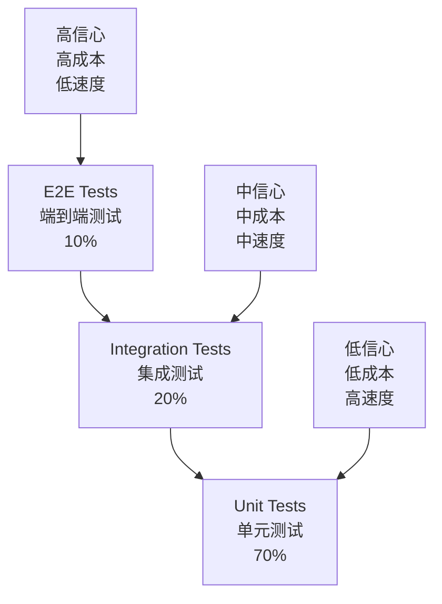
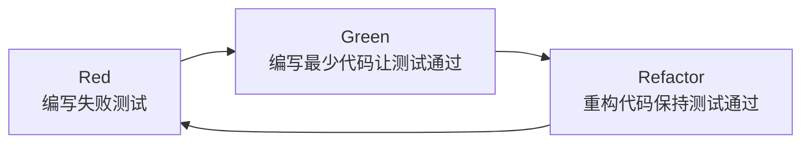

# React测试策略与实践

> 🧪 构建可靠的React应用测试体系，保证代码质量和系统稳定性

## 📖 测试的核心价值

在现代软件开发中，测试不仅是质量保证的手段，更是软件设计和重构的重要支撑。对于React应用而言，良好的测试策略能够：

- **提升代码质量** - 通过测试驱动设计，编写更好的代码
- **增强重构信心** - 在重构时有测试保护，减少引入bug的风险
- **改善用户体验** - 确保功能按预期工作，减少生产环境问题
- **加速开发效率** - 长期来看，良好的测试减少调试和修复时间

### 🤔 为什么React测试具有挑战性？

#### 1. **组件化的复杂性**
```javascript
// React组件涉及多个测试维度
function UserProfile({ userId, onEdit }) {
  const { data: user, loading, error } = useUser(userId);
  const [isEditing, setIsEditing] = useState(false);
  
  // 需要测试：
  // 1. Props传递和处理
  // 2. Hook的使用和状态管理
  // 3. 条件渲染逻辑
  // 4. 用户交互行为
  // 5. 异步数据加载
  // 6. 错误处理
  
  if (loading) return <LoadingSpinner />;
  if (error) return <ErrorMessage error={error} />;
  
  return (
    <div>
      {isEditing ? (
        <UserEditForm user={user} onSave={() => setIsEditing(false)} />
      ) : (
        <UserDisplay user={user} onEdit={() => setIsEditing(true)} />
      )}
    </div>
  );
}
```

#### 2. **异步操作的测试复杂性**
```javascript
// 异步操作的测试挑战
function useUserData(userId) {
  const [data, setData] = useState(null);
  const [loading, setLoading] = useState(false);
  
  useEffect(() => {
    async function fetchUser() {
      setLoading(true);
      try {
        const user = await apiClient.getUser(userId);
        setData(user);
      } catch (error) {
        setError(error);
      } finally {
        setLoading(false);
      }
    }
    
    fetchUser();
  }, [userId]);
  
  // 测试挑战：
  // 1. 如何模拟异步API调用？
  // 2. 如何测试loading和error状态？
  // 3. 如何处理时序问题？
  // 4. 如何测试cleanup逻辑？
}
```

## 🏗️ React测试金字塔

### 📊 测试层次划分



### 🔬 单元测试 (Unit Tests) - 70%
**目标**: 测试独立的函数、组件和Hook

#### 组件单元测试
```javascript
import { render, screen, fireEvent } from '@testing-library/react';
import Counter from './Counter';

describe('Counter Component', () => {
  test('renders initial count', () => {
    render(<Counter initialCount={0} />);
    expect(screen.getByText('Count: 0')).toBeInTheDocument();
  });
  
  test('increments count when button clicked', () => {
    render(<Counter initialCount={5} />);
    
    const incrementButton = screen.getByRole('button', { name: /increment/i });
    fireEvent.click(incrementButton);
    
    expect(screen.getByText('Count: 6')).toBeInTheDocument();
  });
  
  test('calls onCountChange when count changes', () => {
    const mockOnCountChange = jest.fn();
    render(<Counter initialCount={0} onCountChange={mockOnCountChange} />);
    
    const incrementButton = screen.getByRole('button', { name: /increment/i });
    fireEvent.click(incrementButton);
    
    expect(mockOnCountChange).toHaveBeenCalledWith(1);
  });
});
```

#### Hook单元测试
```javascript
import { renderHook, act } from '@testing-library/react';
import useCounter from './useCounter';

describe('useCounter Hook', () => {
  test('初始化计数器', () => {
    const { result } = renderHook(() => useCounter(10));
    
    expect(result.current.count).toBe(10);
    expect(typeof result.current.increment).toBe('function');
    expect(typeof result.current.decrement).toBe('function');
  });
  
  test('递增计数', () => {
    const { result } = renderHook(() => useCounter(0));
    
    act(() => {
      result.current.increment();
    });
    
    expect(result.current.count).toBe(1);
  });
  
  test('支持步长递增', () => {
    const { result } = renderHook(() => useCounter(0));
    
    act(() => {
      result.current.increment(5);
    });
    
    expect(result.current.count).toBe(5);
  });
});
```

#### 工具函数测试
```javascript
import { formatCurrency, validateEmail, debounce } from './utils';

describe('Utility Functions', () => {
  describe('formatCurrency', () => {
    test('格式化美元', () => {
      expect(formatCurrency(1234.56, 'USD')).toBe('$1,234.56');
    });
    
    test('处理零值', () => {
      expect(formatCurrency(0, 'USD')).toBe('$0.00');
    });
    
    test('处理负值', () => {
      expect(formatCurrency(-100, 'USD')).toBe('-$100.00');
    });
  });
  
  describe('validateEmail', () => {
    test('验证有效邮箱', () => {
      expect(validateEmail('user@example.com')).toBe(true);
    });
    
    test('拒绝无效邮箱', () => {
      expect(validateEmail('invalid-email')).toBe(false);
      expect(validateEmail('')).toBe(false);
      expect(validateEmail('user@')).toBe(false);
    });
  });
  
  describe('debounce', () => {
    beforeEach(() => {
      jest.useFakeTimers();
    });
    
    afterEach(() => {
      jest.useRealTimers();
    });
    
    test('延迟执行函数', () => {
      const mockFn = jest.fn();
      const debouncedFn = debounce(mockFn, 300);
      
      debouncedFn('arg1');
      debouncedFn('arg2');
      debouncedFn('arg3');
      
      expect(mockFn).not.toHaveBeenCalled();
      
      jest.advanceTimersByTime(300);
      
      expect(mockFn).toHaveBeenCalledTimes(1);
      expect(mockFn).toHaveBeenCalledWith('arg3');
    });
  });
});
```

### 🔗 集成测试 (Integration Tests) - 20%
**目标**: 测试组件间的协作和数据流

#### 组件集成测试
```javascript
import { render, screen, fireEvent, waitFor } from '@testing-library/react';
import { QueryClient, QueryClientProvider } from '@tanstack/react-query';
import UserProfile from './UserProfile';
import { server } from '../mocks/server';

// Mock API服务器
const createTestQueryClient = () => new QueryClient({

  },
});

function renderWithProviders(ui, options = {}) {
  const queryClient = createTestQueryClient();
  
  const Wrapper = ({ children }) => (
    <QueryClientProvider client={queryClient}>
      {children}
    </QueryClientProvider>
  );
  
  return render(ui, { wrapper ...options });
}

describe('UserProfile Integration', () => {
  beforeAll(() => server.listen());
  afterEach(() => server.resetHandlers());
  afterAll(() => server.close());
  
  test('加载用户数据并显示', async () => {
    renderWithProviders(<UserProfile userId="1" />);
    
    // 验证加载状态
    expect(screen.getByText('Loading...')).toBeInTheDocument();
    
    // 等待数据加载完成
    await waitFor(() => {
      expect(screen.getByText('John Doe')).toBeInTheDocument();
    });
    
    // 验证用户信息显示
    expect(screen.getByText('john@example.com')).toBeInTheDocument();
  });
  
  test('处理API错误', async () => {
    // 模拟API错误
    server.use(
      rest.get('/api/users/1', (req, res, ctx) => {
        return res(ctx.status(500), ctx.json({ message: 'Server Error' }));
      })
    );
    
    renderWithProviders(<UserProfile userId="1" />);
    
    await waitFor(() => {
      expect(screen.getByText('Failed to load user')).toBeInTheDocument();
    });
  });
  
  test('编辑用户信息流程', async () => {
    renderWithProviders(<UserProfile userId="1" />);
    
    // 等待用户数据加载
    await waitFor(() => {
      expect(screen.getByText('John Doe')).toBeInTheDocument();
    });
    
    // 点击编辑按钮
    fireEvent.click(screen.getByRole('button', { name: /edit/i }));
    
    // 验证进入编辑模式
    expect(screen.getByDisplayValue('John Doe')).toBeInTheDocument();
    
    // 修改用户名
    const nameInput = screen.getByDisplayValue('John Doe');
    fireEvent.change(nameInput, { target: { value: 'Jane Doe' } });
    
    // 保存修改
    fireEvent.click(screen.getByRole('button', { name: /save/i }));
    
    // 验证保存后状态
    await waitFor(() => {
      expect(screen.getByText('Jane Doe')).toBeInTheDocument();
    });
  });
});
```

#### 状态管理集成测试
```javascript
import { render, screen, fireEvent } from '@testing-library/react';
import { Provider } from 'react-redux';
import { store } from '../store';
import TodoApp from './TodoApp';

describe('TodoApp Redux Integration', () => {
  test('添加和删除待办事项', () => {
    render(
      <Provider store={store}>
        <TodoApp />
      </Provider>
    );
    
    // 添加待办事项
    const input = screen.getByPlaceholderText('Add todo...');
    const addButton = screen.getByRole('button', { name: /add/i });
    
    fireEvent.change(input, { target: { value: '学习React测试' } });
    fireEvent.click(addButton);
    
    // 验证添加成功
    expect(screen.getByText('学习React测试')).toBeInTheDocument();
    
    // 删除待办事项
    const deleteButton = screen.getByRole('button', { name: /delete/i });
    fireEvent.click(deleteButton);
    
    // 验证删除成功
    expect(screen.queryByText('学习React测试')).not.toBeInTheDocument();
  });
});
```

### 🌐 端到端测试 (E2E Tests) - 10%
**目标**: 测试完整的用户流程

#### Cypress E2E测试
```javascript
// cypress/integration/user-workflow.spec.js
describe('用户完整工作流程', () => {
  beforeEach(() => {
    cy.visit('/');
  });
  
  it('用户注册、登录、管理待办事项', () => {
    // 1. 用户注册
    cy.contains('Sign Up').click();
    cy.get('[data-testid=username-input]').type('testuser');
    cy.get('[data-testid=email-input]').type('test@example.com');
    cy.get('[data-testid=password-input]').type('password123');
    cy.get('[data-testid=confirm-password-input]').type('password123');
    cy.get('[data-testid=signup-button]').click();
    
    // 验证注册成功
    cy.contains('Registration successful').should('be.visible');
    
    // 2. 用户登录
    cy.get('[data-testid=username-input]').type('testuser');
    cy.get('[data-testid=password-input]').type('password123');
    cy.get('[data-testid=login-button]').click();
    
    // 验证登录成功
    cy.url().should('include', '/dashboard');
    cy.contains('Welcome, testuser').should('be.visible');
    
    // 3. 管理待办事项
    cy.get('[data-testid=add-todo-input]').type('完成项目测试');
    cy.get('[data-testid=add-todo-button]').click();
    
    // 验证待办事项添加
    cy.contains('完成项目测试').should('be.visible');
    
    // 标记完成
    cy.get('[data-testid=todo-checkbox]').check();
    cy.contains('完成项目测试').should('have.class', 'completed');
    
    // 删除待办事项
    cy.get('[data-testid=delete-todo-button]').click();
    cy.contains('完成项目测试').should('not.exist');
  });
  
  it('移动端响应式测试', () => {
    cy.viewport('iphone-6');
    
    // 测试移动端菜单
    cy.get('[data-testid=mobile-menu-button]').click();
    cy.get('[data-testid=mobile-menu]').should('be.visible');
    
    // 测试移动端导航
    cy.contains('Profile').click();
    cy.url().should('include', '/profile');
  });
});
```

#### Playwright E2E测试
```javascript
import { test, expect } from '@playwright/test';

test.describe('用户认证流程', () => {
  test('登录失败后重试成功', async ({ page }) => {
    await page.goto('/login');
    
    // 首次登录失败
    await page.fill('[data-testid=username]', 'wronguser');
    await page.fill('[data-testid=password]', 'wrongpassword');
    await page.click('[data-testid=login-button]');
    
    // 验证错误消息
    await expect(page.locator('[data-testid=error-message]')).toContainText('Invalid credentials');
    
    // 重试正确登录
    await page.fill('[data-testid=username]', 'validuser');
    await page.fill('[data-testid=password]', 'validpassword');
    await page.click('[data-testid=login-button]');
    
    // 验证登录成功
    await expect(page).toHaveURL('/dashboard');
  });
  
  test('会话过期处理', async ({ page }) => {
    await page.goto('/dashboard');
    
    // 模拟会话过期
    await page.evaluate(() => {
      localStorage.removeItem('auth-token');
    });
    
    // 尝试访问受保护页面
    await page.goto('/profile');
    
    // 验证重定向到登录页
    await expect(page).toHaveURL('/login');
    await expect(page.locator('[data-testid=session-expired-message]')).toBeVisible();
  });
});
```

## 🧪 Testing Library深度解析

### 🎯 核心设计理念

Testing Library的核心理念是**"测试应该与用户使用软件的方式相似"**：

```javascript
// ❌ 实现细节测试 - 不推荐
test('计数器状态管理', () => {
  const wrapper = shallow(<Counter />);
  const instance = wrapper.instance();
  
  expect(instance.state.count).toBe(0);
  instance.increment();
  expect(instance.state.count).toBe(1);
});

// ✅ 用户行为测试 - 推荐
test('用户可以递增计数', () => {
  render(<Counter />);
  
  expect(screen.getByText('Count: 0')).toBeInTheDocument();
  
  fireEvent.click(screen.getByRole('button', { name: /increment/i }));
  
  expect(screen.getByText('Count: 1')).toBeInTheDocument();
});
```

### 🔍 查询优先级

Testing Library推荐的查询优先级：

```javascript
// 1. 可访问性查询 - 最优先
screen.getByRole('button', { name: /submit/i });
screen.getByLabelText('Username');

// 2. 语义化查询
screen.getByPlaceholderText('Enter username');
screen.getByText('Welcome back');
screen.getByDisplayValue('current value');

// 3. 测试ID查询 - 最后选择
screen.getByTestId('submit-button');
```

#### 查询方法详解
```javascript
describe('查询方法完整示例', () => {
  test('各种查询方法的使用', () => {
    render(
      <form>
        <label htmlFor="username">用户名</label>
        <input 
          id="username"
          placeholder="请输入用户名"
          data-testid="username-input"
        />
        <button type="submit">提交</button>
        
      </form>
    );
    
    // getBy* - 期望找到元素，找不到会报错
    const usernameLabel = screen.getByText('用户名');
    const usernameInput = screen.getByLabelText('用户名');
    const submitButton = screen.getByRole('button', { name: '提交' });
    const avatar = screen.getByAltText('用户头像');
    
    // queryBy* - 可能找不到元素，返回null
    const nonExistent = screen.queryByText('不存在的文本');
    expect(nonExistent).toBeNull();
    
    // findBy* - 异步查找，返回Promise
    const asyncElement = await screen.findByText('异步加载的内容');
    
    // getAllBy* - 查找多个匹配的元素
    const allButtons = screen.getAllByRole('button');
    expect(allButtons).toHaveLength(2);
  });
});
```

### 🎭 用户事件模拟

#### 基础事件模拟
```javascript
import userEvent from '@testing-library/user-event';

test('用户交互模拟', async () => {
  const user = userEvent.setup();
  
  render(<ContactForm />);
  
  // 文本输入
  await user.type(screen.getByLabelText('姓名'), '张三');
  
  // 选择下拉框
  await user.selectOptions(screen.getByLabelText('城市'), '北京');
  
  // 文件上传
  const fileInput = screen.getByLabelText('上传头像');
  const file = new File(['hello'], 'hello.png', { type: 'image/png' });
  await user.upload(fileInput, file);
  
  // 复选框操作
  await user.click(screen.getByLabelText('同意条款'));
  
  // 表单提交
  await user.click(screen.getByRole('button', { name: '提交' }));
});
```

#### 高级交互模拟
```javascript
test('复杂用户交互', async () => {
  const user = userEvent.setup();
  
  render(<TextEditor />);
  
  const editor = screen.getByRole('textbox');
  
  // 模拟复制粘贴
  await user.type(editor, '原始文本');
  await user.selectAll(editor);
  await user.copy();
  await user.clear(editor);
  await user.paste();
  
  // 模拟键盘快捷键
  await user.keyboard('{Control>}s{/Control}'); // Ctrl+S
  
  // 模拟拖拽
  const draggable = screen.getByTestId('draggable-item');
  const dropzone = screen.getByTestId('drop-zone');
  
  await user.dragAndDrop(draggable, dropzone);
});
```

## 🔧 测试工具生态

### 📦 Jest配置与优化

#### 基础配置
```javascript
// jest.config.js
module.exports = {
  testEnvironment: 'jsdom',
  setupFilesAfterEnv: ['<rootDir>/src/setupTests.js'],

  collectCoverageFrom: [
    'src/**/*.{js,jsx,ts,tsx}',
    '!src/index.js',
    '!src/reportWebVitals.js',
    '!src/**/*.stories.{js,jsx,ts,tsx}'
  ],

  }
};
```

#### 高级配置
```javascript
// jest.config.js - 高级配置
module.exports = {
  // 测试环境配置
  testEnvironment: 'jsdom',

  // 并行执行配置
  maxWorkers: '50%',
  
  // 测试文件匹配
  testMatch: [
    '<rootDir>/src/**/__tests__/**/*.{js,jsx,ts,tsx}',
    '<rootDir>/src/**/*.{spec,test}.{js,jsx,ts,tsx}'
  ],
  
  // Mock配置
  clearMocks: true,
  resetMocks: true,
  restoreMocks: true,
  
  // 覆盖率配置
  collectCoverageFrom: [
    'src/**/*.{js,jsx,ts,tsx}',
    '!src/**/*.d.ts',
    '!src/**/*.stories.{js,jsx,ts,tsx}',
    '!src/**/index.{js,jsx,ts,tsx}'
  ],
  
  // 性能配置
  cacheDirectory: '<rootDir>/.jest-cache',
  
  // 全局设置
  globalSetup: '<rootDir>/jest.global-setup.js',
  globalTeardown: '<rootDir>/jest.global-teardown.js'
};
```

### 🎭 Mock策略

#### 模块Mock
```javascript
// __mocks__/axios.js - 全局axios mock
export default {
  get: jest.fn(() => Promise.resolve({ data: {} })),
  post: jest.fn(() => Promise.resolve({ data: {} })),
  put: jest.fn(() => Promise.resolve({ data: {} })),
  delete: jest.fn(() => Promise.resolve({ data: {} })),
  create: jest.fn(function() {
    return this;
  })
};

// 在测试中使用
import axios from 'axios';
import { getUser } from './userService';

jest.mock('axios');
const mockedAxios = axios as jest.Mocked<typeof axios>;

test('获取用户信息', async () => {
  const userData = { id: 1, name: 'John' };
  mockedAxios.get.mockResolvedValue({ data: userData });
  
  const result = await getUser(1);
  
  expect(mockedAxios.get).toHaveBeenCalledWith('/api/users/1');
  expect(result).toEqual(userData);
});
```

#### Hook Mock
```javascript
// Mock自定义Hook
import { useUser } from './hooks/useUser';

jest.mock('./hooks/useUser');
const mockUseUser = useUser as jest.MockedFunction<typeof useUser>;

test('用户资料组件', () => {
  mockUseUser.mockReturnValue({

    loading: false,
    error: null
  });
  
  render(<UserProfile userId={1} />);
  
  expect(screen.getByText('John')).toBeInTheDocument();
});
```

#### 时间Mock
```javascript
describe('时间相关测试', () => {
  beforeEach(() => {
    jest.useFakeTimers();
    jest.setSystemTime(new Date('2024-01-01'));
  });
  
  afterEach(() => {
    jest.useRealTimers();
  });
  
  test('定时器功能', () => {
    const callback = jest.fn();
    const timer = setTimeout(callback, 1000);
    
    expect(callback).not.toHaveBeenCalled();
    
    jest.advanceTimersByTime(1000);
    
    expect(callback).toHaveBeenCalledTimes(1);
  });
});
```

### 🌐 MSW (Mock Service Worker)

#### 基础设置
```javascript
// src/mocks/handlers.js
import { rest } from 'msw';

export const handlers = [
  rest.get('/api/users/:userId', (req, res, ctx) => {
    const { userId } = req.params;
    
    return res(
      ctx.json({
        id: userId,
        name: 'John Doe',
        email: 'john@example.com'
      })
    );
  }),
  
  rest.post('/api/users', async (req, res, ctx) => {
    const userData = await req.json();
    
    return res(
      ctx.status(201),
      ctx.json({
        id: Math.random().toString(),
        ...userData
      })
    );
  }),
  
  rest.get('/api/users/:userId/posts', (req, res, ctx) => {
    const { userId } = req.params;
    const page = req.url.searchParams.get('page') || '1';
    
    return res(
      ctx.json({
        posts: [
          { id: 1, title: 'First Post', authorId: userId },
          { id: 2, title: 'Second Post', authorId: userId }
        ],
        page: parseInt(page),
        total: 20
      })
    );
  })
];

// src/mocks/server.js
import { setupServer } from 'msw/node';
import { handlers } from './handlers';

export const server = setupServer(...handlers);

// src/setupTests.js
import { server } from './mocks/server';

beforeAll(() => server.listen());
afterEach(() => server.resetHandlers());
afterAll(() => server.close());
```

#### 动态Mock响应
```javascript
import { server } from './mocks/server';
import { rest } from 'msw';

test('处理服务器错误', async () => {
  // 临时覆盖默认处理器
  server.use(
    rest.get('/api/users/:userId', (req, res, ctx) => {
      return res(
        ctx.status(500),
        ctx.json({ message: 'Internal Server Error' })
      );
    })
  );
  
  render(<UserProfile userId="1" />);
  
  await waitFor(() => {
    expect(screen.getByText('Error loading user')).toBeInTheDocument();
  });
});

test('测试网络延迟', async () => {
  server.use(
    rest.get('/api/users/:userId', (req, res, ctx) => {
      return res(
        ctx.delay(2000), // 2秒延迟
        ctx.json({ id: '1', name: 'John Doe' })
      );
    })
  );
  
  render(<UserProfile userId="1" />);
  
  // 验证加载状态
  expect(screen.getByText('Loading...')).toBeInTheDocument();
  
  // 等待数据加载
  await waitFor(() => {
    expect(screen.getByText('John Doe')).toBeInTheDocument();
  }, { timeout: 3000 });
});
```

## 🎯 测试驱动开发 (TDD)

### 🔄 TDD循环



#### TDD实践示例
```javascript
// 1. Red - 编写失败测试
describe('Calculator', () => {
  test('adds two numbers', () => {
    const calculator = new Calculator();
    expect(calculator.add(2, 3)).toBe(5);
  });
});

// 2. Green - 编写最少代码
class Calculator {
  add(a, b) {
    return a + b;
  }
}

// 3. Red - 添加更多测试
test('handles negative numbers', () => {
  const calculator = new Calculator();
  expect(calculator.add(-1, 1)).toBe(0);
  expect(calculator.add(-5, -3)).toBe(-8);
});

// 4. Green - 代码已经通过
// 无需修改

// 5. Red - 添加边缘情况测试
test('handles invalid inputs', () => {
  const calculator = new Calculator();
  expect(() => calculator.add('a', 1)).toThrow('Invalid input');
  expect(() => calculator.add(null, 1)).toThrow('Invalid input');
});

// 6. Green - 添加输入验证
class Calculator {
  add(a, b) {
    if (typeof a !== 'number' || typeof b !== 'number') {
      throw new Error('Invalid input');
    }
    return a + b;
  }
}

// 7. Refactor - 重构代码
class Calculator {
  add(a, b) {
    this._validateNumbers(a, b);
    return a + b;
  }
  
  _validateNumbers(...numbers) {
    numbers.forEach(num => {
      if (typeof num !== 'number' || isNaN(num)) {
        throw new Error('Invalid input: expected number');
      }
    });
  }
}
```

### 🧩 组件TDD示例

```javascript
// 1. Red - 编写组件测试
describe('TodoList Component', () => {
  test('renders empty list message when no todos', () => {
    render(<TodoList todos={[]} />);
    expect(screen.getByText('No todos yet')).toBeInTheDocument();
  });
});

// 2. Green - 实现基础组件
function TodoList({ todos }) {
  if (todos.length === 0) {
    return <div>No todos yet</div>;
  }
  
  return <ul>{/* TODO: render todos */}</ul>;
}

// 3. Red - 添加渲染待办事项测试
test('renders list of todos', () => {
  const todos = [
    { id: 1, text: 'Learn React', completed: false },
    { id: 2, text: 'Write tests', completed: true }
  ];
  
  render(<TodoList todos={todos} />);
  
  expect(screen.getByText('Learn React')).toBeInTheDocument();
  expect(screen.getByText('Write tests')).toBeInTheDocument();
});

// 4. Green - 实现待办事项渲染
function TodoList({ todos }) {
  if (todos.length === 0) {
    return <div>No todos yet</div>;
  }
  
  return (
    <ul>
      {todos.map(todo => (
        <li key={todo.id}>
          <span className={todo.completed ? 'completed' : ''}>
            {todo.text}
          </span>
        </li>
      ))}
    </ul>
  );
}

// 5. Red - 添加交互测试
test('calls onToggle when todo clicked', () => {
  const mockOnToggle = jest.fn();
  const todos = [{ id: 1, text: 'Learn React', completed: false }];
  
  render(<TodoList todos={todos} onToggle={mockOnToggle} />);
  
  fireEvent.click(screen.getByText('Learn React'));
  
  expect(mockOnToggle).toHaveBeenCalledWith(1);
});

// 6. Green - 实现交互功能
function TodoList({ todos, onToggle }) {
  if (todos.length === 0) {
    return <div>No todos yet</div>;
  }
  
  return (
    <ul>
      {todos.map(todo => (
        <li key={todo.id} onClick={() => onToggle(todo.id)}>
          <span className={todo.completed ? 'completed' : ''}>
            {todo.text}
          </span>
        </li>
      ))}
    </ul>
  );
}
```

## 📊 测试覆盖率与质量指标

### 🎯 覆盖率类型

#### 语句覆盖率 (Statement Coverage)
```javascript
function divide(a, b) {
  if (b === 0) {
    throw new Error('Division by zero'); // 这行是否被执行？
  }
  return a / b; // 这行是否被执行？
}

// 测试语句覆盖率
test('语句覆盖率测试', () => {
  expect(divide(10, 2)).toBe(5); // 覆盖return语句
  expect(() => divide(10, 0)).toThrow(); // 覆盖throw语句
});
```

#### 分支覆盖率 (Branch Coverage)
```javascript
function getDiscount(user) {
  if (user.isPremium) { // 分支1: true/false
    if (user.yearsActive > 5) { // 分支2: true/false
      return 0.2;
    }
    return 0.1;
  }
  return 0;
}

// 测试分支覆盖率 - 需要覆盖所有分支组合
describe('分支覆盖率测试', () => {
  test('普通用户', () => {
    expect(getDiscount({ isPremium: false })).toBe(0);
  });
  
  test('新高级用户', () => {
    expect(getDiscount({ isPremium: true, yearsActive: 2 })).toBe(0.1);
  });
  
  test('老高级用户', () => {
    expect(getDiscount({ isPremium: true, yearsActive: 6 })).toBe(0.2);
  });
});
```

#### 函数覆盖率 (Function Coverage)
```javascript
class UserService {
  getUser(id) { /* ... */ }
  createUser(data) { /* ... */ }
  updateUser(id, data) { /* ... */ }
  deleteUser(id) { /* ... */ } // 这个函数是否被测试？
}

// 确保所有公共方法都被测试
describe('UserService 函数覆盖率', () => {
  test('getUser', () => { /* 测试getUser */ });
  test('createUser', () => { /* 测试createUser */ });
  test('updateUser', () => { /* 测试updateUser */ });
  test('deleteUser', () => { /* 测试deleteUser */ }); // 必须测试
});
```

### 📈 质量指标监控

#### 设置覆盖率阈值
```javascript
// jest.config.js
module.exports = {

    // 针对特定目录的阈值
    './src/utils/': {
      branches: 90,
      functions: 95,
      lines: 90,
      statements: 90
    },
    // 针对特定文件的阈值
    './src/components/CriticalComponent.js': {
      branches: 100,
      functions: 100,
      lines: 100,
      statements: 100
    }
  },
  
  // 覆盖率报告格式
  coverageReporters: ['text', 'lcov', 'html', 'json'],
  
  // 排除不需要测试的文件
  coveragePathIgnorePatterns: [
    '/node_modules/',
    '/build/',
    '/coverage/',
    '/.storybook/',
    '/src/index.js',
    '/src/setupTests.js'
  ]
};
```

#### CI/CD集成
```yaml
# .github/workflows/test.yml
name: Test and Coverage

on: [push, pull_request]

jobs:
  test:
    runs-on: ubuntu-latest
    
    steps:
    - uses: actions/checkout@v2
    
    - name: Setup Node.js
      uses: actions/setup-node@v2
      with:
        node-version: '16'
        cache: 'npm'
    
    - name: Install dependencies
      run: npm ci
    
    - name: Run tests with coverage
      run: npm run test:coverage
    
    - name: Upload coverage to Codecov
      uses: codecov/codecov-action@v2
      with:
        file: ./coverage/lcov.info
        flags: unittests
        name: codecov-umbrella
    
    - name: Comment coverage on PR
      if: github.event_name == 'pull_request'
      uses: actions/github-script@v6
      with:
        script: |
          const fs = require('fs');
          const coverage = JSON.parse(fs.readFileSync('./coverage/coverage-summary.json'));
          
          const comment = `
          ## 📊 Test Coverage Report
          
          | Metric | Coverage |
          |--------|----------|
          | Lines | ${coverage.total.lines.pct}% |
          | Functions | ${coverage.total.functions.pct}% |
          | Branches | ${coverage.total.branches.pct}% |
          | Statements | ${coverage.total.statements.pct}% |
          `;
          
          github.rest.issues.createComment({
            issue_number: context.issue.number,
            owner: context.repo.owner,
            repo: context.repo.repo,
            body: comment
          });
```

## 🚀 高级测试技术

### 🎭 视觉回归测试

#### Storybook + Chromatic
```javascript
// Button.stories.js
export default {
  title: 'Components/Button',
  component
  parameters: {
    chromatic: { delay: 300 }, // 等待动画完成
  },
};

export const Primary = {

};

export const Secondary = {

};

export const Large = {

};

// 交互测试
export const WithInteraction = {

  play: async ({ canvasElement }) => {
    const canvas = within(canvasElement);
    const button = canvas.getByRole('button');
    
    await userEvent.hover(button);
    await userEvent.click(button);
  },
};
```

#### Percy视觉测试
```javascript
// 在测试中使用Percy
import percySnapshot from '@percy/puppeteer';

test('视觉回归测试', async () => {
  render(<ComplexComponent />);
  
  // 等待组件完全渲染
  await waitFor(() => {
    expect(screen.getByTestId('complex-component')).toBeInTheDocument();
  });
  
  // 截取屏幕快照
  await percySnapshot(page, 'Complex Component - Default State');
  
  // 触发状态变化
  fireEvent.click(screen.getByRole('button', { name: /toggle/i }));
  
  // 截取变化后的快照
  await percySnapshot(page, 'Complex Component - Toggled State');
});
```

### 🔍 无障碍测试

#### jest-axe集成
```javascript
import { render } from '@testing-library/react';
import { axe, toHaveNoViolations } from 'jest-axe';

expect.extend(toHaveNoViolations);

test('无障碍测试', async () => {
  const { container } = render(<LoginForm />);
  
  const results = await axe(container);
  expect(results).toHaveNoViolations();
});

// 自定义无障碍规则
test('特定无障碍规则测试', async () => {
  const { container } = render(<NavigationMenu />);
  
  const results = await axe(container, {

      'keyboard-navigation': { enabled: true },
      'aria-labels': { enabled: true }
    }
  });
  
  expect(results).toHaveNoViolations();
});
```

#### 键盘导航测试
```javascript
test('键盘导航测试', async () => {
  const user = userEvent.setup();
  
  render(<DialogComponent />);
  
  const openButton = screen.getByRole('button', { name: /open dialog/i });
  
  // 使用Tab导航到按钮
  await user.tab();
  expect(openButton).toHaveFocus();
  
  // 按Enter打开对话框
  await user.keyboard('{Enter}');
  
  const dialog = screen.getByRole('dialog');
  expect(dialog).toBeInTheDocument();
  
  // 测试焦点陷阱
  const closeButton = screen.getByRole('button', { name: /close/i });
  expect(closeButton).toHaveFocus();
  
  // 按Escape关闭对话框
  await user.keyboard('{Escape}');
  expect(dialog).not.toBeInTheDocument();
  expect(openButton).toHaveFocus(); // 焦点应回到触发元素
});
```

### ⚡ 性能测试

#### React性能测试
```javascript
import { Profiler } from 'react';

test('组件渲染性能测试', () => {
  let renderTime = 0;
  
  const onRender = (id, phase, actualDuration) => {
    renderTime = actualDuration;
  };
  
  render(
    <Profiler id="expensive-component" onRender={onRender}>
      <ExpensiveComponent data={largeDataSet} />
    </Profiler>
  );
  
  // 断言渲染时间在可接受范围内
  expect(renderTime).toBeLessThan(100); // 100ms
});

// 内存泄漏测试
test('内存泄漏测试', () => {
  const { unmount } = render(<ComponentWithTimers />);
  
  // 模拟组件卸载
  unmount();
  
  // 验证定时器被清理
  expect(global.setTimeout).toHaveBeenCalledTimes(0);
  expect(global.setInterval).toHaveBeenCalledTimes(0);
});
```

#### Web Vitals测试
```javascript
import { getCLS, getFID, getFCP, getLCP, getTTFB } from 'web-vitals';

test('Web Vitals性能指标', (done) => {
  const metrics = {};
  
  getCLS((metric) => { metrics.cls = metric.value; });
  getFID((metric) => { metrics.fid = metric.value; });
  getFCP((metric) => { metrics.fcp = metric.value; });
  getLCP((metric) => { metrics.lcp = metric.value; });
  getTTFB((metric) => { metrics.ttfb = metric.value; });
  
  render(<App />);
  
  setTimeout(() => {
    // 验证性能指标在可接受范围内
    expect(metrics.fcp).toBeLessThan(2000); // 2秒
    expect(metrics.lcp).toBeLessThan(4000); // 4秒
    expect(metrics.cls).toBeLessThan(0.1); // 0.1
    done();
  }, 5000);
});
```

## 📋 测试最佳实践总结

### 🎯 测试策略制定

#### 1. 测试金字塔遵循
```javascript
// 70% 单元测试 - 快速、隔离、大量
describe('Utils Functions', () => {
  test('formatDate formats date correctly', () => {
    expect(formatDate('2024-01-01')).toBe('January 1, 2024');
  });
});

// 20% 集成测试 - 组件协作
describe('User Registration Flow', () => {
  test('user can register and login', async () => {
    // 测试多个组件的协作
  });
});

// 10% E2E测试 - 完整用户流程
describe('Complete User Journey', () => {
  test('user completes purchase flow', () => {
    // 测试完整的业务流程
  });
});
```

#### 2. 测试命名规范
```javascript
// ❌ 不好的测试命名
test('test 1', () => {});
test('button works', () => {});

// ✅ 好的测试命名
test('increments counter when increment button is clicked', () => {});
test('shows error message when email format is invalid', () => {});
test('redirects to dashboard after successful login', () => {});

// 测试分组和描述
describe('UserProfileForm', () => {
  describe('when user is authenticated', () => {
    test('displays user information', () => {});
    test('allows editing profile', () => {});
  });
  
  describe('when user is not authenticated', () => {
    test('redirects to login page', () => {});
  });
});
```

#### 3. 测试数据管理
```javascript
// 使用工厂函数创建测试数据
const createUser = (overrides = {}) => ({
  id: '1',
  name: 'John Doe',
  email: 'john@example.com',
  role: 'user',
  ...overrides
});

const createPost = (overrides = {}) => ({
  id: '1',
  title: 'Test Post',
  content: 'Test content',
  authorId: '1',
  publishedAt: '2024-01-01',
  ...overrides
});

// 在测试中使用
test('displays user posts', () => {
  const user = createUser({ name: 'Jane Doe' });
  const posts = [
    createPost({ title: 'First Post', authorId: user.id }),
    createPost({ title: 'Second Post', authorId: user.id })
  ];
  
  render(<UserProfile user={user} posts={posts} />);
  
  expect(screen.getByText('Jane Doe')).toBeInTheDocument();
  expect(screen.getByText('First Post')).toBeInTheDocument();
});
```

### 📊 质量保证流程

#### 1. 测试驱动的代码审查
```markdown
## 代码审查检查清单

### 测试覆盖
- [ ] 新功能有对应的测试
- [ ] 修改的代码更新了相关测试
- [ ] 测试覆盖率未降低
- [ ] 边缘情况有测试覆盖

### 测试质量
- [ ] 测试名称清晰描述测试意图
- [ ] 测试只测试一个功能点
- [ ] 测试是独立的，不依赖其他测试
- [ ] Mock使用合理，不过度Mock

### 测试维护性
- [ ] 测试代码易于理解和维护
- [ ] 重复的测试逻辑被提取为工具函数
- [ ] 测试数据创建使用工厂模式
```

#### 2. 持续集成中的测试
```yaml
# GitHub Actions配置
name: Test Pipeline

on: [push, pull_request]

jobs:
  test:
    steps:
      - name: Unit Tests
        run: npm run test:unit
        
      - name: Integration Tests
        run: npm run test:integration
        
      - name: E2E Tests
        run: npm run test:e2e
        
      - name: Performance Tests
        run: npm run test:performance
        
      - name: Accessibility Tests
        run: npm run test:a11y
        
      - name: Visual Regression Tests
        run: npm run test:visual
```

### 🔧 常见问题解决方案

#### 1. 测试速度优化
```javascript
// 并行测试执行
// jest.config.js
module.exports = {
  maxWorkers: '50%',
  testPathIgnorePatterns: ['/node_modules/', '/build/'],
  
  // 只对变更的文件运行测试
  collectCoverageFrom: [
    'src/**/*.{js,jsx,ts,tsx}',
    '!src/**/*.d.ts'
  ]
};

// 使用setupFilesAfterEnv减少重复设置
// setupTests.js
import '@testing-library/jest-dom';
import { server } from './mocks/server';

beforeAll(() => server.listen());
afterEach(() => server.resetHandlers());
afterAll(() => server.close());
```

#### 2. 异步测试处理
```javascript
// ❌ 错误的异步测试
test('loads user data', () => {
  render(<UserProfile userId="1" />);
  expect(screen.getByText('John Doe')).toBeInTheDocument(); // 可能失败
});

// ✅ 正确的异步测试
test('loads user data', async () => {
  render(<UserProfile userId="1" />);
  
  // 等待异步操作完成
  await waitFor(() => {
    expect(screen.getByText('John Doe')).toBeInTheDocument();
  });
});

// 使用findBy*方法
test('loads user data with findBy', async () => {
  render(<UserProfile userId="1" />);
  
  // findBy*自动等待元素出现
  expect(await screen.findByText('John Doe')).toBeInTheDocument();
});
```

#### 3. 测试隔离
```javascript
// 确保测试之间相互独立
describe('UserService', () => {
  let userService;
  
  beforeEach(() => {
    // 每个测试前重新创建实例
    userService = new UserService();
  });
  
  afterEach(() => {
    // 清理全局状态
    jest.clearAllMocks();
    localStorage.clear();
    sessionStorage.clear();
  });
});
```

---

*构建可靠的测试体系，为React应用的长期发展奠定坚实基础！*
