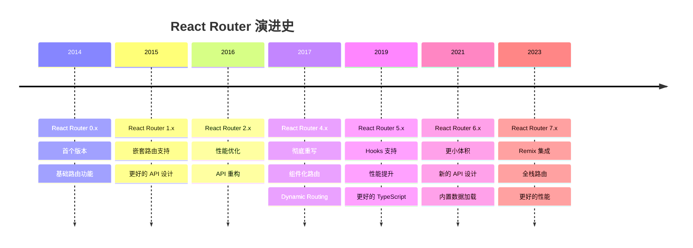

# React Router 版本演进深度解析

React Router 作为 React 生态系统中最重要的路由库，经历了多个重大版本的演进。每个版本都反映了 React 生态和前端开发理念的变化。

## 📅 完整版本时间线



## 🔍 版本详细分析

### React Router v3 (2016) - 经典时代

**核心特性**：
- 声明式路由配置
- 嵌套路由支持
- 异步路由加载

```jsx
// React Router v3 典型用法
import { Router, Route, IndexRoute } from 'react-router';
import { browserHistory } from 'react-router';

const routes = (
  <Router history={browserHistory}>
    <Route path="/" component={App}>
      <IndexRoute component={Home} />
      <Route path="about" component={About} />
      <Route path="users" component={Users}>
        <Route path=":userId" component={User} />
      </Route>
    </Route>
  </Router>
);
```

**设计理念**：
- **静态路由配置** - 路由在应用启动时确定
- **集中式管理** - 所有路由在一个地方定义
- **传统的嵌套结构** - 类似文件系统的层级关系

**优点**：
- ✅ 清晰的路由结构
- ✅ 易于理解和维护
- ✅ 强大的嵌套路由支持

**缺点**：
- ❌ 静态配置限制了灵活性
- ❌ 代码分割需要复杂配置
- ❌ 与组件耦合度较高

---

### React Router v4 (2017) - 革命性重写

**核心变化**：
- **组件化路由** - 路由即组件
- **动态路由** - 路由可以在任何地方定义
- **声明式导航** - 更符合 React 理念

```jsx
// React Router v4 典型用法
import { BrowserRouter, Route, Switch } from 'react-router-dom';

function App() {
  return (
    <BrowserRouter>
      <div>
        <nav>
          <Link to="/">Home</Link>
          <Link to="/about">About</Link>
        </nav>
        
        <Switch>
          <Route exact path="/" component={Home} />
          <Route path="/about" component={About} />
          <Route path="/users/:id" component={User} />
        </Switch>
      </div>
    </BrowserRouter>
  );
}
```

**设计理念的转变**：

| 方面 | v3 (静态路由) | v4 (动态路由) |
|------|-------------|-------------|
| **路由定义** | 集中配置 | 分散在组件中 |
| **加载时机** | 应用启动时 | 组件渲染时 |
| **灵活性** | 受限于配置 | 完全动态 |
| **代码组织** | 路由与组件分离 | 路由即组件 |

**核心 API 变化**：

```jsx
// v3 方式 - 静态配置
const routes = (
  <Route path="/" component={App}>
    <Route path="inbox" component={Inbox}>
      <Route path="messages/:id" component={Message} />
    </Route>
  </Route>
);

// v4 方式 - 组件内定义
function App() {
  return (
    <div>
      <Route path="/inbox" component={Inbox} />
    </div>
  );
}

function Inbox() {
  return (
    <div>
      <Route path="/inbox/messages/:id" component={Message} />
    </div>
  );
}
```

**突破性创新**：

1. **路由即组件**
```jsx
// 路由可以像普通组件一样使用
function ConditionalRoute({ user }) {
  return user.isAdmin ? (
    <Route path="/admin" component={AdminPanel} />
  ) : null;
}
```

2. **动态路由匹配**
```jsx
// 可以基于状态动态显示路由
function DynamicRoutes({ features }) {
  return (
    <div>
      {features.includes('blog') && (
        <Route path="/blog" component={Blog} />
      )}
      {features.includes('shop') && (
        <Route path="/shop" component={Shop} />
      )}
    </div>
  );
}
```

**优点**：
- ✅ 极大的灵活性
- ✅ 更符合 React 组件化理念
- ✅ 代码分割更容易实现
- ✅ 更好的组合性

**缺点**：
- ❌ 学习曲线陡峭
- ❌ 路由结构不够直观
- ❌ 容易造成路由混乱

---

### React Router v5 (2019) - 成熟稳定

**主要改进**：
- React Hooks 支持
- 更好的性能
- 改进的 TypeScript 支持

```jsx
// React Router v5 Hooks 用法
import { useHistory, useLocation, useParams } from 'react-router-dom';

function UserProfile() {
  const history = useHistory();
  const location = useLocation();
  const { id } = useParams();
  
  const handleEdit = () => {
    history.push(`/users/${id}/edit`);
  };
  
  return (
    <div>
      <h1>用户 {id}</h1>
      <p>当前路径: {location.pathname}</p>
      <button onClick={handleEdit}>编辑</button>
    </div>
  );
}
```

**新增 Hooks API**：

| Hook | 功能 | v4 对应方式 |
|------|------|------------|
| `useHistory` | 访问 history 对象 | `withRouter` HOC |
| `useLocation` | 获取当前位置 | `withRouter` HOC |
| `useParams` | 获取 URL 参数 | `match.params` |
| `useRouteMatch` | 匹配路由信息 | `match` prop |

**性能优化**：

1. **更好的 Bundle 分割**
```jsx
// 改进的懒加载支持
const LazyComponent = React.lazy(() => import('./LazyComponent'));

function App() {
  return (
    <Suspense fallback={<div>Loading...</div>}>
      <Route path="/lazy" component={LazyComponent} />
    </Suspense>
  );
}
```

2. **减少重新渲染**
```jsx
// 使用 useCallback 优化路由监听
function useRouteChanged() {
  const location = useLocation();
  
  const handleRouteChange = useCallback(() => {
    // 路由变化处理逻辑
    trackPageView(location.pathname);
  }, [location.pathname]);
  
  useEffect(handleRouteChange, [handleRouteChange]);
}
```

---

### React Router v6 (2021) - 现代化重构

**重大变化**：
- 更小的包体积（减少了 58%）
- 新的 API 设计
- 内置数据加载支持
- 更好的 TypeScript 支持

```jsx
// React Router v6 新 API
import { useRoutes, useNavigate } from 'react-router-dom';

function App() {
  const element = useRoutes([
    { path: '/', element: <Home /> },
    { path: '/about', element: <About /> },
    {
      path: '/dashboard',
      element: <Dashboard />,
      children: [
        { path: 'profile', element: <Profile /> },
        { path: 'settings', element: <Settings /> }
      ]
    }
  ]);
  
  return element;
}
```

**API 变化对比**：

| v5 API | v6 API | 变化说明 |
|--------|--------|----------|
| `Switch` | `Routes` | 重命名，更好的类型推断 |
| `useHistory` | `useNavigate` | 简化的导航 API |
| `Redirect` | `Navigate` | 组件化重定向 |
| `useRouteMatch` | `useMatch` | 简化的匹配 API |

**新特性深度解析**：

1. **路由配置对象**
```jsx
// v6 支持配置对象形式
const routes = [
  {
    path: '/',
    element: <Layout />,
    children: [
      { index: true, element: <Home /> },
      { path: 'about', element: <About /> },
      {
        path: 'users',
        element: <Users />,
        children: [
          { path: ':id', element: <UserDetail /> },
          { path: ':id/edit', element: <EditUser /> }
        ]
      }
    ]
  }
];

function App() {
  return <RouterProvider router={createBrowserRouter(routes)} />;
}
```

2. **简化的导航 API**
```jsx
// v5
const history = useHistory();
history.push('/users');
history.replace('/login');
history.go(-1);

// v6
const navigate = useNavigate();
navigate('/users');
navigate('/login', { replace: true });
navigate(-1);
```

3. **相对路由导航**
```jsx
// v6 支持相对路径导航
function UserTabs() {
  return (
    <div>
      <Link to="profile">个人资料</Link>      {/* 相对路径 */}
      <Link to="../settings">设置</Link>       {/* 向上一级 */}
      <Link to="/absolute">绝对路径</Link>     {/* 绝对路径 */}
    </div>
  );
}
```

**性能改进**：

1. **更小的包体积**
```bash
# 包大小对比
React Router v5: ~41KB (gzipped)
React Router v6: ~17KB (gzipped)  # 减少 58%
```

2. **更好的 Tree Shaking**
```jsx
// v6 支持更细粒度的导入
import { useNavigate } from 'react-router-dom';  // 只导入需要的 Hook
```

---

### React Router v7 (2023+) - 全栈路由

**目标特性**：
- Remix 集成
- 服务端渲染优化
- 流式数据加载
- 边缘计算支持

```jsx
// React Router v7 预期用法（基于 Remix 集成）
import type { LoaderFunction } from '@remix-run/router';

// 数据加载器
export const loader: LoaderFunction = async ({ params }) => {
  const user = await getUser(params.userId);
  return json({ user });
};

// 组件
export default function UserProfile() {
  const { user } = useLoaderData<typeof loader>();
  
  return (
    <div>
      <h1>{user.name}</h1>
      <p>{user.email}</p>
    </div>
  );
}

// 路由配置
export const routes = [
  {
    path: '/users/:userId',
    component: UserProfile,
    loader,
    // 流式加载
    defer: ['posts', 'comments']
  }
];
```

## 🔄 迁移策略

### v5 到 v6 迁移

**1. 组件 API 更新**
```jsx
// v5
import { Switch, Route, Redirect } from 'react-router-dom';

<Switch>
  <Route exact path="/" component={Home} />
  <Route path="/about" component={About} />
  <Redirect from="/old-path" to="/new-path" />
</Switch>

// v6
import { Routes, Route, Navigate } from 'react-router-dom';

<Routes>
  <Route path="/" element={<Home />} />
  <Route path="/about" element={<About />} />
  <Route path="/old-path" element={<Navigate to="/new-path" replace />} />
</Routes>
```

**2. Hook API 更新**
```jsx
// v5
import { useHistory, useRouteMatch } from 'react-router-dom';

function Component() {
  const history = useHistory();
  const match = useRouteMatch();
  
  const handleClick = () => {
    history.push('/new-route');
  };
}

// v6
import { useNavigate, useMatch } from 'react-router-dom';

function Component() {
  const navigate = useNavigate();
  const match = useMatch('/current-route');
  
  const handleClick = () => {
    navigate('/new-route');
  };
}
```

**3. 嵌套路由重构**
```jsx
// v5 - 在父组件中定义子路由
function App() {
  return (
    <Switch>
      <Route path="/dashboard/*" component={Dashboard} />
    </Switch>
  );
}

function Dashboard() {
  const { path } = useRouteMatch();
  return (
    <Switch>
      <Route path={`${path}/profile`} component={Profile} />
      <Route path={`${path}/settings`} component={Settings} />
    </Switch>
  );
}

// v6 - 集中定义嵌套路由
function App() {
  return (
    <Routes>
      <Route path="/dashboard" element={<Dashboard />}>
        <Route path="profile" element={<Profile />} />
        <Route path="settings" element={<Settings />} />
      </Route>
    </Routes>
  );
}

function Dashboard() {
  return (
    <div>
      <h1>仪表板</h1>
      <Outlet /> {/* 子路由渲染位置 */}
    </div>
  );
}
```

## 📊 版本选择指南

### 项目场景分析

| 场景 | 推荐版本 | 理由 |
|------|----------|------|
| **新项目** | v6.x | 最新特性，更好性能，长期支持 |
| **现有 v5 项目** | 保持 v5 | 除非有特殊需求，迁移成本较高 |
| **大型企业项目** | v6.x | 更好的 TypeScript 支持，更小包体积 |
| **学习项目** | v6.x | 代表未来方向，API 更现代化 |
| **维护模式项目** | 当前版本 | 不建议升级，风险大于收益 |

### 技术因素考量

**选择 v6 的理由**：
- ✅ 更小的包体积 (17KB vs 41KB)
- ✅ 更好的 TypeScript 支持
- ✅ 更现代化的 API 设计
- ✅ 更好的性能表现
- ✅ 长期维护支持

**保持 v5 的理由**：
- ✅ API 稳定，团队熟悉
- ✅ 迁移成本高
- ✅ 现有生态完善
- ✅ 无紧急升级需求

## 🚀 未来展望

### React Router 的发展趋势

1. **全栈集成**
   - 与 Remix 深度集成
   - 统一的数据加载模式
   - 更好的 SSR 支持

2. **性能优化**
   - 智能预加载
   - 流式路由渲染
   - 边缘计算优化

3. **开发体验**
   - 更好的 TypeScript 推断
   - 可视化路由调试
   - 自动路由生成

4. **新兴技术支持**
   - React 并发特性集成
   - Suspense 深度集成
   - Server Components 支持

### 学习建议

1. **掌握核心概念** - 理解路由的本质和设计理念
2. **关注版本演进** - 了解每个版本解决的问题
3. **实践中学习** - 通过项目实践加深理解
4. **保持更新** - 关注社区动态和最佳实践

---

React Router 的演进反映了整个前端生态的发展轨迹，从静态配置到组件化，从命令式到声明式，从客户端到全栈。理解这个演进过程，不仅能帮助我们更好地使用 React Router，也能让我们对前端技术的发展有更深入的认识。
