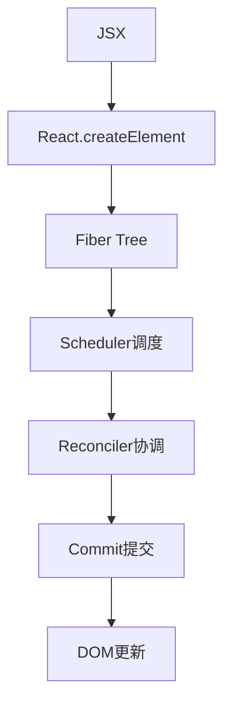

# 源码解读导读

> 🔬 深入React核心源码，理解设计理念和实现细节

## 📖 源码学习的价值

React源码是现代前端框架设计的典型代表，学习React源码不仅能深入理解React的工作原理，更能从中学到优秀的软件架构设计思想。

### 🎯 学习收获
- **技术深度** - 理解React的核心实现原理
- **设计思维** - 学习优秀的软件架构设计
- **性能优化** - 从源码层面理解性能优化策略
- **技术洞察** - 对前端技术发展的深度理解

## 🏗️ React架构总览

### 📦 核心模块划分

```
React 源码架构
├── react/                    # React核心API
│   ├── ReactElement.js       # JSX转换和Element创建
│   ├── ReactHooks.js         # Hook的API实现
│   └── ReactChildren.js      # Children相关API
│
├── react-reconciler/         # 协调器(核心)
│   ├── ReactFiberWorkLoop.js # 工作循环和调度
│   ├── ReactFiberReconciler.js # Fiber协调算法
│   ├── ReactFiberCommitWork.js # 提交阶段工作
│   └── ReactFiberHooks.js    # Hook的具体实现
│
├── react-dom/               # 渲染器
│   ├── ReactDOMRoot.js      # 根节点管理
│   ├── ReactDOMComponent.js # DOM组件处理
│   └── events/              # 事件系统
│
└── scheduler/               # 调度器
    ├── Scheduler.js         # 任务调度逻辑
    └── SchedulerPriorities.js # 优先级管理
```

### 🔄 核心工作流程



## 📚 学习路径规划

### 🎯 第一阶段：环境搭建与整体认知
**目标**: 建立源码学习环境，理解整体架构

1. **环境搭建**
   - Clone React仓库
   - 配置调试环境
   - 理解目录结构

2. **整体架构**
   - React、Reconciler、Renderer的职责划分
   - Fiber架构的设计理念
   - 从JSX到DOM的完整流程

### 🔬 第二阶段：核心原理深入
**目标**: 理解React的核心实现原理

#### 🏗️ [Fiber内部机制深度解析](/advanced/source-analysis/fiber-internals)
- Fiber节点的数据结构设计
- Fiber树的构建和遍历算法
- 双缓存机制的实现原理
- 工作单元的调度逻辑

#### 🎣 [Hook实现原理剖析](/advanced/source-analysis/hooks-internals)  
- Hook的链表数据结构
- useState的状态管理机制
- useEffect的依赖追踪和清理
- 自定义Hook的实现原理

#### ⚖️ [协调器核心算法](/advanced/source-analysis/reconciler-deep-dive)
- Diff算法的优化策略
- 子节点的协调逻辑
- Key的作用机制
- 协调过程的性能优化

### 🚀 第三阶段：高级特性实现
**目标**: 理解React的高级特性和性能优化

#### ⏰ [调度器原理解析](/advanced/source-analysis/scheduler-analysis)
- 时间切片的实现机制
- 优先级调度算法
- 任务中断和恢复
- 浏览器空闲时间的利用

#### 🏃 [并发特性实现](/advanced/source-analysis/concurrent-features)
- Concurrent Mode的技术实现
- Suspense的工作原理
- useTransition的实现机制
- 并发渲染的挑战和解决方案

## 🛠️ 学习方法与技巧

### 📖 阅读策略
1. **自顶向下** - 从API入手，逐步深入实现细节
2. **关键路径** - 专注核心流程，暂时忽略边缘情况
3. **对比学习** - 对比不同版本的实现差异
4. **实践验证** - 通过断点调试验证理解

### 🔧 调试技巧
```javascript
// 1. 在关键位置添加断点
function workLoopSync() {
  debugger; // 在工作循环中添加断点
  while (workInProgress !== null) {
    performUnitOfWork(workInProgress);
  }
}

// 2. 使用React DevTools分析Fiber树
// 3. 通过console.log追踪数据流
// 4. 利用Performance面板分析调度过程
```

### 📝 学习笔记
- **数据结构图** - 绘制Fiber节点、Hook链表等数据结构
- **流程图** - 梳理渲染流程、调度流程等关键过程
- **代码注释** - 为关键代码添加中文注释
- **实验验证** - 编写小Demo验证理解

## ⚠️ 学习难点与解决方案

### 🤔 常见难点
1. **Fiber树遍历** - 复杂的深度优先遍历逻辑
2. **Hook链表** - Hook之间的依赖关系和执行顺序  
3. **调度算法** - 时间切片和优先级的调度机制
4. **并发模式** - 并发渲染带来的复杂性

### 💡 解决策略
1. **画图理解** - 通过图表可视化复杂的数据结构和流程
2. **断点调试** - 单步调试理解代码执行流程
3. **简化模型** - 先理解简化版本，再深入完整实现
4. **社区讨论** - 参与技术社区，与其他学习者交流

## 📖 推荐学习资源

### 📚 官方资源
- [React源码仓库](https://github.com/facebook/react)
- [React设计原则](https://react.dev/learn/react-design-principles)
- [React官方博客](https://react.dev/blog)

### 🎯 学习工具
- **React DevTools** - 分析组件树和Fiber结构
- **Performance面板** - 分析渲染性能
- **VS Code调试** - 源码断点调试
- **React源码注释版** - 带中文注释的源码版本

### 🤝 社区资源
- **GitHub Issues** - React仓库的Issue讨论
- **技术博客** - 优秀的React源码分析文章
- **技术会议** - React Conf等技术会议分享

---

*开始你的React源码探索之旅，从表面使用者转变为深度理解者！*
