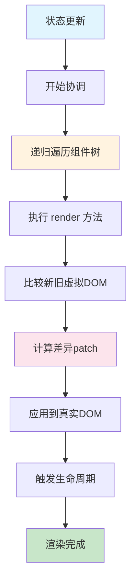

# React 15 - 栈协调器时代

> 🏗️ 深入理解 React 15 的栈协调器架构、工作原理和历史意义

## 📅 版本概述

- **发布时间**: 2016年4月
- **核心特性**: 栈协调器（Stack Reconciler）
- **架构模式**: 同步递归渲染
- **主要改进**: 移除 React.addons，引入警告系统
- **历史地位**: 经典的 React 架构，为 Fiber 奠定基础

## 🏗️ 栈协调器架构

### 核心设计理念

React 15 采用**栈协调器**（Stack Reconciler）作为核心协调引擎，其设计思想是：

1. **同步渲染** - 一旦开始更新，必须完整执行完毕
2. **递归遍历** - 深度优先遍历整个组件树
3. **即时更新** - 计算出差异后立即应用到 DOM
4. **简单直观** - 架构清晰，易于理解和调试

### 工作流程



## 🔍 核心算法实现

### 1. 递归协调算法

```javascript
// React 15 栈协调器的核心逻辑（简化版）
function reconcileChildren(instance, nextChildren) {
  // 获取当前子元素
  const prevChildren = instance._renderedChildren || {};
  const nextChildrenArray = React.Children.toArray(nextChildren);
  
  // 递归处理每个子元素
  const updatedChildren = {};
  
  for (let i = 0; i < nextChildrenArray.length; i++) {
    const child = nextChildrenArray[i];
    const name = child.key || i;
    const prevChild = prevChildren[name];
    
    if (prevChild && shouldUpdateComponent(prevChild, child)) {
      // 更新现有组件
      updatedChildren[name] = updateComponent(prevChild, child);
    } else {
      // 创建新组件
      updatedChildren[name] = instantiateComponent(child);
    }
  }
  
  // 卸载不再存在的组件
  for (const name in prevChildren) {
    if (!updatedChildren[name]) {
      unmountComponent(prevChildren[name]);
    }
  }
  
  instance._renderedChildren = updatedChildren;
}

// 同步更新组件
function updateComponent(instance, nextElement) {
  const prevElement = instance._currentElement;
  
  // 更新 props
  instance._currentElement = nextElement;
  
  // 调用 componentWillReceiveProps
  if (instance.componentWillReceiveProps) {
    instance.componentWillReceiveProps(nextElement.props);
  }
  
  // 调用 shouldComponentUpdate
  const shouldUpdate = instance.shouldComponentUpdate 
    ? instance.shouldComponentUpdate(nextElement.props, instance.state)
    : true;
  
  if (shouldUpdate) {
    // 调用 componentWillUpdate
    if (instance.componentWillUpdate) {
      instance.componentWillUpdate(nextElement.props, instance.state);
    }
    
    // 重新渲染
    const nextRenderedElement = instance.render();
    
    // 递归协调子树
    reconcileChildren(instance, nextRenderedElement);
    
    // 调用 componentDidUpdate
    if (instance.componentDidUpdate) {
      instance.componentDidUpdate(prevElement.props, prevElement.state);
    }
  }
  
  return instance;
}
```

### 2. Diff 算法实现

```javascript
// React 15 的 Diff 算法核心
function diff(prevNode, nextNode) {
  // 1. 类型不同，直接替换
  if (prevNode.type !== nextNode.type) {
    return {
      type: 'REPLACE',
      node: nextNode
    };
  }
  
  // 2. 文本节点比较
  if (typeof nextNode === 'string' || typeof nextNode === 'number') {
    if (prevNode !== nextNode) {
      return {
        type: 'TEXT',
        content: nextNode
      };
    }
    return null;
  }
  
  // 3. 元素节点比较
  const patches = [];
  
  // 比较属性
  const propPatches = diffProps(prevNode.props, nextNode.props);
  if (propPatches.length > 0) {
    patches.push({
      type: 'PROPS',
      patches: propPatches
    });
  }
  
  // 比较子元素
  const childPatches = diffChildren(
    prevNode.props.children, 
    nextNode.props.children
  );
  
  if (childPatches.length > 0) {
    patches.push({
      type: 'CHILDREN',
      patches: childPatches
    });
  }
  
  return patches.length > 0 ? patches : null;
}

// 子元素对比
function diffChildren(prevChildren, nextChildren) {
  const patches = [];
  const maxLength = Math.max(prevChildren.length, nextChildren.length);
  
  for (let i = 0; i < maxLength; i++) {
    const childPatch = diff(prevChildren[i], nextChildren[i]);
    if (childPatch) {
      patches.push({
        index: i,
        patch: childPatch
      });
    }
  }
  
  return patches;
}
```

## ⚡ 性能特征分析

### 🎯 优势

#### 1. **简单直观**
```javascript
// 栈协调器的渲染流程非常直观
class TodoApp extends React.Component {
  render() {
    return (
      <div>
        <TodoList items={this.state.todos} />
        <AddTodoForm onAdd={this.handleAdd} />
      </div>
    );
  }
}

// 执行路径：
// setState() → render() → 子组件render() → DOM更新 → 完成
```

#### 2. **同步可预测**
- 更新过程是同步的，结果可预测
- 调试简单，错误堆栈清晰
- 生命周期方法按顺序执行

#### 3. **内存占用小**
- 没有额外的调度开销
- 简单的递归调用栈
- 内存使用相对较少

### 🚨 局限性

#### 1. **长任务阻塞**
```javascript
// 问题示例：大量组件的同步渲染
const LargeList = ({ items }) => {
  return (
    <div>
      {items.map(item => (
        <ComplexItem key={item.id} data={item} />
      ))}
    </div>
  );
};

// 当 items.length > 1000 时，渲染会阻塞主线程
// 用户界面会出现明显的卡顿
```

#### 2. **无法中断**
一旦开始协调过程，就必须完整执行完毕：

```javascript
// React 15 的更新过程
function performSyncWork() {
  while (pendingUpdates.length > 0) {
    const update = pendingUpdates.shift();
    
    // 🚨 这个循环无法被中断
    processUpdate(update); // 可能耗时很长
  }
  
  // 只有全部完成后，用户才能看到更新
  commitUpdates();
}
```

#### 3. **优先级缺失**
所有更新都是同等优先级：

```javascript
// React 15 中的问题
handleUserInput();     // 高优先级（用户交互）
updateAnalytics();     // 低优先级（后台统计）
refreshAds();          // 低优先级（广告刷新）

// 以上三个更新会一起处理，没有优先级区分
// 可能导致用户交互响应延迟
```

## 🧮 性能瓶颈分析

### CPU 密集型场景

```javascript
// 性能瓶颈示例：递归渲染大型列表
const BigList = ({ items }) => {
  console.time('render-start');
  
  const renderItem = (item) => {
    // 每个项目都包含复杂的子组件树
    return (
      <div key={item.id}>
        <Header>{item.title}</Header>
        <Content>
          {item.sections.map(section => (
            <Section key={section.id}>
              {section.items.map(subItem => (
                <SubItem key={subItem.id} data={subItem} />
              ))}
            </Section>
          ))}
        </Content>
        <Footer actions={item.actions} />
      </div>
    );
  };
  
  const result = (
    <div>
      {items.map(renderItem)} {/* 同步渲染所有项目 */}
    </div>
  );
  
  console.timeEnd('render-start');
  return result;
};

// 当 items.length > 100 且每个 item 有复杂结构时
// 渲染时间可能超过 16.67ms (60fps)，造成卡顿
```

### 内存使用模式

```javascript
// React 15 的内存使用特点
const ComponentTree = {
  // 调用栈深度 = 组件树深度
  callStack: [
    'App.render()',
    'TodoList.render()', 
    'TodoItem.render()',
    'TodoItemContent.render()',
    // ... 可能很深
  ],
  
  // 同步处理，内存峰值较高
  memoryUsage: {
    peak: '组件树深度 × 组件复杂度',
    duration: '整个渲染周期',
    pattern: '突发高峰'
  }
};
```

## 📊 真实场景性能数据

### 测试场景对比

| 场景 | 组件数量 | 渲染时间 | 主线程阻塞 | 用户体验 |
|------|----------|----------|------------|----------|
| 小型应用 | < 50 | 1-3ms | 无感知 | ✅ 流畅 |
| 中型应用 | 50-200 | 5-15ms | 轻微 | ⚠️ 可接受 |
| 大型应用 | 200-500 | 15-50ms | 明显 | ❌ 卡顿 |
| 超大应用 | > 500 | > 50ms | 严重 | ❌ 不可用 |

### 实际测量代码

```javascript
// React 15 性能测量
class PerformanceMonitor extends React.Component {
  componentWillUpdate() {
    this.startTime = performance.now();
  }
  
  componentDidUpdate() {
    const endTime = performance.now();
    const duration = endTime - this.startTime;
    
    console.log(`组件更新耗时: ${duration.toFixed(2)}ms`);
    
    if (duration > 16.67) {
      console.warn('⚠️ 渲染时间超过一帧，可能造成卡顿');
    }
  }
  
  render() {
    return this.props.children;
  }
}

// 使用方式
<PerformanceMonitor>
  <LargeComponentTree />
</PerformanceMonitor>
```

## 🔧 典型开发模式

### 类组件模式

```javascript
// React 15 典型的组件写法
class TodoApp extends React.Component {
  constructor(props) {
    super(props);
    this.state = {
      todos: [],
      filter: 'all',
      newTodo: ''
    };
    
    // 手动绑定 this
    this.handleAddTodo = this.handleAddTodo.bind(this);
    this.handleToggleTodo = this.handleToggleTodo.bind(this);
    this.handleDeleteTodo = this.handleDeleteTodo.bind(this);
  }
  
  // 生命周期方法
  componentDidMount() {
    this.loadTodos();
  }
  
  componentWillReceiveProps(nextProps) {
    if (nextProps.userId !== this.props.userId) {
      this.loadTodos(nextProps.userId);
    }
  }
  
  shouldComponentUpdate(nextProps, nextState) {
    return nextState.todos !== this.state.todos ||
           nextState.filter !== this.state.filter;
  }
  
  componentDidUpdate(prevProps, prevState) {
    if (prevState.todos.length !== this.state.todos.length) {
      this.saveTodos();
    }
  }
  
  // 事件处理方法
  handleAddTodo() {
    const { newTodo } = this.state;
    if (newTodo.trim()) {
      this.setState({
        todos: [
          ...this.state.todos,
          {
            id: Date.now(),
            text: newTodo.trim(),
            completed: false
          }
        ],
        newTodo: ''
      });
    }
  }
  
  handleToggleTodo(id) {
    this.setState({
      todos: this.state.todos.map(todo =>
        todo.id === id ? { ...todo, completed: !todo.completed } : todo
      )
    });
  }
  
  render() {
    const { todos, filter, newTodo } = this.state;
    const filteredTodos = this.getFilteredTodos(todos, filter);
    
    return (
      <div className="todo-app">
        <h1>Todo List</h1>
        <input
          value={newTodo}
          onChange={(e) => this.setState({ newTodo: e.target.value })}
          placeholder="添加新任务..."
        />
        <button onClick={this.handleAddTodo}>添加</button>
        
        <TodoList
          todos={filteredTodos}
          onToggle={this.handleToggleTodo}
          onDelete={this.handleDeleteTodo}
        />
        
        <TodoFilter
          filter={filter}
          onChange={(filter) => this.setState({ filter })}
        />
      </div>
    );
  }
}
```

### Mixin 模式（已废弃）

```javascript
// React 15 早期的 Mixin 模式
var PureRenderMixin = require('react-addons-pure-render-mixin');
var LinkedStateMixin = require('react-addons-linked-state-mixin');

var TodoItem = React.createClass({
  mixins: [PureRenderMixin, LinkedStateMixin],
  
  getInitialState: function() {
    return {
      editing: false,
      editText: this.props.todo.text
    };
  },
  
  render: function() {
    return (
      <div>
        {this.state.editing ? (
          <input
            valueLink={this.linkState('editText')}
            onBlur={this.handleSave}
          />
        ) : (
          <span onClick={this.handleEdit}>
            {this.props.todo.text}
          </span>
        )}
      </div>
    );
  }
});
```

## 🎭 生命周期系统

### 完整生命周期图

```javascript
// React 15 完整的生命周期流程
class LifecycleDemo extends React.Component {
  constructor(props) {
    super(props);
    console.log('1. constructor - 组件实例化');
    this.state = { count: 0 };
  }
  
  // === 挂载阶段 ===
  componentWillMount() {
    console.log('2. componentWillMount - 即将挂载');
  }
  
  render() {
    console.log('3. render - 渲染');
    return <div>Count: {this.state.count}</div>;
  }
  
  componentDidMount() {
    console.log('4. componentDidMount - 挂载完成');
  }
  
  // === 更新阶段 ===
  componentWillReceiveProps(nextProps) {
    console.log('5. componentWillReceiveProps - 接收新props');
  }
  
  shouldComponentUpdate(nextProps, nextState) {
    console.log('6. shouldComponentUpdate - 是否应该更新');
    return true;
  }
  
  componentWillUpdate(nextProps, nextState) {
    console.log('7. componentWillUpdate - 即将更新');
  }
  
  // render() 再次调用
  
  componentDidUpdate(prevProps, prevState) {
    console.log('8. componentDidUpdate - 更新完成');
  }
  
  // === 卸载阶段 ===
  componentWillUnmount() {
    console.log('9. componentWillUnmount - 即将卸载');
  }
}
```

### 生命周期的同步特性

```javascript
// React 15 的同步执行特点
class SyncLifecycle extends React.Component {
  componentDidUpdate() {
    console.log('开始生命周期');
    
    // 🚨 这里的任何操作都会阻塞渲染
    this.processLargeDataset(); // 可能耗时 100ms
    
    console.log('生命周期结束');
    // 用户在这 100ms 内看不到界面更新
  }
  
  processLargeDataset() {
    // 模拟耗时操作
    const start = Date.now();
    while (Date.now() - start < 100) {
      // 计算密集型任务
    }
  }
  
  render() {
    return <div>{this.state.data}</div>;
  }
}
```

## 🔀 事件系统

### 合成事件机制

```javascript
// React 15 的事件系统
class EventDemo extends React.Component {
  handleClick = (e) => {
    console.log('React 合成事件:', e);
    console.log('原生事件:', e.nativeEvent);
    
    // 事件对象会被重用（对象池模式）
    setTimeout(() => {
      console.log('延迟访问:', e.type); // 可能已被重置
    }, 0);
  }
  
  render() {
    return (
      <button onClick={this.handleClick}>
        点击测试事件系统
      </button>
    );
  }
}

// React 15 事件处理流程
const EventFlow = {
  capture: '1. 事件捕获阶段',
  target: '2. 目标元素处理', 
  bubble: '3. 事件冒泡阶段',
  cleanup: '4. 事件对象回收'
};
```

### 事件委托实现

```javascript
// React 15 的事件委托机制
function attachEvents(container) {
  // 所有事件都绑定在 document 上
  document.addEventListener('click', dispatchEvent, false);
  document.addEventListener('change', dispatchEvent, false);
  // ... 其他事件类型
}

function dispatchEvent(nativeEvent) {
  const targetNode = nativeEvent.target;
  const reactInstance = getReactInstanceFromNode(targetNode);
  
  if (reactInstance) {
    const syntheticEvent = createSyntheticEvent(nativeEvent);
    
    // 构建事件路径
    const eventPath = buildEventPath(reactInstance);
    
    // 执行捕获阶段
    executeEventPath(eventPath, syntheticEvent, 'capture');
    
    // 执行冒泡阶段  
    executeEventPath(eventPath.reverse(), syntheticEvent, 'bubble');
    
    // 回收事件对象
    releaseSyntheticEvent(syntheticEvent);
  }
}
```

## 🏛️ 组件系统

### 组件类型

```javascript
// 1. React.createClass (已废弃)
var OldStyleComponent = React.createClass({
  getInitialState: function() {
    return { count: 0 };
  },
  
  getDefaultProps: function() {
    return { title: 'Default Title' };
  },
  
  render: function() {
    return React.createElement('div', null, this.state.count);
  }
});

// 2. ES6 Class 组件
class ModernComponent extends React.Component {
  static defaultProps = {
    title: 'Default Title'
  };
  
  state = { count: 0 };
  
  render() {
    return <div>{this.state.count}</div>;
  }
}

// 3. 函数组件（仅用于静态渲染）
function StatelessComponent(props) {
  return <div>{props.title}</div>;
}
```

### 组件通信模式

```javascript
// React 15 的组件通信模式

// 1. Props Down, Events Up
class Parent extends React.Component {
  state = { data: [] };
  
  handleChildEvent = (newData) => {
    this.setState({ data: newData });
  }
  
  render() {
    return (
      <Child 
        data={this.state.data}
        onUpdate={this.handleChildEvent}
      />
    );
  }
}

// 2. Context API (早期版本，不推荐)
class App extends React.Component {
  static childContextTypes = {
    theme: React.PropTypes.string
  };
  
  getChildContext() {
    return { theme: 'dark' };
  }
  
  render() {
    return <ThemedComponent />;
  }
}

class ThemedComponent extends React.Component {
  static contextTypes = {
    theme: React.PropTypes.string
  };
  
  render() {
    return (
      <div style={{ 
        background: this.context.theme === 'dark' ? '#333' : '#fff' 
      }}>
        主题化组件
      </div>
    );
  }
}
```

## 🚀 优化技巧

### 1. shouldComponentUpdate 优化

```javascript
// 手动优化重渲染
class OptimizedComponent extends React.Component {
  shouldComponentUpdate(nextProps, nextState) {
    // 浅比较 props
    const propsChanged = Object.keys(nextProps).some(
      key => nextProps[key] !== this.props[key]
    );
    
    // 浅比较 state
    const stateChanged = Object.keys(nextState).some(
      key => nextState[key] !== this.state[key]
    );
    
    return propsChanged || stateChanged;
  }
  
  render() {
    return <ExpensiveChildTree {...this.props} />;
  }
}

// 使用 PureComponent (React 15.3+)
class PureOptimizedComponent extends React.PureComponent {
  // 自动实现浅比较的 shouldComponentUpdate
  render() {
    return <ExpensiveChildTree {...this.props} />;
  }
}
```

### 2. 组件拆分策略

```javascript
// 避免大组件的重渲染
// ❌ 不好的做法
class MonolithicComponent extends React.Component {
  render() {
    return (
      <div>
        <Header user={this.props.user} />
        <Navigation items={this.props.navigation} />
        <Content data={this.state.content} />
        <Sidebar widgets={this.state.widgets} />
        <Footer links={this.props.footerLinks} />
      </div>
    );
  }
}

// ✅ 好的做法 - 组件拆分
class App extends React.Component {
  render() {
    return (
      <div>
        <HeaderContainer />
        <NavigationContainer />
        <ContentContainer />
        <SidebarContainer />
        <FooterContainer />
      </div>
    );
  }
}
```

### 3. 状态提升优化

```javascript
// 合理的状态管理
class TodoContainer extends React.Component {
  state = {
    todos: [],
    filter: 'all'
  };
  
  // 只有真正需要的状态才放在顶层
  render() {
    return (
      <div>
        <TodoList 
          todos={this.getFilteredTodos()}
          onToggle={this.handleToggle}
        />
        <FilterControls
          filter={this.state.filter}
          onChange={this.handleFilterChange}
        />
      </div>
    );
  }
}

// 局部状态保持在组件内部
class AddTodoForm extends React.Component {
  state = { inputValue: '' }; // 输入状态不需要提升
  
  handleSubmit = () => {
    this.props.onAdd(this.state.inputValue);
    this.setState({ inputValue: '' });
  }
  
  render() {
    return (
      <form onSubmit={this.handleSubmit}>
        <input 
          value={this.state.inputValue}
          onChange={(e) => this.setState({ inputValue: e.target.value })}
        />
      </form>
    );
  }
}
```

## 🎯 React 15 的历史价值

### 奠定基础
React 15 确立了 React 的核心概念：
- **声明式 UI** - 描述界面应该是什么样子
- **组件化思想** - 将 UI 拆分为独立的组件
- **单向数据流** - 数据从父组件流向子组件
- **虚拟 DOM** - 提供性能优化的抽象层

### 发现问题
React 15 也暴露了一些根本性问题：
- **长任务阻塞** - 大型应用的性能瓶颈
- **优先级缺失** - 无法区分更新的重要性
- **生命周期复杂** - 逻辑分散在多个方法中
- **逻辑复用困难** - 高阶组件和渲染属性的复杂性

### 推动演进
这些问题最终推动了 React 16 的革命性改进：
- **Fiber 架构** - 解决阻塞问题
- **优先级调度** - 区分更新重要性
- **Hooks 系统** - 简化逻辑复用
- **并发特性** - 提升用户体验

## 🎓 学习建议

### 为什么要学习 React 15？

#### 1. **理解演进** 
了解 React 的发展历程，理解每个设计决策的背景

#### 2. **架构思维**
栈协调器的简单性有助于理解协调算法的本质

#### 3. **问题意识**
体验 React 15 的局限性，更好地理解 Fiber 的价值

#### 4. **历史传承**
很多现有项目仍在使用 React 15，需要维护和升级

### 实践建议

1. **动手实现** - 尝试实现一个简化版的栈协调器
2. **性能测试** - 亲自体验大型应用的性能瓶颈
3. **对比学习** - 与 React 16+ 的实现进行对比
4. **源码阅读** - 阅读 React 15 的核心源码

## 🔗 相关资源

- [React 15 官方文档](https://15.reactjs.org/)
- [React 15 源码仓库](https://github.com/facebook/react/tree/15-stable)
- [栈协调器设计文档](https://reactjs.org/docs/implementation-notes.html)
- [React 15 迁移指南](https://reactjs.org/blog/2016/04/07/react-v15.html)

## 🎯 下一步

学习完 React 15 的栈协调器后，建议继续学习：
1. **[React 16 - Fiber 架构](./react-16.md)** - 理解革命性的改进
2. **[架构对比分析](./comparison.md)** - 深度对比两种架构
3. **[实践项目](../../packages/react-15-demo/)** - 动手体验栈协调器

React 15 虽然已成历史，但理解它对于成为真正的 React 专家是必不可少的！🚀
