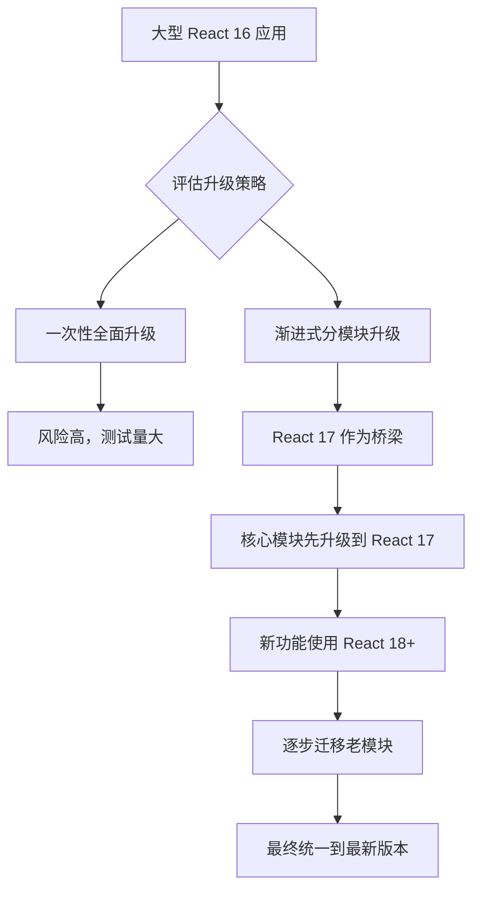

# React 17：零破坏性升级的里程碑

> React 17 - 为未来铺路的"垫脚石"版本，开启渐进式升级新时代

## 概述

React 17 于 2020年10月发布，被称为"垫脚石"版本。虽然没有引入重大的新功能，但它在 React 的发展历程中具有重要意义，主要体现在**零破坏性升级**理念和**事件系统重构**上。

### 🎯 核心理念：零破坏性升级

React 17 的最大价值在于为**渐进式升级**奠定基础，允许应用的不同部分使用不同版本的 React。

## 🔄 主要变化

### 1. 事件委托机制重构

#### 🏗️ React 16 及之前的事件委托

```javascript
// React 16：事件委托到 document
document.addEventListener('click', handleClick);
document.addEventListener('change', handleChange);

// 问题：多个 React 版本会冲突
// App A (React 16) -> document
// App B (React 17) -> document  // 冲突！
```

#### ⚡ React 17 的事件委托改进

```javascript
// React 17：事件委托到 React 根容器
const rootContainer = document.getElementById('react-root');
rootContainer.addEventListener('click', handleClick);
rootContainer.addEventListener('change', handleChange);

// 优势：不同版本可以共存
// App A (React 16) -> document
// App B (React 17) -> #react-root-b
// App C (React 18) -> #react-root-c
```

### 2. 新的 JSX 转换

#### 传统的 JSX 转换
```jsx
// 源代码
function App() {
  return <h1>Hello World</h1>;
}

// React 16 编译后
import React from 'react';

function App() {
  return React.createElement('h1', null, 'Hello World');
}
```

#### React 17 的新 JSX 转换
```jsx
// 源代码（无需导入 React）
function App() {
  return <h1>Hello World</h1>;
}

// React 17 编译后
import { jsx as _jsx } from 'react/jsx-runtime';

function App() {
  return _jsx('h1', { children: 'Hello World' });
}
```

### 3. 事件池优化移除

```javascript
// React 16：事件对象会被重用（事件池）
function handleClick(e) {
  // 需要调用 persist() 来保持事件对象
  e.persist();
  setTimeout(() => {
    console.log(e.target); // 可能已被清空
  }, 100);
}

// React 17：移除事件池，简化使用
function handleClick(e) {
  // 直接使用，无需 persist()
  setTimeout(() => {
    console.log(e.target); // 始终有效
  }, 100);
}
```

## 🎯 渐进式升级策略

### 多版本共存场景

```html
<!DOCTYPE html>
<html>
<head>
  <title>多版本 React 应用</title>
</head>
<body>
  <!-- 老系统：React 16 -->
  <div id="legacy-app"></div>
  
  <!-- 新模块：React 17 -->
  <div id="new-module"></div>
  
  <!-- 微前端：React 18 -->
  <div id="micro-frontend"></div>
  
  <script>
    // 不同版本可以并存运行
    ReactDOM.render(<LegacyApp />, document.getElementById('legacy-app'));
    ReactDOM.render(<NewModule />, document.getElementById('new-module'));
    ReactDOM.render(<MicroApp />, document.getElementById('micro-frontend'));
  </script>
</body>
</html>
```

### 升级路径策略



## 🔧 技术细节

### 1. 事件系统架构变化

#### React 16 事件流
```
用户点击 -> DOM 事件 -> document 捕获 -> React 合成事件 -> 组件处理
```

#### React 17 事件流
```
用户点击 -> DOM 事件 -> 根容器捕获 -> React 合成事件 -> 组件处理
```

### 2. 新的 JSX Runtime 实现

```javascript
// React 17 jsx-runtime 源码简化版
export function jsx(type, config, maybeKey) {
  let propName;
  const props = {};
  let key = null;
  let ref = null;

  if (maybeKey !== undefined) {
    key = '' + maybeKey;
  }

  if (config != null) {
    if (hasValidRef(config)) {
      ref = config.ref;
    }
    if (hasValidKey(config)) {
      key = '' + config.key;
    }

    for (propName in config) {
      if (hasOwnProperty.call(config, propName) && 
          !RESERVED_PROPS.hasOwnProperty(propName)) {
        props[propName] = config[propName];
      }
    }
  }

  return ReactElement(type, key, ref, props);
}
```

### 3. 兼容性处理机制

```javascript
// React 17 兼容性检查
function checkReactVersion() {
  const reactVersion = React.version;
  const [major, minor] = reactVersion.split('.').map(Number);
  
  if (major < 17) {
    console.warn('建议升级到 React 17 以获得更好的兼容性');
  }
  
  return {
    supportsNewJSX: major >= 17,
    supportsEventDelegation: major >= 17,
    supportsConcurrentFeatures: major >= 18
  };
}
```

## 📊 性能优化

### 1. Bundle 大小优化

```javascript
// React 16 打包大小
// react.production.min.js: ~6.4KB
// react-dom.production.min.js: ~103.7KB

// React 17 打包大小优化
// react.production.min.js: ~6.3KB (-0.1KB)
// react-dom.production.min.js: ~103.9KB (+0.2KB)
// 整体相当，但新 JSX Runtime 可以减少打包大小
```

### 2. 新 JSX 转换的优势

```jsx
// 传统方式：每个文件都需要导入 React
import React from 'react'; // +1 import 语句
function Component() {
  return <div>Content</div>;
}

// 新方式：自动导入，减少 bundle 大小
// 无需手动导入
function Component() {
  return <div>Content</div>; // 编译器自动处理
}

// Bundle 分析
// 1000 个组件文件 × React 导入 = 显著的 bundle 增加
// 新 JSX Runtime = 自动优化，更小的 bundle
```

## 🚀 升级指南

### 1. 创建 React 17 项目

```bash
# 创建新项目
npx create-react-app my-react17-app

# 或升级现有项目
npm install react@17 react-dom@17

# 更新 package.json
{
  "dependencies": {
    "react": "^17.0.0",
    "react-dom": "^17.0.0"
  }
}
```

### 2. 启用新的 JSX 转换

```javascript
// babel.config.js
module.exports = {
  presets: [
    ['@babel/preset-react', {
      "runtime": "automatic" // 启用新的 JSX Runtime
    }]
  ]
};

// tsconfig.json (TypeScript)
{
  "compilerOptions": {
    "jsx": "react-jsx" // 使用新的 JSX 转换
  }
}
```

### 3. 渐进式升级策略

```javascript
// 步骤1：升级 React 17
npm install react@17 react-dom@17

// 步骤2：启用新 JSX 转换
// 可以逐个文件移除 React 导入

// 步骤3：测试事件处理
// 确保事件委托变化不影响现有功能

// 步骤4：为 React 18 升级做准备
// 开始使用 createRoot API（React 18 预备）
```

## 🔍 深度分析

### 1. 事件委托变化的深层原因

```javascript
// 问题场景：多个 React 应用共存
// React 16 及之前
window.addEventListener('load', () => {
  // 主应用 React 16
  ReactDOM.render(<MainApp />, document.getElementById('main'));
  
  // 微前端 React 16（另一个版本）
  ReactDOM.render(<MicroApp />, document.getElementById('micro'));
  
  // 问题：两个应用的事件都委托到 document
  // 可能造成事件冲突、处理顺序问题
});

// React 17 解决方案
window.addEventListener('load', () => {
  // 主应用 React 17
  const mainRoot = document.getElementById('main');
  ReactDOM.render(<MainApp />, mainRoot);
  
  // 微前端 React 17
  const microRoot = document.getElementById('micro');
  ReactDOM.render(<MicroApp />, microRoot);
  
  // 优势：事件委托到各自的根容器
  // 完全隔离，避免冲突
});
```

### 2. JSX 转换优化的编译器视角

```javascript
// 编译器优化角度
// 传统 JSX 转换
function OldJSXTransform(node) {
  return {
    type: 'CallExpression',
    callee: {
      type: 'MemberExpression',
      object: { type: 'Identifier', name: 'React' },
      property: { type: 'Identifier', name: 'createElement' }
    },
    arguments: [
      { type: 'Literal', value: node.type },
      node.props,
      ...node.children
    ]
  };
}

// 新 JSX 转换
function NewJSXTransform(node) {
  return {
    type: 'CallExpression',
    callee: {
      type: 'Identifier', 
      name: '_jsx' // 直接调用，无需对象访问
    },
    arguments: [
      { type: 'Literal', value: node.type },
      {
        type: 'ObjectExpression',
        properties: [
          ...node.props,
          {
            key: 'children',
            value: node.children
          }
        ]
      }
    ]
  };
}
```

## 📈 迁移最佳实践

### 1. 大型应用迁移策略

```javascript
// 阶段性迁移计划
const migrationPlan = {
  phase1: {
    target: '核心基础库',
    actions: [
      '升级 React/ReactDOM 到 17',
      '启用新 JSX 转换',
      '测试事件处理兼容性'
    ]
  },
  phase2: {
    target: '业务组件库',
    actions: [
      '逐个模块测试',
      '移除不必要的 React 导入',
      '优化事件处理逻辑'
    ]
  },
  phase3: {
    target: '应用层',
    actions: [
      '全面回归测试',
      '性能对比验证',
      '准备 React 18 升级'
    ]
  }
};
```

### 2. 测试策略

```javascript
// 事件系统测试
describe('React 17 事件系统', () => {
  test('事件委托到根容器', () => {
    const container = document.createElement('div');
    document.body.appendChild(container);
    
    const handleClick = jest.fn();
    ReactDOM.render(
      <button onClick={handleClick}>Click me</button>, 
      container
    );
    
    // 验证事件不在 document 上
    expect(document._listeners).toBeUndefined();
    
    // 验证事件在容器上
    expect(container._listeners).toBeDefined();
  });
  
  test('新 JSX 无需 React 导入', () => {
    // 编译测试
    const source = `
      function Component() {
        return <div>Hello</div>;
      }
    `;
    
    const compiled = babel.transform(source, {
      presets: [['@babel/preset-react', { runtime: 'automatic' }]]
    });
    
    // 验证没有 React.createElement
    expect(compiled.code).not.toContain('React.createElement');
    expect(compiled.code).toContain('jsx');
  });
});
```

## 🎯 总结

React 17 虽然没有引入令人兴奋的新功能，但它在 React 生态系统中扮演着重要的"桥梁"角色：

### 🌟 核心价值

1. **零破坏性升级** - 为大型应用提供平滑的升级路径
2. **事件系统重构** - 解决多版本共存问题
3. **新 JSX 转换** - 提升开发体验，优化 bundle 大小
4. **为未来铺路** - 为 React 18 的并发特性奠定基础

### 🚀 战略意义

React 17 证明了 React 团队对**向后兼容性**和**渐进式升级**的承诺，这种理念在大型应用的技术演进中具有重要价值。

### 📅 时间线价值

```
React 16 (2017) → Fiber 架构革命
React 17 (2020) → 零破坏性升级桥梁  ← 我们在这里
React 18 (2022) → 并发特性正式版
React 19 (2024) → 编译器优化时代
```

React 17 是理解 React 演进策略的关键版本，它展示了如何在快速发展的技术栈中保持稳定性和可预测性。
