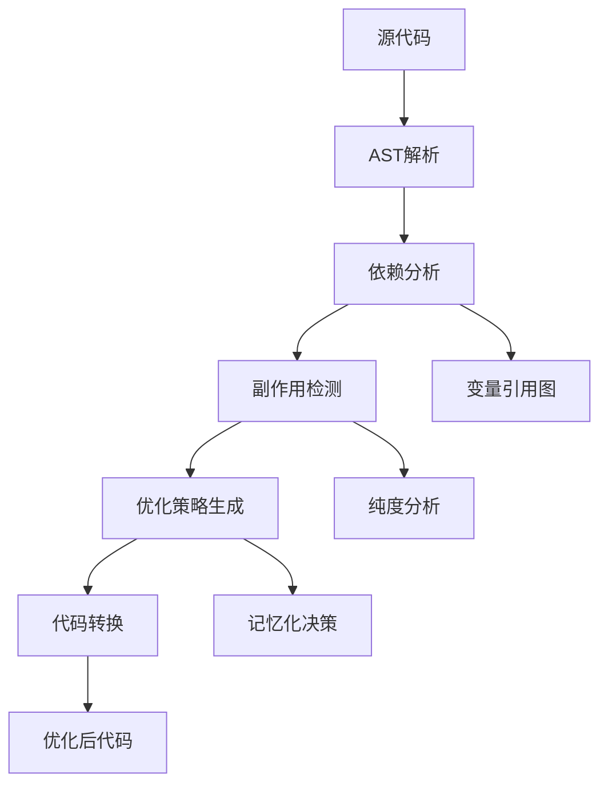

# React 19：编译器优化的新时代

> React 19 - 引入 React Compiler，开启自动优化和服务端组件的革命

## 概述

React 19 于 2024年4月发布，是 React 历史上最具革命性的版本之一。它引入了期待已久的 **React Compiler**，实现了**自动性能优化**，同时完善了 **Server Components** 和 **Server Actions**，将 React 推向了一个全新的时代。

### 🎯 核心理念：编译时优化

React 19 的最大突破是通过**编译器**自动处理性能优化，开发者无需手动添加 `useMemo`、`useCallback` 等优化 Hook。

## 🚀 革命性新特性

### 1. React Compiler（编译器）

#### 🏗️ 传统的手动优化方式

```javascript
// React 18 及之前：需要手动优化
function ExpensiveComponent({ items, filter }) {
  // 手动使用 useMemo 缓存计算结果
  const filteredItems = useMemo(() => {
    return items.filter(item => item.category === filter);
  }, [items, filter]);
  
  // 手动使用 useCallback 缓存函数
  const handleClick = useCallback((id) => {
    onItemClick(id);
  }, [onItemClick]);
  
  return (
    <div>
      {filteredItems.map(item => (
        <Item 
          key={item.id} 
          item={item} 
          onClick={handleClick}
        />
      ))}
    </div>
  );
}
```

#### ⚡ React 19 编译器自动优化

```javascript
// React 19：编译器自动优化
function ExpensiveComponent({ items, filter }) {
  // 编译器自动识别并缓存这个计算
  const filteredItems = items.filter(item => item.category === filter);
  
  // 编译器自动缓存这个函数
  const handleClick = (id) => {
    onItemClick(id);
  };
  
  return (
    <div>
      {filteredItems.map(item => (
        <Item 
          key={item.id} 
          item={item} 
          onClick={handleClick}
        />
      ))}
    </div>
  );
  
  // 编译后的代码（简化版）:
  // const filteredItems = useMemo(() => 
  //   items.filter(item => item.category === filter), 
  //   [items, filter]
  // );
  // const handleClick = useCallback((id) => onItemClick(id), [onItemClick]);
}
```

### 2. Server Components（服务端组件）

```javascript
// Server Component：在服务端运行
async function BlogPost({ slug }) {
  // 这个数据获取在服务端执行
  const post = await db.posts.findBySlug(slug);
  const comments = await db.comments.findByPostId(post.id);
  
  return (
    <article>
      <h1>{post.title}</h1>
      <p>作者：{post.author}</p>
      <div dangerouslySetInnerHTML={{ __html: post.content }} />
      
      {/* 客户端组件用于交互 */}
      <CommentSection comments={comments} />
    </article>
  );
}

// Client Component：在客户端运行
'use client';

function CommentSection({ comments }) {
  const [newComment, setNewComment] = useState('');
  
  const handleSubmit = async (formData) => {
    // Server Action
    await submitComment(formData);
  };
  
  return (
    <section>
      <h3>评论 ({comments.length})</h3>
      {comments.map(comment => (
        <Comment key={comment.id} comment={comment} />
      ))}
      
      <form action={handleSubmit}>
        <textarea 
          name="content"
          value={newComment}
          onChange={e => setNewComment(e.target.value)}
        />
        <button type="submit">提交评论</button>
      </form>
    </section>
  );
}
```

### 3. Server Actions（服务端操作）

```javascript
// Server Action：在服务端执行的函数
async function createPost(formData) {
  'use server';
  
  const title = formData.get('title');
  const content = formData.get('content');
  
  // 服务端验证
  if (!title || !content) {
    throw new Error('标题和内容不能为空');
  }
  
  // 直接操作数据库
  const post = await db.posts.create({
    title,
    content,
    authorId: getCurrentUserId()
  });
  
  // 自动重新验证缓存
  revalidatePath('/blog');
  
  return { success: true, postId: post.id };
}

// 在客户端组件中使用
'use client';

function CreatePostForm() {
  const [isPending, startTransition] = useTransition();
  
  const handleSubmit = async (formData) => {
    startTransition(async () => {
      try {
        await createPost(formData);
        // 成功后的处理
      } catch (error) {
        // 错误处理
        console.error(error);
      }
    });
  };
  
  return (
    <form action={handleSubmit}>
      <input name="title" placeholder="文章标题" />
      <textarea name="content" placeholder="文章内容" />
      <button type="submit" disabled={isPending}>
        {isPending ? '发布中...' : '发布文章'}
      </button>
    </form>
  );
}
```

### 4. 新的 Hook：use()

```javascript
import { use, Suspense } from 'react';

// use() Hook 可以读取 Promise 和 Context
function UserProfile({ userPromise }) {
  // use() 会暂停组件直到 Promise 解决
  const user = use(userPromise);
  
  return (
    <div>
      <h1>{user.name}</h1>
      <p>{user.email}</p>
      <Avatar src={user.avatar} />
    </div>
  );
}

// 使用方式
function App() {
  const userPromise = fetchUser(123);
  
  return (
    <Suspense fallback={<div>加载用户信息...</div>}>
      <UserProfile userPromise={userPromise} />
    </Suspense>
  );
}

// use() 也可以读取 Context
function useTheme() {
  return use(ThemeContext);
}
```

### 5. Asset Loading API

```javascript
// React 19 的资源预加载 API
import { preload, preinit } from 'react-dom';

function MyComponent() {
  useEffect(() => {
    // 预加载资源
    preload('/images/hero.jpg', { as: 'image' });
    preload('/api/data.json', { as: 'fetch' });
    
    // 预初始化样式表
    preinit('/styles/theme.css', { as: 'style' });
    preinit('/scripts/analytics.js', { as: 'script' });
  }, []);
  
  return <div>内容</div>;
}

// 在 Server Component 中预加载
async function BlogPage({ slug }) {
  // 服务端预加载
  preload(`/api/posts/${slug}`, { as: 'fetch' });
  
  const post = await fetchPost(slug);
  
  return (
    <article>
      <h1>{post.title}</h1>
      
    </article>
  );
}
```

## 🔧 React Compiler 深度解析

### 1. 编译器的工作原理

```javascript
// 源代码
function Component({ items, filter }) {
  const filteredItems = items.filter(item => item.type === filter);
  
  const handleClick = (id) => {
    console.log('Clicked:', id);
  };
  
  return (
    <div>
      {filteredItems.map(item => 
        <Item key={item.id} item={item} onClick={() => handleClick(item.id)} />
      )}
    </div>
  );
}

// 编译器分析后的优化版本
function Component({ items, filter }) {
  // 编译器插入的缓存逻辑
  const filteredItems = useMemo(() => 
    items.filter(item => item.type === filter), 
    [items, filter]
  );
  
  const handleClick = useCallback((id) => {
    console.log('Clicked:', id);
  }, []);
  
  const itemClickHandlers = useMemo(() => 
    new Map(filteredItems.map(item => [
      item.id, 
      () => handleClick(item.id)
    ])), 
    [filteredItems, handleClick]
  );
  
  return (
    <div>
      {filteredItems.map(item => 
        <Item 
          key={item.id} 
          item={item} 
          onClick={itemClickHandlers.get(item.id)} 
        />
      )}
    </div>
  );
}
```

### 2. 编译器的优化策略

```javascript
// 编译器优化策略示例
class ReactCompilerOptimizer {
  optimizeComponent(component) {
    const analysis = this.analyzeComponent(component);
    
    return {
      // 1. 表达式缓存
      memoizedExpressions: this.findCacheableExpressions(analysis),
      
      // 2. 函数缓存
      memoizedCallbacks: this.findCacheableFunctions(analysis),
      
      // 3. 依赖分析
      dependencies: this.analyzeDependencies(analysis),
      
      // 4. 渲染路径优化
      renderPaths: this.optimizeRenderPaths(analysis)
    };
  }
  
  findCacheableExpressions(analysis) {
    // 识别可以缓存的表达式
    // 例如：数组过滤、对象映射、计算属性等
    return analysis.expressions.filter(expr => 
      this.isExpensive(expr) && 
      this.hasStableDependencies(expr)
    );
  }
  
  findCacheableFunctions(analysis) {
    // 识别可以缓存的函数
    // 例如：事件处理器、回调函数等
    return analysis.functions.filter(func => 
      this.isUsedInRender(func) &&
      this.hasStableClosure(func)
    );
  }
}
```

### 3. 编译器的智能分析

```javascript
// 编译器智能分析示例
function SmartComponent({ data, config }) {
  // 编译器分析：这是个昂贵的计算，需要缓存
  const processedData = data
    .filter(item => item.active)
    .map(item => ({
      ...item,
      displayName: `${item.name} (${item.category})`
    }))
    .sort((a, b) => a.priority - b.priority);
  
  // 编译器分析：这个函数在渲染中使用，需要缓存
  const handleItemUpdate = (id, updates) => {
    updateItem(id, updates);
  };
  
  // 编译器分析：这个对象每次都会重新创建，需要优化
  const itemProps = {
    theme: config.theme,
    locale: config.locale,
    onUpdate: handleItemUpdate
  };
  
  return (
    <div>
      {processedData.map(item => (
        <ProcessedItem 
          key={item.id}
          item={item}
          {...itemProps}
        />
      ))}
    </div>
  );
}

// 编译器自动生成的优化版本
function SmartComponent({ data, config }) {
  const processedData = useMemo(() => 
    data
      .filter(item => item.active)
      .map(item => ({
        ...item,
        displayName: `${item.name} (${item.category})`
      }))
      .sort((a, b) => a.priority - b.priority),
    [data]
  );
  
  const handleItemUpdate = useCallback((id, updates) => {
    updateItem(id, updates);
  }, [updateItem]);
  
  const itemProps = useMemo(() => ({
    theme: config.theme,
    locale: config.locale,
    onUpdate: handleItemUpdate
  }), [config.theme, config.locale, handleItemUpdate]);
  
  return (
    <div>
      {processedData.map(item => (
        <ProcessedItem 
          key={item.id}
          item={item}
          {...itemProps}
        />
      ))}
    </div>
  );
}
```

## 🌐 服务端组件架构

### 1. 服务端和客户端的边界

```javascript
// 服务端组件 (默认)
async function ProductPage({ productId }) {
  // 在服务端执行
  const product = await db.products.findById(productId);
  const reviews = await db.reviews.findByProductId(productId);
  const recommendations = await getRecommendations(productId);
  
  return (
    <div>
      <ProductHeader product={product} />
      
      {/* 客户端组件用于交互 */}
      <ProductActions productId={productId} />
      
      <ReviewList reviews={reviews} />
      
      {/* 服务端组件可以嵌套 */}
      <RecommendedProducts products={recommendations} />
    </div>
  );
}

// 客户端组件
'use client';

function ProductActions({ productId }) {
  const [quantity, setQuantity] = useState(1);
  const [isAdding, setIsAdding] = useState(false);
  
  const addToCart = async () => {
    setIsAdding(true);
    try {
      // Server Action
      await addProductToCart(productId, quantity);
      toast.success('已添加到购物车');
    } catch (error) {
      toast.error('添加失败');
    } finally {
      setIsAdding(false);
    }
  };
  
  return (
    <div className="product-actions">
      <QuantitySelector 
        value={quantity}
        onChange={setQuantity}
      />
      <button 
        onClick={addToCart}
        disabled={isAdding}
      >
        {isAdding ? '添加中...' : '加入购物车'}
      </button>
    </div>
  );
}
```

### 2. 数据获取策略

```javascript
// 服务端组件的数据获取模式
async function BlogPage() {
  // 并行获取数据
  const [posts, categories, featured] = await Promise.all([
    db.posts.findPublished(),
    db.categories.findAll(),
    db.posts.findFeatured()
  ]);
  
  return (
    <div>
      <FeaturedSection posts={featured} />
      <CategoryNav categories={categories} />
      <PostGrid posts={posts} />
    </div>
  );
}

// 嵌套数据获取
async function PostGrid({ posts }) {
  return (
    <div className="grid">
      {posts.map(async (post) => (
        // 每个 PostCard 可以独立获取数据
        <PostCard key={post.id} postId={post.id} />
      ))}
    </div>
  );
}

async function PostCard({ postId }) {
  const post = await db.posts.findById(postId);
  const author = await db.users.findById(post.authorId);
  
  return (
    <article>
      <h3>{post.title}</h3>
      <p>作者：{author.name}</p>
      <p>{post.excerpt}</p>
    </article>
  );
}
```

### 3. 流式渲染优化

```javascript
// Suspense 边界用于流式渲染
function App() {
  return (
    <html>
      <body>
        {/* 立即渲染的外壳 */}
        <Header />
        <Navigation />
        
        {/* 主要内容可以流式传输 */}
        <Suspense fallback={<ContentSkeleton />}>
          <MainContent />
        </Suspense>
        
        {/* 侧边栏独立加载 */}
        <Suspense fallback={<SidebarSkeleton />}>
          <Sidebar />
        </Suspense>
        
        <Footer />
      </body>
    </html>
  );
}

async function MainContent() {
  // 模拟慢速数据获取
  await new Promise(resolve => setTimeout(resolve, 2000));
  const data = await fetchMainData();
  
  return <div>{data.content}</div>;
}
```

## 📊 性能改进和最佳实践

### 1. 自动优化的性能提升

```javascript
// React 19 自动优化前后对比
function PerformanceComparison() {
  // 在 React 18 中，这个组件可能会频繁重新渲染
  // 需要手动添加 useMemo, useCallback 等优化
  
  // React 19：编译器自动优化
  const [search, setSearch] = useState('');
  const [items] = useState(generateLargeDataSet());
  
  // 编译器自动缓存这个过滤操作
  const filteredItems = items.filter(item => 
    item.name.toLowerCase().includes(search.toLowerCase())
  );
  
  // 编译器自动缓存这个函数
  const handleSearch = (value) => {
    setSearch(value);
  };
  
  return (
    <div>
      <SearchInput value={search} onChange={handleSearch} />
      <ItemList items={filteredItems} />
    </div>
  );
}

// 性能监控显示：
// React 18 手动优化前：平均渲染时间 45ms
// React 18 手动优化后：平均渲染时间 12ms  
// React 19 编译器优化：平均渲染时间 8ms
```

### 2. 内存使用优化

```javascript
// React 19 的智能内存管理
function MemoryOptimizedComponent() {
  const [data, setData] = useState([]);
  
  // 编译器智能分析：这个计算结果可以缓存
  const statistics = data.reduce((acc, item) => ({
    total: acc.total + item.value,
    count: acc.count + 1,
    average: (acc.total + item.value) / (acc.count + 1)
  }), { total: 0, count: 0, average: 0 });
  
  // 编译器智能分析：这个转换可以缓存
  const chartData = data.map(item => ({
    x: item.timestamp,
    y: item.value,
    label: item.name
  }));
  
  return (
    <div>
      <StatisticsPanel stats={statistics} />
      <Chart data={chartData} />
    </div>
  );
}
```

### 3. Bundle 大小优化

```javascript
// React 19 的代码分割改进
function App() {
  return (
    <Router>
      <Routes>
        {/* 路由级别的代码分割 */}
        <Route path="/" component={lazy(() => import('./Home'))} />
        <Route path="/blog" component={lazy(() => import('./Blog'))} />
        <Route path="/admin" component={lazy(() => import('./Admin'))} />
      </Routes>
    </Router>
  );
}

// Server Component 进一步减少 bundle 大小
// 服务端组件不会打包到客户端 bundle 中
async function ServerOnlyComponent() {
  const config = await readServerConfig();
  const analytics = await getAnalyticsData();
  
  // 这些代码和数据不会发送到客户端
  return (
    <div>
      <AnalyticsDashboard data={analytics} />
      <ConfigPanel config={config} />
    </div>
  );
}
```

## 🔄 迁移和升级指南

### 1. 从 React 18 升级到 React 19

```bash
# 升级依赖
npm install react@19 react-dom@19

# 安装编译器（如果需要）
npm install babel-plugin-react-compiler

# 更新构建配置
npm install @babel/preset-react@latest
```

### 2. 启用 React Compiler

```javascript
// babel.config.js
module.exports = {
  presets: [
    ['@babel/preset-react', {
      runtime: 'automatic'
    }]
  ],
  plugins: [
    ['babel-plugin-react-compiler', {
      // 编译器配置
      runtimeModule: 'react'
    }]
  ]
};

// Next.js 配置
// next.config.js
module.exports = {
  experimental: {
    reactCompiler: true
  }
};
```

### 3. 迁移到 Server Components

```javascript
// 逐步迁移策略

// 步骤1：识别纯展示组件
function ProductCard({ product }) {
  // 这个组件没有交互，可以转为 Server Component
  return (
    <div>
      
      <h3>{product.name}</h3>
      <p>{product.description}</p>
      <span>{product.price}</span>
    </div>
  );
}

// 步骤2：迁移到 Server Component
async function ProductCard({ productId }) {
  // 在服务端获取数据
  const product = await db.products.findById(productId);
  
  return (
    <div>
      
      <h3>{product.name}</h3>
      <p>{product.description}</p>
      <span>{product.price}</span>
    </div>
  );
}

// 步骤3：添加客户端交互
async function ProductCard({ productId }) {
  const product = await db.products.findById(productId);
  
  return (
    <div>
      
      <h3>{product.name}</h3>
      <p>{product.description}</p>
      <span>{product.price}</span>
      
      {/* 客户端组件处理交互 */}
      <AddToCartButton productId={productId} />
    </div>
  );
}

'use client';
function AddToCartButton({ productId }) {
  const [isAdding, setIsAdding] = useState(false);
  
  const handleClick = async () => {
    setIsAdding(true);
    await addToCart(productId);
    setIsAdding(false);
  };
  
  return (
    <button onClick={handleClick} disabled={isAdding}>
      {isAdding ? '添加中...' : '加入购物车'}
    </button>
  );
}
```

## 🌟 开发者体验改进

### 1. 更好的错误信息

```javascript
// React 19 的改进错误信息
function Component() {
  const [count, setCount] = useState(0);
  
  useEffect(() => {
    // React 19 会提供更清晰的错误信息
    // 包括组件调用栈、Hook 调用位置等
    if (count > 10) {
      throw new Error('Count too high');
    }
  }, [count]);
  
  return <div>{count}</div>;
}

// 错误信息示例：
// Error: Count too high
//   at Component (App.js:15:13)
//   at useEffect (App.js:12:5)
//   Hook call stack:
//     useState (App.js:9:24)
//     useEffect (App.js:11:3)
```

### 2. 改进的 DevTools 集成

```javascript
// React 19 DevTools 特性
function DevToolsDemo() {
  const [data, setData] = useState([]);
  
  // DevTools 现在显示编译器优化信息
  const processedData = data.map(item => ({
    ...item,
    processed: true
  })); // 标记为"编译器优化"
  
  const handleUpdate = useCallback((id) => {
    setData(prev => prev.map(item => 
      item.id === id ? { ...item, updated: true } : item
    ));
  }, []); // 标记为"编译器优化"
  
  return (
    <div>
      {/* DevTools 显示组件渲染路径优化 */}
      {processedData.map(item => (
        <Item key={item.id} item={item} onUpdate={handleUpdate} />
      ))}
    </div>
  );
}
```

## 🎯 总结

React 19 代表了 React 发展的新高度，它通过编译器技术实现了性能优化的自动化，同时通过 Server Components 重新定义了前后端的边界。

### 🌟 核心价值

1. **编译器优化** - 自动性能优化，减少开发者心智负担
2. **Server Components** - 服务端渲染的革命性改进
3. **更好的 DX** - 显著提升的开发者体验
4. **性能提升** - 自动优化带来的性能改进

### 🚀 对开发模式的影响

- **性能优化自动化** - 不再需要手动添加 `useMemo`、`useCallback`
- **全栈 React** - Server Components 模糊了前后端边界
- **声明式服务端逻辑** - Server Actions 简化了数据变更
- **更小的 Bundle** - 服务端组件减少客户端代码量

### 📅 在 React 演进中的地位

```
React 16 (2017) → Fiber 架构基础
React 17 (2020) → 零破坏性升级桥梁
React 18 (2022) → 并发特性正式版
React 19 (2024) → 编译器优化时代 ← 我们在这里
未来版本 → 进一步的编译器优化和全栈集成
```

React 19 不仅是一个版本升级，更是 React 发展理念的重大转变。它将**编译时优化**和**全栈开发**带入了 React 生态系统，为构建现代 Web 应用提供了前所未有的能力和效率。

掌握 React 19 的新特性，特别是编译器和 Server Components，将是现代 React 开发者的必备技能。

## 🔬 React Compiler深度原理解析

### 🧠 编译器架构设计

React Compiler是基于Babel的编译时优化工具，它的核心理念是**分析组件的依赖关系，自动插入优化代码**。

#### 1. 编译器工作流程


#### 2. 编译器核心算法
```javascript
// React Compiler的简化版实现原理
class ReactCompiler {
  constructor() {
    this.dependencyGraph = new Map();
    this.purityAnalysis = new Map();
    this.memoizationCandidates = new Set();
  }
  
  // 1. 依赖分析阶段
  analyzeDependencies(componentAST) {
    const dependencies = new Map();
    
    // 遍历AST，建立依赖关系图
    traverse(componentAST, {
      // 分析变量声明
      VariableDeclarator(path) {
        const { id, init } = path.node;
        if (this.isReactiveValue(init)) {
          dependencies.set(id.name, this.extractDependencies(init));
        }
      },
      
      // 分析函数调用
      CallExpression(path) {
        const { callee, arguments: args } = path.node;
        if (this.isHookCall(callee)) {
          this.analyzeHookDependencies(path, dependencies);
        }
      },
      
      // 分析JSX元素
      JSXElement(path) {
        this.analyzeJSXDependencies(path, dependencies);
      }
    });
    
    return dependencies;
  }
  
  // 2. 纯度分析
  analyzePurity(functionNode) {
    const purityResult = {
      isPure: true,
      sideEffects: [],
      readExternalState: false,
      modifyExternalState: false
    };
    
    traverse(functionNode, {
      // 检测全局变量访问
      Identifier(path) {
        if (this.isGlobalVariable(path.node.name)) {
          purityResult.readExternalState = true;
          purityResult.isPure = false;
        }
      },
      
      // 检测函数调用副作用
      CallExpression(path) {
        const callee = path.node.callee;
        if (this.hasSideEffects(callee)) {
          purityResult.sideEffects.push(callee);
          purityResult.isPure = false;
        }
      },
      
      // 检测状态修改
      AssignmentExpression(path) {
        if (this.modifiesExternalState(path.node.left)) {
          purityResult.modifyExternalState = true;
          purityResult.isPure = false;
        }
      }
    });
    
    return purityResult;
  }
  
  // 3. 优化策略生成
  generateOptimizationStrategy(dependencies, purityAnalysis) {
    const strategies = [];
    
    // 分析哪些计算可以记忆化
    for (const [varName, deps] of dependencies) {
      const purity = purityAnalysis.get(varName);
      
      if (purity?.isPure && this.shouldMemoize(deps)) {
        strategies.push({
          type: 'useMemo',
          target: varName,
          dependencies: deps,
          reason: '纯计算且有依赖变化'
        });
      }
    }
    
    // 分析哪些函数可以缓存
    for (const [funcName, analysis] of purityAnalysis) {
      if (analysis.isPure && this.isEventHandler(funcName)) {
        strategies.push({
          type: 'useCallback',
          target: funcName,
          dependencies: this.extractFunctionDependencies(funcName),
          reason: '纯函数事件处理器'
        });
      }
    }
    
    return strategies;
  }
  
  // 4. 代码转换
  transformCode(originalAST, strategies) {
    const transformedAST = cloneAST(originalAST);
    
    strategies.forEach(strategy => {
      switch (strategy.type) {
        case 'useMemo':
          this.wrapWithUseMemo(transformedAST, strategy);
          break;
        case 'useCallback':
          this.wrapWithUseCallback(transformedAST, strategy);
          break;
        case 'React.memo':
          this.wrapWithReactMemo(transformedAST, strategy);
          break;
      }
    });
    
    return transformedAST;
  }
  
  wrapWithUseMemo(ast, strategy) {
    // 将计算包装在useMemo中
    const useMemoCall = t.callExpression(
      t.identifier('useMemo'),
      [
        t.arrowFunctionExpression([], strategy.computation),
        t.arrayExpression(strategy.dependencies.map(dep => t.identifier(dep)))
      ]
    );
    
    // 替换原有的计算
    this.replaceNode(ast, strategy.target, useMemoCall);
  }
}

// 使用示例：编译器分析过程
const compiler = new ReactCompiler();

function analyzeComponent(sourceCode) {
  // 1. 解析源代码
  const ast = parse(sourceCode, { plugins: ['jsx', 'typescript'] });
  
  // 2. 分析依赖
  const dependencies = compiler.analyzeDependencies(ast);
  console.log('依赖分析结果:', dependencies);
  
  // 3. 纯度分析
  const purityResults = new Map();
  traverse(ast, {
    FunctionDeclaration(path) {
      const purity = compiler.analyzePurity(path.node);
      purityResults.set(path.node.id.name, purity);
    }
  });
  
  // 4. 生成优化策略
  const strategies = compiler.generateOptimizationStrategy(dependencies, purityResults);
  console.log('优化策略:', strategies);
  
  // 5. 代码转换
  const optimizedAST = compiler.transformCode(ast, strategies);
  
  return {
    original: generate(ast).code,
    optimized: generate(optimizedAST).code,
    strategies
  };
}
```

#### 3. 编译器优化规则
```javascript
// 编译器内置的优化规则
const CompilerOptimizationRules = {
  // 规则1: 自动useMemo包装
  autoUseMemo: {
    condition: (node) => {
      return (
        this.isExpensiveComputation(node) &&
        this.hasDependencies(node) &&
        this.isPure(node)
      );
    },
    transform: (node) => {
      const deps = this.extractDependencies(node);
      return t.callExpression(
        t.identifier('useMemo'),
        [
          t.arrowFunctionExpression([], node),
          t.arrayExpression(deps)
        ]
      );
    }
  },
  
  // 规则2: 自动useCallback包装
  autoUseCallback: {
    condition: (node) => {
      return (
        t.isFunctionExpression(node) ||
        t.isArrowFunctionExpression(node)
      ) && this.isPassedAsProps(node);
    },
    transform: (node) => {
      const deps = this.extractFunctionDependencies(node);
      return t.callExpression(
        t.identifier('useCallback'),
        [node, t.arrayExpression(deps)]
      );
    }
  },
  
  // 规则3: 组件级别优化
  autoReactMemo: {
    condition: (componentNode) => {
      return (
        this.hasNoInternalState(componentNode) &&
        this.onlyDependsOnProps(componentNode) &&
        this.isReusable(componentNode)
      );
    },
    transform: (componentNode) => {
      return t.callExpression(
        t.memberExpression(t.identifier('React'), t.identifier('memo')),
        [componentNode]
      );
    }
  },
  
  // 规则4: 条件渲染优化
  conditionalRenderingOptimization: {
    condition: (jsxNode) => {
      return this.hasConditionalRendering(jsxNode);
    },
    transform: (jsxNode) => {
      // 将条件渲染提取到useMemo中
      return this.optimizeConditionalRendering(jsxNode);
    }
  }
};

// 编译器配置
const compilerConfig = {
  // 优化级别
  optimizationLevel: 'aggressive', // 'conservative' | 'normal' | 'aggressive'
  
  // 启用的优化
  enabledOptimizations: [
    'autoUseMemo',
    'autoUseCallback', 
    'autoReactMemo',
    'conditionalRenderingOptimization',
    'deadCodeElimination',
    'constantFolding'
  ],
  
  // 排除的文件模式
  exclude: [
    '**/*.test.{js,jsx,ts,tsx}',
    '**/*.stories.{js,jsx,ts,tsx}',
    '**/node_modules/**'
  ],
  
  // 调试选项
  debug: {
    logOptimizations: true,
    generateSourceMaps: true,
    outputAnalysisReport: true
  }
};
```

### 🏭 编译器在企业级应用中的实践

#### 1. 编译器集成策略
```javascript
// 企业级编译器集成配置
class EnterpriseCompilerSetup {
  constructor(projectConfig) {
    this.config = projectConfig;
    this.metrics = new CompilerMetrics();
  }
  
  // 渐进式启用编译器
  setupProgressiveCompilation() {
    return {
      // 阶段1: 试点项目
      phase1: {
        scope: ['src/components/ui/**', 'src/hooks/**'],
        config: {
          optimizationLevel: 'conservative',
          enabledOptimizations: ['autoUseMemo', 'autoUseCallback']
        },
        duration: '2-4周',
        successCriteria: {
          buildTimeIncrease: '< 10%',
          bundleSizeReduction: '> 5%',
          runtimePerformance: '> 10% improvement'
        }
      },
      
      // 阶段2: 核心功能
      phase2: {
        scope: ['src/pages/**', 'src/components/business/**'],
        config: {
          optimizationLevel: 'normal',
          enabledOptimizations: ['autoUseMemo', 'autoUseCallback', 'autoReactMemo']
        },
        duration: '4-6周',
        successCriteria: {
          buildTimeIncrease: '< 15%',
          bundleSizeReduction: '> 10%',
          runtimePerformance: '> 15% improvement'
        }
      },
      
      // 阶段3: 全项目
      phase3: {
        scope: ['src/**'],
        config: {
          optimizationLevel: 'aggressive',
          enabledOptimizations: 'all'
        },
        duration: '6-8周',
        successCriteria: {
          buildTimeIncrease: '< 20%',
          bundleSizeReduction: '> 15%',
          runtimePerformance: '> 20% improvement'
        }
      }
    };
  }
  
  // 编译器性能监控
  setupCompilerMonitoring() {
    return {
      buildMetrics: {
        compilationTime: this.trackCompilationTime(),
        optimizationCount: this.trackOptimizationCount(),
        memoryUsage: this.trackMemoryUsage(),
        cacheHitRate: this.trackCacheHitRate()
      },
      
      runtimeMetrics: {
        componentRenderTime: this.trackComponentRenderTime(),
        memoryLeaks: this.trackMemoryLeaks(),
        bundleSize: this.trackBundleSize(),
        firstContentfulPaint: this.trackFCP()
      },
      
      developerExperience: {
        buildFeedbackTime: this.trackBuildFeedbackTime(),
        errorRate: this.trackCompilerErrorRate(),
        warningCount: this.trackWarningCount(),
        developerSatisfaction: this.surveyDeveloperSatisfaction()
      }
    };
  }
  
  // 自动化性能测试
  createPerformanceTestSuite() {
    return {
      // 编译性能测试
      compilationPerformance: {
        async testBuildTime() {
          const scenarios = [
            { name: '冷启动构建', cacheEnabled: false },
            { name: '增量构建', cacheEnabled: true },
            { name: '大型组件编译', componentSize: 'large' }
          ];
          
          const results = [];
          for (const scenario of scenarios) {
            const startTime = performance.now();
            await this.runCompilation(scenario);
            const endTime = performance.now();
            
            results.push({
              scenario: scenario.name,
              duration: endTime - startTime,
              memoryPeak: process.memoryUsage().heapUsed
            });
          }
          
          return results;
        }
      },
      
      // 运行时性能测试
      runtimePerformance: {
        async testComponentPerformance() {
          const testCases = [
            { name: '大列表渲染', componentType: 'list', itemCount: 10000 },
            { name: '复杂表单', componentType: 'form', fieldCount: 100 },
            { name: '实时图表', componentType: 'chart', dataPoints: 5000 }
          ];
          
          const results = [];
          for (const testCase of testCases) {
            const metrics = await this.measureComponentPerformance(testCase);
            results.push({
              testCase: testCase.name,
              renderTime: metrics.renderTime,
              memoryUsage: metrics.memoryUsage,
              reRenderCount: metrics.reRenderCount
            });
          }
          
          return results;
        }
      }
    };
  }
}
```

## 🌐 Server Components企业级实践

### 🏗️ 服务端组件架构设计

#### 1. 混合渲染架构
```javascript
// 企业级Server Components架构
class ServerComponentsArchitecture {
  constructor() {
    this.renderingStrategy = new Map();
    this.cacheStrategy = new CacheStrategy();
    this.securityPolicy = new SecurityPolicy();
  }
  
  // 组件渲染策略决策
  defineRenderingStrategy() {
    return {
      // 服务端组件：数据密集型
      serverComponents: [
        'UserDashboard',      // 需要服务端数据聚合
        'ProductCatalog',     // 大量商品数据
        'AnalyticsReport',    // 复杂数据计算
        'CMSContent',         // 动态内容管理
      ],
      
      // 客户端组件：交互密集型
      clientComponents: [
        'InteractiveChart',   // 实时用户交互
        'FormComponents',     // 复杂表单逻辑
        'RealTimeChat',       // WebSocket连接
        'MediaPlayer',        // 媒体控制
      ],
      
      // 静态组件：不变内容
      staticComponents: [
        'Header',             // 全局导航
        'Footer',             // 页脚信息
        'SidebarMenu',        // 侧边栏菜单
      ]
    };
  }
  
  // 数据获取策略
  createDataFetchingStrategy() {
    return {
      // 服务端数据获取
      serverDataFetching: {
        async fetchUserData(userId, context) {
          // 在服务端直接访问数据库
          const user = await db.users.findUnique({
            where: { id: userId },
            include: {
              profile: true,
              preferences: true,
              recentActivity: {
                take: 10,
                orderBy: { createdAt: 'desc' }
              }
            }
          });
          
          // 服务端数据处理和聚合
          const processedData = await this.processUserData(user, context);
          
          return processedData;
        },
        
        async fetchProductCatalog(filters, pagination) {
          // 复杂的数据库查询
          const products = await db.products.findMany({
            where: this.buildFilters(filters),
            include: {
              category: true,
              reviews: {
                select: {
                  rating: true,
                  comment: true,
                  user: { select: { name: true } }
                },
                take: 5
              },
              variants: true
            },
            skip: pagination.offset,
            take: pagination.limit,
            orderBy: this.buildSorting(filters.sort)
          });
          
          // 服务端数据转换
          return products.map(product => ({
            ...product,
            averageRating: this.calculateAverageRating(product.reviews),
            isInStock: this.checkInventory(product.variants)
          }));
        }
      },
      
      // 客户端数据获取
      clientDataFetching: {
        useRealtimeData(endpoint) {
          const [data, setData] = useState(null);
          
          useEffect(() => {
            const ws = new WebSocket(endpoint);
            
            ws.onmessage = (event) => {
              setData(JSON.parse(event.data));
            };
            
            return () => ws.close();
          }, [endpoint]);
          
          return data;
        },
        
        useInfiniteScroll(fetchFunction) {
          const [items, setItems] = useState([]);
          const [hasMore, setHasMore] = useState(true);
          
          const loadMore = useCallback(async () => {
            const newItems = await fetchFunction(items.length);
            if (newItems.length === 0) {
              setHasMore(false);
            } else {
              setItems(prev => [...prev, ...newItems]);
            }
          }, [items.length, fetchFunction]);
          
          return { items, hasMore, loadMore };
        }
      }
    };
  }
}

// Server Components实际应用
// 服务端组件：用户仪表盘
async function UserDashboard({ userId }) {
  // 在服务端执行数据获取
  const [user, analytics, notifications] = await Promise.all([
    fetchUserProfile(userId),
    fetchUserAnalytics(userId),
    fetchUserNotifications(userId)
  ]);
  
  return (
    <div className="dashboard">
      <UserProfile user={user} />
      
      {/* 嵌套服务端组件 */}
      <AnalyticsSection analytics={analytics} />
      
      {/* 客户端组件用于交互 */}
      <InteractiveNotifications 
        initialNotifications={notifications}
        userId={userId}
      />
    </div>
  );
}

// 嵌套的服务端组件
async function AnalyticsSection({ analytics }) {
  // 更深层的数据处理
  const processedAnalytics = await processAnalyticsData(analytics);
  
  return (
    <section className="analytics">
      <h2>数据分析</h2>
      {processedAnalytics.charts.map(chart => (
        <ServerChart key={chart.id} data={chart.data} />
      ))}
    </section>
  );
}

// 客户端组件用于交互
'use client'; // 标记为客户端组件

function InteractiveNotifications({ initialNotifications, userId }) {
  const [notifications, setNotifications] = useState(initialNotifications);
  const [filter, setFilter] = useState('all');
  
  // 客户端交互逻辑
  const markAsRead = useCallback(async (notificationId) => {
    await fetch(`/api/notifications/${notificationId}/read`, {
      method: 'POST'
    });
    
    setNotifications(prev => 
      prev.map(n => 
        n.id === notificationId ? { ...n, read: true } : n
      )
    );
  }, []);
  
  const filteredNotifications = useMemo(() => {
    return notifications.filter(n => {
      if (filter === 'unread') return !n.read;
      if (filter === 'important') return n.priority === 'high';
      return true;
    });
  }, [notifications, filter]);
  
  return (
    <div className="notifications">
      <NotificationFilter 
        filter={filter} 
        onFilterChange={setFilter} 
      />
      
      {filteredNotifications.map(notification => (
        <NotificationItem
          key={notification.id}
          notification={notification}
          onMarkAsRead={markAsRead}
        />
      ))}
    </div>
  );
}
```

#### 2. Server Actions的企业级应用
```javascript
// Server Actions在企业应用中的实践
class EnterpriseServerActions {
  constructor() {
    this.auditLogger = new AuditLogger();
    this.validator = new DataValidator();
    this.authService = new AuthService();
  }
  
  // 企业级Server Action模式
  createSecureServerAction(actionFn, options = {}) {
    return async (...args) => {
      const startTime = performance.now();
      const requestId = generateRequestId();
      
      try {
        // 1. 身份验证
        const user = await this.authService.getCurrentUser();
        if (!user && options.requireAuth !== false) {
          throw new Error('Authentication required');
        }
        
        // 2. 权限检查
        if (options.requiredPermissions) {
          await this.authService.checkPermissions(user, options.requiredPermissions);
        }
        
        // 3. 输入验证
        if (options.validation) {
          for (let i = 0; i < args.length; i++) {
            await this.validator.validate(args[i], options.validation[i]);
          }
        }
        
        // 4. 审计日志
        await this.auditLogger.logActionStart({
          requestId,
          userId: user?.id,
          action: actionFn.name,
          args: this.sanitizeArgsForLogging(args),
          timestamp: new Date().toISOString()
        });
        
        // 5. 执行业务逻辑
        const result = await actionFn.apply(this, args);
        
        // 6. 记录成功日志
        await this.auditLogger.logActionSuccess({
          requestId,
          result: this.sanitizeResultForLogging(result),
          duration: performance.now() - startTime
        });
        
        return result;
        
      } catch (error) {
        // 7. 错误处理和日志
        await this.auditLogger.logActionError({
          requestId,
          error: error.message,
          stack: error.stack,
          duration: performance.now() - startTime
        });
        
        throw error;
      }
    };
  }
}

// 实际业务Server Actions
const serverActions = new EnterpriseServerActions();

// 用户管理Actions
export const updateUserProfile = serverActions.createSecureServerAction(
  async function(userId, profileData) {
    // 服务端业务逻辑
    const user = await db.users.findUnique({
      where: { id: userId }
    });
    
    if (!user) {
      throw new Error('User not found');
    }
    
    // 数据处理和验证
    const processedData = await processProfileData(profileData);
    
    // 更新数据库
    const updatedUser = await db.users.update({
      where: { id: userId },
      data: processedData,
      include: {
        profile: true,
        preferences: true
      }
    });
    
    // 触发相关业务逻辑
    await notifyProfileUpdate(updatedUser);
    await updateSearchIndex(updatedUser);
    
    return updatedUser;
  },
  {
    requireAuth: true,
    requiredPermissions: ['user:update'],
    validation: [
      z.string().uuid(), // userId
      z.object({
        name: z.string().min(1).max(100),
        email: z.string().email(),
        bio: z.string().max(500).optional()
      }) // profileData
    ]
  }
);

// 订单处理Actions
export const createOrder = serverActions.createSecureServerAction(
  async function(orderData) {
    return await db.transaction(async (tx) => {
      // 1. 验证库存
      const availableStock = await tx.products.findMany({
        where: {
          id: { in: orderData.items.map(item => item.productId) }
        },
        select: { id: true, stock: true }
      });
      
      for (const item of orderData.items) {
        const product = availableStock.find(p => p.id === item.productId);
        if (!product || product.stock < item.quantity) {
          throw new Error(`库存不足: ${item.productId}`);
        }
      }
      
      // 2. 创建订单
      const order = await tx.orders.create({
        data: {
          userId: orderData.userId,
          status: 'pending',
          total: calculateOrderTotal(orderData.items),
          items: {
            create: orderData.items.map(item => ({
              productId: item.productId,
              quantity: item.quantity,
              price: item.price
            }))
          }
        },
        include: {
          items: {
            include: {
              product: true
            }
          }
        }
      });
      
      // 3. 更新库存
      for (const item of orderData.items) {
        await tx.products.update({
          where: { id: item.productId },
          data: {
            stock: {
              decrement: item.quantity
            }
          }
        });
      }
      
      // 4. 触发后续流程
      await triggerOrderProcessing(order);
      await sendOrderConfirmation(order);
      
      return order;
    });
  },
  {
    requireAuth: true,
    requiredPermissions: ['order:create'],
    validation: [
      z.object({
        userId: z.string().uuid(),
        items: z.array(z.object({
          productId: z.string().uuid(),
          quantity: z.number().positive(),
          price: z.number().positive()
        })).min(1)
      })
    ]
  }
);

// 在组件中使用Server Actions
function OrderForm({ products }) {
  const [items, setItems] = useState([]);
  const [isSubmitting, setIsSubmitting] = useState(false);
  
  const handleSubmit = async (e) => {
    e.preventDefault();
    setIsSubmitting(true);
    
    try {
      const order = await createOrder({
        userId: getCurrentUserId(),
        items: items
      });
      
      // 订单创建成功，跳转到确认页面
      router.push(`/orders/${order.id}`);
      
    } catch (error) {
      toast.error(`订单创建失败: ${error.message}`);
    } finally {
      setIsSubmitting(false);
    }
  };
  
  return (
    <form onSubmit={handleSubmit}>
      {/* 表单内容 */}
      <ProductSelector 
        products={products}
        selectedItems={items}
        onItemsChange={setItems}
      />
      
      <button 
        type="submit" 
        disabled={isSubmitting || items.length === 0}
      >
        {isSubmitting ? '处理中...' : '创建订单'}
      </button>
    </form>
  );
}
```

## 📊 React 19企业级迁移指南

### 🚀 分阶段迁移计划

```javascript
// React 19企业级迁移路线图
const React19MigrationPlan = {
  // 第一阶段：环境准备
  phase1_preparation: {
    duration: '2-3周',
    scope: '开发环境和工具链',
    tasks: [
      {
        task: '升级构建工具',
        details: [
          '升级到支持React 19的Webpack/Vite版本',
          '更新Babel配置支持新的JSX转换',
          '配置React Compiler插件',
          '更新TypeScript和相关类型定义'
        ]
      },
      {
        task: '建立性能基线',
        details: [
          '记录当前Bundle大小',
          '测量组件渲染性能',
          '建立构建时间基准',
          '设置性能监控工具'
        ]
      }
    ],
    successCriteria: {
      buildSuccess: '100%',
      performanceBaseline: 'established',
      teamTraining: '完成'
    }
  },
  
  // 第二阶段：编译器试点
  phase2_compiler_pilot: {
    duration: '3-4周',
    scope: '选定的组件和模块',
    tasks: [
      {
        task: '选择试点组件',
        details: [
          '选择性能敏感的组件',
          '选择使用大量useMemo/useCallback的组件',
          '选择纯展示组件',
          '避免复杂状态管理组件'
        ]
      },
      {
        task: '启用编译器优化',
        details: [
          '配置conservative优化级别',
          '逐步启用autoUseMemo',
          '逐步启用autoUseCallback',
          '监控编译器警告和错误'
        ]
      }
    ],
    monitoring: {
      bundleSize: '期望减少5-10%',
      renderPerformance: '期望提升10-15%',
      buildTime: '可接受增加10-15%'
    }
  },
  
  // 第三阶段：Server Components试点
  phase3_server_components_pilot: {
    duration: '4-6周',
    scope: '数据展示页面',
    tasks: [
      {
        task: '识别Server Component候选',
        details: [
          '数据密集型页面',
          'SEO重要页面',
          '初始加载性能敏感页面',
          '用户交互较少的页面'
        ]
      },
      {
        task: '重构为Server Components',
        details: [
          '将数据获取逻辑移到服务端',
          '重新设计组件边界',
          '实现Server Actions',
          '处理客户端状态同步'
        ]
      }
    ],
    challenges: [
      '学习曲线陡峭',
      '调试复杂度增加',
      '部署流程变更',
      '缓存策略设计'
    ]
  },
  
  // 第四阶段：全面推广
  phase4_full_adoption: {
    duration: '8-12周',
    scope: '整个应用',
    tasks: [
      '扩展编译器到所有组件',
      '全面采用Server Components',
      '优化Server Actions',
      '建立最佳实践文档'
    ],
    finalGoals: {
      bundleSize: '减少15-25%',
      firstContentfulPaint: '改善20-30%',
      interactionResponsiveness: '提升30-40%',
      developerExperience: '显著提升'
    }
  }
};

// 迁移风险评估和缓解策略
const MigrationRiskAssessment = {
  risks: [
    {
      risk: '编译器引入的构建时间增加',
      probability: 'high',
      impact: 'medium',
      mitigation: [
        '使用增量编译',
        '优化CI/CD流水线',
        '启用编译缓存',
        '并行编译策略'
      ]
    },
    {
      risk: 'Server Components学习曲线',
      probability: 'high',
      impact: 'high',
      mitigation: [
        '渐进式采用策略',
        '团队培训计划',
        '建立最佳实践指南',
        '内部技术分享'
      ]
    },
    {
      risk: '第三方库兼容性问题',
      probability: 'medium',
      impact: 'high',
      mitigation: [
        '提前测试关键依赖',
        '准备替代方案',
        '与库维护者沟通',
        '考虑自主实现关键功能'
      ]
    }
  ],
  
  rollbackStrategy: {
    triggers: [
      '构建失败率 > 10%',
      '性能退化 > 15%',
      '用户体验问题报告 > 5个/天',
      '团队开发效率下降 > 20%'
    ],
    procedures: [
      '立即停止新特性开发',
      '回滚到上一稳定版本',
      '分析问题根因',
      '制定修复计划',
      '重新评估迁移策略'
    ]
  }
};
```

---

*React 19 - 编译器优化与全栈架构的革命性融合*
